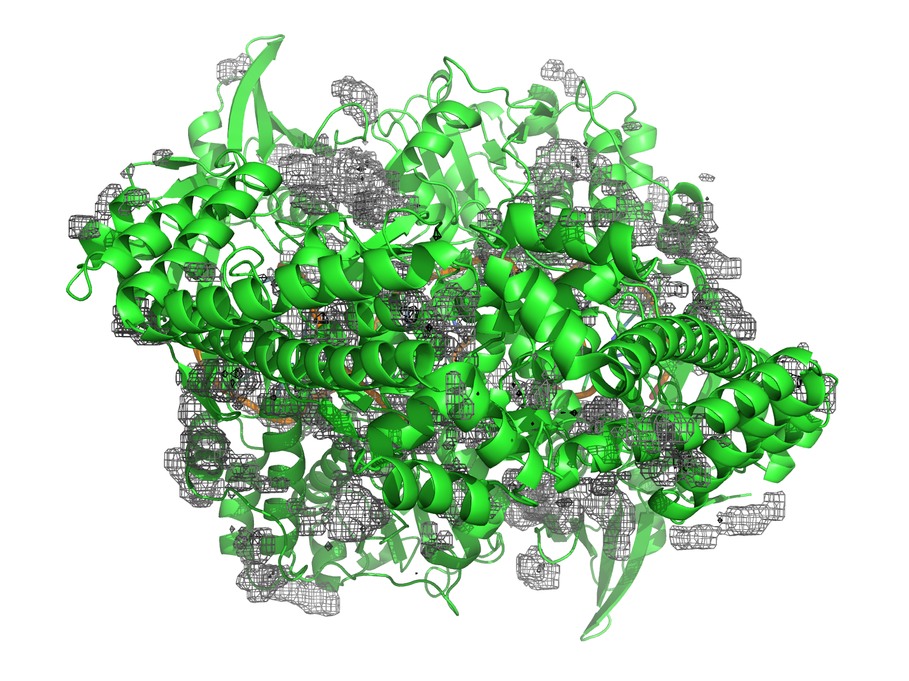

<!-- REPO_TOC -->
# FBDD Repository Structure
- [FBDD](../../../../)
  - [Frag_to_lead](../../../)
    - [9N39](../../)
      - [1ns_Preliminary Results](../)
        - [1ns_test](../1ns_test/)
          - [NPT_equil](../1ns_test/NPT_equil/)
          - [NVT_equil](../1ns_test/NVT_equil/)
          - [Production](../1ns_test/Production/)
          - [em](../1ns_test/em/)
        - [binding_event_detection](../binding_event_detection/)
        - [mdpocket_figures](./)
        - [occupancy_maps](../occupancy_maps/)
        - [plumed_metad_cvs](../plumed_metad_cvs/)
        - [representative_snapshots](../representative_snapshots/)
          - [P01A_probespecific_snapshots](../representative_snapshots/P01A_probespecific_snapshots/)
          - [P02A_probespecific_snapshots](../representative_snapshots/P02A_probespecific_snapshots/)
          - [P03A_probespecific_snapshots](../representative_snapshots/P03A_probespecific_snapshots/)
          - [P04A_probespecific_snapshots](../representative_snapshots/P04A_probespecific_snapshots/)
          - [global_snapshots](../representative_snapshots/global_snapshots/)
    - [Frag_to_lead_4MZI](../../../Frag_to_lead_4MZI/)
      - [100ps_Preliminary Results](../../../Frag_to_lead_4MZI/100ps_Preliminary%20Results/)
        - [100ps_pipeline_test](../../../Frag_to_lead_4MZI/100ps_Preliminary%20Results/100ps_pipeline_test/)
          - [NPT_equil](../../../Frag_to_lead_4MZI/100ps_Preliminary%20Results/100ps_pipeline_test/NPT_equil/)
          - [NVT_equil](../../../Frag_to_lead_4MZI/100ps_Preliminary%20Results/100ps_pipeline_test/NVT_equil/)
          - [Production](../../../Frag_to_lead_4MZI/100ps_Preliminary%20Results/100ps_pipeline_test/Production/)
          - [em](../../../Frag_to_lead_4MZI/100ps_Preliminary%20Results/100ps_pipeline_test/em/)
        - [binding_event_detection](../../../Frag_to_lead_4MZI/100ps_Preliminary%20Results/binding_event_detection/)
        - [mdpocket_figures](../../../Frag_to_lead_4MZI/100ps_Preliminary%20Results/mdpocket_figures/)
        - [plumed_metad_cvs](../../../Frag_to_lead_4MZI/100ps_Preliminary%20Results/plumed_metad_cvs/)
        - [representative_snapshots](../../../Frag_to_lead_4MZI/100ps_Preliminary%20Results/representative_snapshots/)
      - [100ps_run_for_checkpoint_testing](../../../Frag_to_lead_4MZI/100ps_run_for_checkpoint_testing/)
      - [1ns_Preliminary Results](../../../Frag_to_lead_4MZI/1ns_Preliminary%20Results/)
        - [1ns_pipeline_test](../../../Frag_to_lead_4MZI/1ns_Preliminary%20Results/1ns_pipeline_test/)
          - [NPT_equil](../../../Frag_to_lead_4MZI/1ns_Preliminary%20Results/1ns_pipeline_test/NPT_equil/)
          - [NVT_equil](../../../Frag_to_lead_4MZI/1ns_Preliminary%20Results/1ns_pipeline_test/NVT_equil/)
          - [Production](../../../Frag_to_lead_4MZI/1ns_Preliminary%20Results/1ns_pipeline_test/Production/)
          - [em](../../../Frag_to_lead_4MZI/1ns_Preliminary%20Results/1ns_pipeline_test/em/)
        - [binding_event_detection](../../../Frag_to_lead_4MZI/1ns_Preliminary%20Results/binding_event_detection/)
        - [mdpocket_figures](../../../Frag_to_lead_4MZI/1ns_Preliminary%20Results/mdpocket_figures/)
        - [occupancy_maps](../../../Frag_to_lead_4MZI/1ns_Preliminary%20Results/occupancy_maps/)
        - [plumed_metad_cvs](../../../Frag_to_lead_4MZI/1ns_Preliminary%20Results/plumed_metad_cvs/)
        - [representative_snapshots](../../../Frag_to_lead_4MZI/1ns_Preliminary%20Results/representative_snapshots/)
      - [1ns_withpullres_withcheckpoints_Preliminary Results](../../../Frag_to_lead_4MZI/1ns_withpullres_withcheckpoints_Preliminary%20Results/)
        - [1ns_pipeline_test](../../../Frag_to_lead_4MZI/1ns_withpullres_withcheckpoints_Preliminary%20Results/1ns_pipeline_test/)
          - [NPT_equil](../../../Frag_to_lead_4MZI/1ns_withpullres_withcheckpoints_Preliminary%20Results/1ns_pipeline_test/NPT_equil/)
          - [NVT_equil](../../../Frag_to_lead_4MZI/1ns_withpullres_withcheckpoints_Preliminary%20Results/1ns_pipeline_test/NVT_equil/)
          - [Production](../../../Frag_to_lead_4MZI/1ns_withpullres_withcheckpoints_Preliminary%20Results/1ns_pipeline_test/Production/)
          - [em](../../../Frag_to_lead_4MZI/1ns_withpullres_withcheckpoints_Preliminary%20Results/1ns_pipeline_test/em/)
        - [binding_event_detection](../../../Frag_to_lead_4MZI/1ns_withpullres_withcheckpoints_Preliminary%20Results/binding_event_detection/)
        - [mdpocket_figures](../../../Frag_to_lead_4MZI/1ns_withpullres_withcheckpoints_Preliminary%20Results/mdpocket_figures/)
        - [occupancy_maps](../../../Frag_to_lead_4MZI/1ns_withpullres_withcheckpoints_Preliminary%20Results/occupancy_maps/)
        - [plumed_metad_cvs](../../../Frag_to_lead_4MZI/1ns_withpullres_withcheckpoints_Preliminary%20Results/plumed_metad_cvs/)
        - [representative_snapshots](../../../Frag_to_lead_4MZI/1ns_withpullres_withcheckpoints_Preliminary%20Results/representative_snapshots/)
  - [docking_4MZI_roscovitine](../../../../docking_4MZI_roscovitine/)
  - [images](../../../../images/)
<!-- /REPO_TOC -->

------------------------------------

The MDpocket figures shown here are **preliminary** results for a 1ns production run of the pipeline for worklflow functionality illustration purposes.
 - High-density regions (dens isovalue 8, black meshes) and frequent occupancy (freq isovalue 0.5, gray meshes).

The representative snapshots were analyzed using MDpocket to generate:

 - Occupancy grids (freq_iso), highlighting frequently sampled pockets ie. “frequently visited” regions

 - Density grids (dens_iso), highlighting highly populated regions ie. “densely occupied” regions

Potential cryptic or occluded sites correspond to regions detected in the density grids (dens_iso, black meshes) but not in the frequency grids (freq_iso, gray meshes), i.e. regions visited rarely or transiently during the simulation.

Figures illustrate pocket locations, occupancy density, and potential druggable regions.

All figures show the MDpocket density maps generated from a 1ns simulation of 9N39.

Cavity rankings are saved under the ranking_cavities.json (geometry-informed) and the mapped_cavities.json (occupancy-informed).

# overview_frontview.png & overview_backview.png
Overall pocket occupancy map from representative snapshots highlighting high-density regions (dens isovalue 8, black meshes) and frequent occupancy (freq isovalue 0.5, gray meshes). Front view and back view of the mdpocket_analysis_freq.dx file and the mdpocket_analysis_dens.dx file superimposed on the 9N39 protein structure.

<table style="border-collapse: collapse; border: none;">
  <tr>
    <td style="border: none; text-align: center;">
      <h3>A</h3>
      
    </td>
    <td style="border: none; text-align: center;">
      <h3>B</h3>
      
    </td>
  </tr>
</table>

# cryptic_site.png 
Example of a potential cryptic or occluded pocket identified outside highly populated regions.

