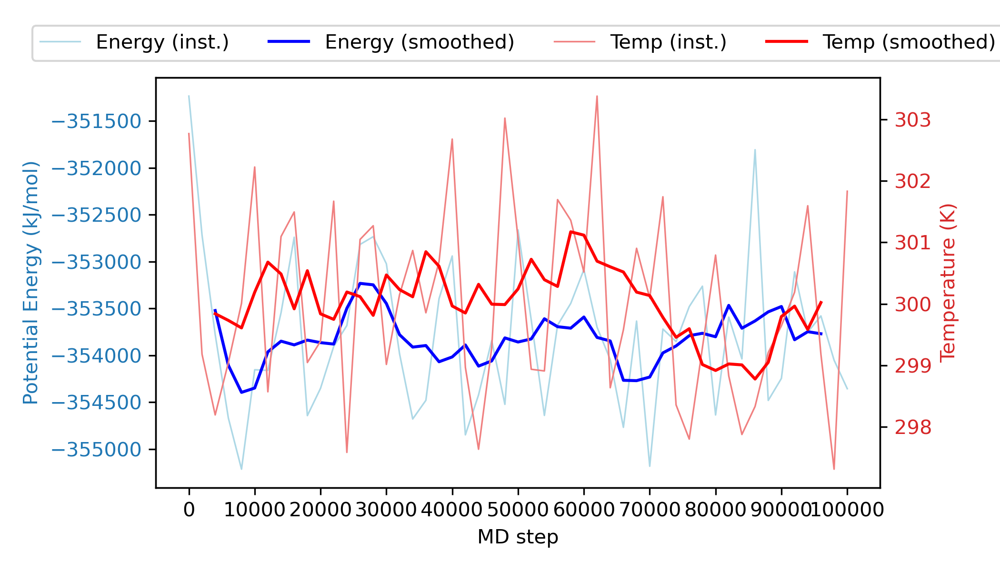
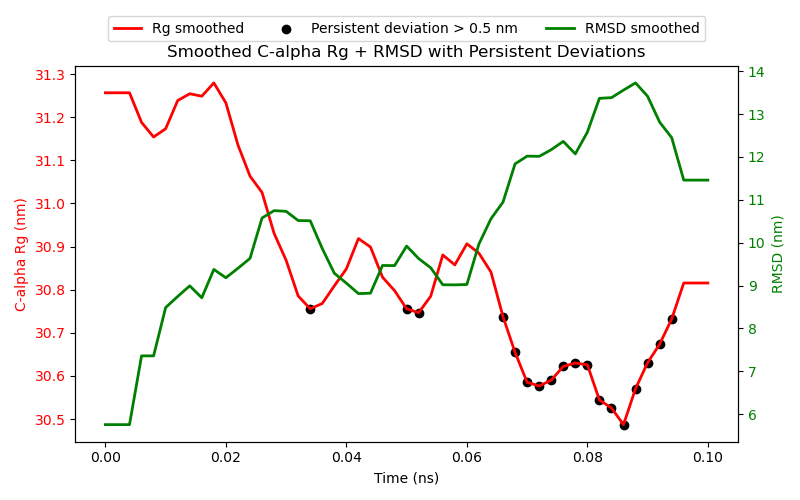

<!-- REPO_TOC -->
# FBDD Repository Structure
- [FBDD](../../../)
  - [Frag_to_lead](../../)
    - [9N39](../../9N39/)
      - [1ns_Preliminary Results](../../9N39/1ns_Preliminary%20Results/)
        - [1ns_test](../../9N39/1ns_Preliminary%20Results/1ns_test/)
          - [NPT_equil](../../9N39/1ns_Preliminary%20Results/1ns_test/NPT_equil/)
          - [NVT_equil](../../9N39/1ns_Preliminary%20Results/1ns_test/NVT_equil/)
          - [Production](../../9N39/1ns_Preliminary%20Results/1ns_test/Production/)
          - [em](../../9N39/1ns_Preliminary%20Results/1ns_test/em/)
    - [Frag_to_lead_4MZI](../)
      - [100ps_Preliminary Results](./)
        - [100ps_pipeline_test](100ps_pipeline_test/)
          - [NPT_equil](100ps_pipeline_test/NPT_equil/)
          - [NVT_equil](100ps_pipeline_test/NVT_equil/)
          - [Production](100ps_pipeline_test/Production/)
          - [em](100ps_pipeline_test/em/)
        - [binding_event_detection](binding_event_detection/)
        - [mdpocket_figures](mdpocket_figures/)
        - [plumed_metad_cvs](plumed_metad_cvs/)
        - [representative_snapshots](representative_snapshots/)
      - [100ps_run_for_checkpoint_testing](../100ps_run_for_checkpoint_testing/)
      - [1ns_Preliminary Results](../1ns_Preliminary%20Results/)
        - [1ns_pipeline_test](../1ns_Preliminary%20Results/1ns_pipeline_test/)
          - [NPT_equil](../1ns_Preliminary%20Results/1ns_pipeline_test/NPT_equil/)
          - [NVT_equil](../1ns_Preliminary%20Results/1ns_pipeline_test/NVT_equil/)
          - [Production](../1ns_Preliminary%20Results/1ns_pipeline_test/Production/)
          - [em](../1ns_Preliminary%20Results/1ns_pipeline_test/em/)
        - [binding_event_detection](../1ns_Preliminary%20Results/binding_event_detection/)
        - [mdpocket_figures](../1ns_Preliminary%20Results/mdpocket_figures/)
        - [occupancy_maps](../1ns_Preliminary%20Results/occupancy_maps/)
        - [plumed_metad_cvs](../1ns_Preliminary%20Results/plumed_metad_cvs/)
        - [representative_snapshots](../1ns_Preliminary%20Results/representative_snapshots/)
      - [1ns_withpullres_withcheckpoints_Preliminary Results](../1ns_withpullres_withcheckpoints_Preliminary%20Results/)
        - [1ns_pipeline_test](../1ns_withpullres_withcheckpoints_Preliminary%20Results/1ns_pipeline_test/)
          - [NPT_equil](../1ns_withpullres_withcheckpoints_Preliminary%20Results/1ns_pipeline_test/NPT_equil/)
          - [NVT_equil](../1ns_withpullres_withcheckpoints_Preliminary%20Results/1ns_pipeline_test/NVT_equil/)
          - [Production](../1ns_withpullres_withcheckpoints_Preliminary%20Results/1ns_pipeline_test/Production/)
          - [em](../1ns_withpullres_withcheckpoints_Preliminary%20Results/1ns_pipeline_test/em/)
        - [binding_event_detection](../1ns_withpullres_withcheckpoints_Preliminary%20Results/binding_event_detection/)
        - [mdpocket_figures](../1ns_withpullres_withcheckpoints_Preliminary%20Results/mdpocket_figures/)
        - [occupancy_maps](../1ns_withpullres_withcheckpoints_Preliminary%20Results/occupancy_maps/)
        - [plumed_metad_cvs](../1ns_withpullres_withcheckpoints_Preliminary%20Results/plumed_metad_cvs/)
        - [representative_snapshots](../1ns_withpullres_withcheckpoints_Preliminary%20Results/representative_snapshots/)
  - [docking_4MZI_roscovitine](../../../docking_4MZI_roscovitine/)
  - [images](../../../images/)
<!-- /REPO_TOC -->

-----------------

# Preliminary Results
[⬆️ Back to top](#fbdd-repository-structure)

This folder contains the preliminary/test results from the pipeline such as energy, temperature and bias plots, as well as post-processing plots (eg. occupancy maps) for a 100ps production run. The preliminary outputs from Gromacs for energy minimization, NVT equilibration, NPT equilibration and the short 100ps production run to show pipeline/workflow functionality can be found in ([100ps_pipeline_test](100ps_pipeline_test/)).

Representative snapshots and MDpocket analysis can be found in ([representative_snapshots](representative_snapshots/)) and ([mdpocket_figures](mdpocket_figures/)) respectively within this directory.

Plots for the PLUMED metadynamics CVs can be found in ([plumed_metad_cvs](plumed_metad_cvs/)) within this directory. 

Details and preliminary results for Binding Event Detection and Pocket Mapping can be found in the binding_event_detection folder ([binding_event_detection](binding_event_detection/)) within this directory.

**All these preliminary results are merely to show pipeline/workflow functionality.**

---

# Benzene occupancy maps per window (only 2 windows shown)
[⬆️ Back to top](#fbdd-repository-structure)

<table style="border-collapse: collapse; border: none;">
  <tr>
    <td style="border: none; text-align: center;">
      <h3>A</h3>
      
    </td>
    <td style="border: none; text-align: center;">
      <h3>B</h3>
      
    </td>
  </tr>
</table>

Benzene occupancy maps were generated from (A) 0–20 ps and (B) 81-100 ps analysis windows of the pipeline MD simulation (total 100 ps), superimposed on the representative protein structure (PDB 4MZI – human mutant p53) for each window. The representative protein structure per window was obtained from the central frame of the window. Benzene occupancy maps are shown as black meshes. Due to the short production run (100ps), the KDE mesh is largely ellipsoidal and does not show real binding site patterns. This is expected to change with longer production runs.

# Methanol occupancy maps per window (only 2 windows shown)
[⬆️ Back to top](#fbdd-repository-structure)

<table style="border-collapse: collapse; border: none;">
  <tr>
    <td style="border: none; text-align: center;">
      <h3>A</h3>
      
    </td>
    <td style="border: none; text-align: center;">
      <h3>B</h3>
      
    </td>
  </tr>
</table>

Methanol occupancy maps were generated from (A) 0–20 ps and (B) 81-100 ps analysis windows of the pipeline MD simulation (total 100 ps), superimposed on the representative protein structure (PDB 4MZI – human mutant p53) for each window. The representative protein structure per window was obtained from the central frame of the window. Methanol occupancy maps are shown as black meshes. Due to the short production run (100ps), the KDE mesh is largely ellipsoidal and does not show real binding site patterns. This is expected to change with longer production runs.

# Acetonitrile occupancy maps per window (only 2 windows shown)
[⬆️ Back to top](#fbdd-repository-structure)

<table style="border-collapse: collapse; border: none;">
  <tr>
    <td style="border: none; text-align: center;">
      <h3>A</h3>
      
    </td>
    <td style="border: none; text-align: center;">
      <h3>B</h3>
      
    </td>
  </tr>
</table>

Acetonitrile occupancy maps were generated from (A) 0–20 ps and (B) 81-100 ps analysis windows of the pipeline MD simulation (total 100 ps), superimposed on the representative protein structure (PDB 4MZI – human mutant p53) for each window. The representative protein structure per window was obtained from the central frame of the window. Acetonitrile occupancy maps are shown as black meshes. Due to the short production run (100ps), the KDE mesh is largely ellipsoidal and does not show real binding site patterns. This is expected to change with longer production runs.

# Toluene occupancy maps per window (only 2 windows shown)
[⬆️ Back to top](#fbdd-repository-structure)

<table style="border-collapse: collapse; border: none;">
  <tr>
    <td style="border: none; text-align: center;">
      <h3>A</h3>
      
    </td>
    <td style="border: none; text-align: center;">
      <h3>B</h3>
      
    </td>
  </tr>
</table>

Toluene occupancy maps were generated from (A) 0–20 ps and (B) 81-100 ps analysis windows of the pipeline MD simulation (total 100 ps), superimposed on the representative protein structure (PDB 4MZI – human mutant p53) for each window. The representative protein structure per window was obtained from the central frame of the window. Toluene occupancy maps are shown as black meshes. Due to the short production run (100ps), the KDE mesh is largely ellipsoidal and does not show real binding site patterns. This is expected to change with longer production runs.

# Full trajectory occupancy maps per probe
[⬆️ Back to top](#fbdd-repository-structure)

<table style="border-collapse: collapse; border: none;">
  <tr>
    <td style="border: none; text-align: center;">
      <h3>A</h3>
      
    </td>
    <td style="border: none; text-align: center;">
      <h3>B</h3>
      
    </td>
    <td style="border: none; text-align: center;">
      <h3>C</h3>
      
    </td>
    <td style="border: none; text-align: center;">
      <h3>D</h3>
      
    </td>
  </tr>
</table>

Occupancy maps for each probe (A) benzene (B) methanol (C) acetonitrile (D) toluene were generated for the full trajectory of the pipeline MD simulation (total 100 ps), superimposed on the representative protein structure (PDB 4MZI – human mutant p53) for the whole trajectory. The representative protein structure per window was obtained from the best frame of the window (minimumRMSD to mean structure). Probe occupancy maps are shown as black meshes. Due to the short production run (100ps), the KDE meshes are largely ellipsoidal and does not show real binding site patterns. This is expected to change with longer production runs.

# Full trajectory occupancy maps for all probes combined
[⬆️ Back to top](#fbdd-repository-structure)

<table style="border-collapse: collapse; border: none;">
  <tr>
    <td style="border: none; text-align: center;">
      
    </td>
  </tr>
</table>

Occupancy maps for each probe (benzene, methanol, acetonitrile, toluene) were generated for the full trajectory of the pipeline MD simulation (total 100 ps), with all of them superimposed at the same time on the representative protein structure (PDB 4MZI – human mutant p53) for the whole trajectory. The representative protein structure per window was obtained from the best frame of the window (minimumRMSD to mean structure). Occupancy maps for each probe (benzene, methanol, acetonitrile, toluene) are shown as (black, blue, orange, brown) meshes respectively. Due to the short production run (100ps), the KDE meshes are largely ellipsoidal and does not show real binding site patterns. This is expected to change with longer production runs.

## energy.png
[⬆️ Back to top](#fbdd-repository-structure)

This plot shows the changes in the (instantaneous and smoothed) potential energy (kJ/mol) of the system as the MD simulation progresses ie. MD step increases. The plot shows that the system is stable ie. no large fluctuations in potential energy.

## temperature.png
[⬆️ Back to top](#fbdd-repository-structure)

This plot shows the changes in the (instantaneous and smoothed) temperature (K) of the system as the MD simulation progresses ie. MD step increases. The plot shows that the system is stable ie. no large fluctuations in temperature.

## energy_temperature_dual.png
[⬆️ Back to top](#fbdd-repository-structure)

This plot shows both of the changes in the (instantaneous and smoothed) temperature (K) of the system, as well as the changes in the (instantaneous and smoothed) potential energy (kJ/mol) of the system as the MD simulation progresses ie. MD step increases. The plot shows that the system is stable ie. no large fluctuations in temperature or potential energy.

## plumed_bias.png
[⬆️ Back to top](#fbdd-repository-structure)

This plot shows the changes in the bias (kJ/mol) of the system as the MD simulation progresses ie. MD step increases. The plot shows that most of the relevant collective variable (CV) regions have been visited since the increase in bias is slowing down.

## Calpha_Rg.png
[⬆️ Back to top](#fbdd-repository-structure)

This plot shows the changes in C-alpha Rg (nm) of the protein backbone as the MD simulation progresses ie. time increases.

## Calpha_Rg_RMSD_combined.png
[⬆️ Back to top](#fbdd-repository-structure)

This plot shows the changes in C-alpha Rg (nm) of the protein backbone as the MD simulation progresses ie. time increases. The plot shows that there is likely a structural change from ca. 0.065ns to ca. 0.095ns as marked by the drop in the radius of gyration together with an increase in RMSD, where RMSD measures deviation from the reference structure (the initial conformation). The fall in the radius of gyration indicates the protein is becoming more compact in that region of the trajectory. The smaller wells with fewer black dots represents shorter-lived or smaller deviations — minor conformational shifts, local motions, or fluctuations.

