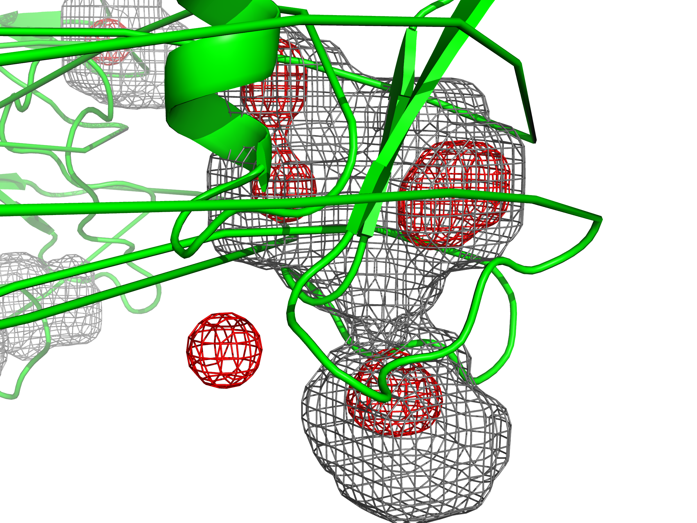

<!-- REPO_TOC -->
# FBDD Repository Structure
- [FBDD](../../../../)
  - [Frag_to_lead](../../../)
    - [9N39](../../../9N39/)
      - [1ns_Preliminary Results](../../../9N39/1ns_Preliminary%20Results/)
        - [1ns_test](../../../9N39/1ns_Preliminary%20Results/1ns_test/)
          - [NPT_equil](../../../9N39/1ns_Preliminary%20Results/1ns_test/NPT_equil/)
          - [NVT_equil](../../../9N39/1ns_Preliminary%20Results/1ns_test/NVT_equil/)
          - [Production](../../../9N39/1ns_Preliminary%20Results/1ns_test/Production/)
          - [em](../../../9N39/1ns_Preliminary%20Results/1ns_test/em/)
        - [binding_event_detection](../../../9N39/1ns_Preliminary%20Results/binding_event_detection/)
        - [mdpocket_figures](../../../9N39/1ns_Preliminary%20Results/mdpocket_figures/)
        - [occupancy_maps](../../../9N39/1ns_Preliminary%20Results/occupancy_maps/)
        - [plumed_metad_cvs](../../../9N39/1ns_Preliminary%20Results/plumed_metad_cvs/)
        - [representative_snapshots](../../../9N39/1ns_Preliminary%20Results/representative_snapshots/)
    - [Frag_to_lead_4MZI](../../)
      - [100ps_Preliminary Results](../)
        - [100ps_pipeline_test](../100ps_pipeline_test/)
          - [NPT_equil](../100ps_pipeline_test/NPT_equil/)
          - [NVT_equil](../100ps_pipeline_test/NVT_equil/)
          - [Production](../100ps_pipeline_test/Production/)
          - [em](../100ps_pipeline_test/em/)
        - [binding_event_detection](../binding_event_detection/)
        - [mdpocket_figures](./)
        - [plumed_metad_cvs](../plumed_metad_cvs/)
        - [representative_snapshots](../representative_snapshots/)
      - [100ps_run_for_checkpoint_testing](../../100ps_run_for_checkpoint_testing/)
      - [1ns_Preliminary Results](../../1ns_Preliminary%20Results/)
        - [1ns_pipeline_test](../../1ns_Preliminary%20Results/1ns_pipeline_test/)
          - [NPT_equil](../../1ns_Preliminary%20Results/1ns_pipeline_test/NPT_equil/)
          - [NVT_equil](../../1ns_Preliminary%20Results/1ns_pipeline_test/NVT_equil/)
          - [Production](../../1ns_Preliminary%20Results/1ns_pipeline_test/Production/)
          - [em](../../1ns_Preliminary%20Results/1ns_pipeline_test/em/)
        - [binding_event_detection](../../1ns_Preliminary%20Results/binding_event_detection/)
        - [mdpocket_figures](../../1ns_Preliminary%20Results/mdpocket_figures/)
        - [occupancy_maps](../../1ns_Preliminary%20Results/occupancy_maps/)
        - [plumed_metad_cvs](../../1ns_Preliminary%20Results/plumed_metad_cvs/)
        - [representative_snapshots](../../1ns_Preliminary%20Results/representative_snapshots/)
      - [1ns_withpullres_withcheckpoints_Preliminary Results](../../1ns_withpullres_withcheckpoints_Preliminary%20Results/)
        - [1ns_pipeline_test](../../1ns_withpullres_withcheckpoints_Preliminary%20Results/1ns_pipeline_test/)
          - [NPT_equil](../../1ns_withpullres_withcheckpoints_Preliminary%20Results/1ns_pipeline_test/NPT_equil/)
          - [NVT_equil](../../1ns_withpullres_withcheckpoints_Preliminary%20Results/1ns_pipeline_test/NVT_equil/)
          - [Production](../../1ns_withpullres_withcheckpoints_Preliminary%20Results/1ns_pipeline_test/Production/)
          - [em](../../1ns_withpullres_withcheckpoints_Preliminary%20Results/1ns_pipeline_test/em/)
        - [binding_event_detection](../../1ns_withpullres_withcheckpoints_Preliminary%20Results/binding_event_detection/)
        - [mdpocket_figures](../../1ns_withpullres_withcheckpoints_Preliminary%20Results/mdpocket_figures/)
        - [occupancy_maps](../../1ns_withpullres_withcheckpoints_Preliminary%20Results/occupancy_maps/)
        - [plumed_metad_cvs](../../1ns_withpullres_withcheckpoints_Preliminary%20Results/plumed_metad_cvs/)
        - [representative_snapshots](../../1ns_withpullres_withcheckpoints_Preliminary%20Results/representative_snapshots/)
  - [docking_4MZI_roscovitine](../../../../docking_4MZI_roscovitine/)
  - [images](../../../../images/)
<!-- /REPO_TOC -->

------------------------------------

The MDpocket figures shown here are **preliminary** results for a short 100ps production run of the pipeline for worklflow functionality illustration purposes.
 - High-density regions (dens 0.5, red meshes) and frequent occupancy (freq 0.5, gray meshes)

Each representative snapshot was analyzed using MDpocket to generate:

 - Occupancy grids (freq_iso), highlighting frequently sampled pockets ie. “frequently visited” regions

 - Density grids (dens_iso), highlighting highly populated regions ie. “densely occupied” regions

Potential cryptic or occluded sites correspond to regions detected in the density grids (dens_iso, gray meshes) but not in the frequency grids (freq_iso, black meshes), i.e., regions visited rarely or transiently during the simulation.

Figures illustrate pocket locations, occupancy density, and potential druggable regions.

All figures show the MDpocket density maps generated from a short 100ps test simulation of 4MZI.

# overview.png
Overall pocket occupancy map from representative snapshots.

# region1.png & region2.png
Localized views highlighting high-density regions (dens 0.8 red meshes) and frequent occupancy (freq 0.8, gray meshes).
<table style="border-collapse: collapse; border: none;">
  <tr>
    <td style="border: none; text-align: center;">
      <h3>A</h3>
      
    </td>
    <td style="border: none; text-align: center;">
      <h3>B</h3>
      
    </td>
  </tr>
</table>

# cryptic_site.png 
Example of a potential cryptic or occluded pocket identified outside highly populated regions.

