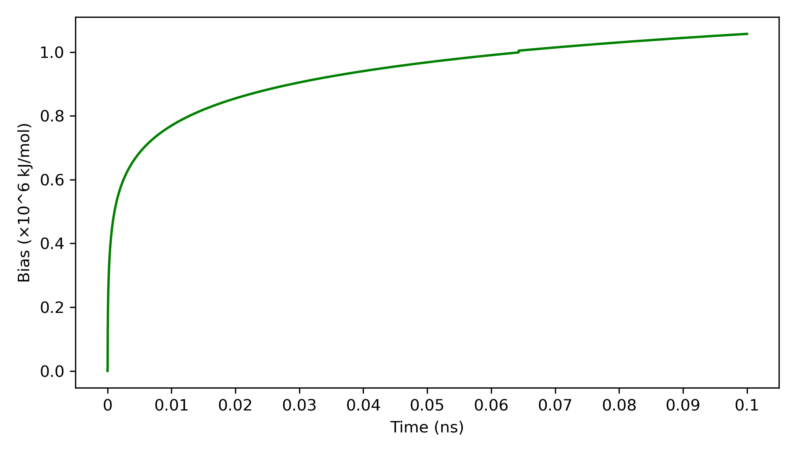

<!-- REPO_TOC -->
# FBDD Repository Structure
- [FBDD](../../../)
  - [Frag_to_lead](../../)
    - [9N39](../../9N39/)
      - [1ns_Preliminary Results](../../9N39/1ns_Preliminary%20Results/)
        - [1ns_test](../../9N39/1ns_Preliminary%20Results/1ns_test/)
          - [NPT_equil](../../9N39/1ns_Preliminary%20Results/1ns_test/NPT_equil/)
          - [NVT_equil](../../9N39/1ns_Preliminary%20Results/1ns_test/NVT_equil/)
          - [Production](../../9N39/1ns_Preliminary%20Results/1ns_test/Production/)
          - [em](../../9N39/1ns_Preliminary%20Results/1ns_test/em/)
    - [Frag_to_lead_4MZI](../)
      - [100ps_Preliminary Results](../100ps_Preliminary%20Results/)
        - [100ps_pipeline_test](../100ps_Preliminary%20Results/100ps_pipeline_test/)
          - [NPT_equil](../100ps_Preliminary%20Results/100ps_pipeline_test/NPT_equil/)
          - [NVT_equil](../100ps_Preliminary%20Results/100ps_pipeline_test/NVT_equil/)
          - [Production](../100ps_Preliminary%20Results/100ps_pipeline_test/Production/)
          - [em](../100ps_Preliminary%20Results/100ps_pipeline_test/em/)
        - [binding_event_detection](../100ps_Preliminary%20Results/binding_event_detection/)
        - [mdpocket_figures](../100ps_Preliminary%20Results/mdpocket_figures/)
        - [plumed_metad_cvs](../100ps_Preliminary%20Results/plumed_metad_cvs/)
        - [representative_snapshots](../100ps_Preliminary%20Results/representative_snapshots/)
      - [100ps_run_for_checkpoint_testing](./)
      - [1ns_Preliminary Results](../1ns_Preliminary%20Results/)
        - [1ns_pipeline_test](../1ns_Preliminary%20Results/1ns_pipeline_test/)
          - [NPT_equil](../1ns_Preliminary%20Results/1ns_pipeline_test/NPT_equil/)
          - [NVT_equil](../1ns_Preliminary%20Results/1ns_pipeline_test/NVT_equil/)
          - [Production](../1ns_Preliminary%20Results/1ns_pipeline_test/Production/)
          - [em](../1ns_Preliminary%20Results/1ns_pipeline_test/em/)
        - [binding_event_detection](../1ns_Preliminary%20Results/binding_event_detection/)
        - [mdpocket_figures](../1ns_Preliminary%20Results/mdpocket_figures/)
        - [occupancy_maps](../1ns_Preliminary%20Results/occupancy_maps/)
        - [plumed_metad_cvs](../1ns_Preliminary%20Results/plumed_metad_cvs/)
        - [representative_snapshots](../1ns_Preliminary%20Results/representative_snapshots/)
      - [1ns_withpullres_withcheckpoints_Preliminary Results](../1ns_withpullres_withcheckpoints_Preliminary%20Results/)
        - [1ns_pipeline_test](../1ns_withpullres_withcheckpoints_Preliminary%20Results/1ns_pipeline_test/)
          - [NPT_equil](../1ns_withpullres_withcheckpoints_Preliminary%20Results/1ns_pipeline_test/NPT_equil/)
          - [NVT_equil](../1ns_withpullres_withcheckpoints_Preliminary%20Results/1ns_pipeline_test/NVT_equil/)
          - [Production](../1ns_withpullres_withcheckpoints_Preliminary%20Results/1ns_pipeline_test/Production/)
          - [em](../1ns_withpullres_withcheckpoints_Preliminary%20Results/1ns_pipeline_test/em/)
        - [binding_event_detection](../1ns_withpullres_withcheckpoints_Preliminary%20Results/binding_event_detection/)
        - [mdpocket_figures](../1ns_withpullres_withcheckpoints_Preliminary%20Results/mdpocket_figures/)
        - [occupancy_maps](../1ns_withpullres_withcheckpoints_Preliminary%20Results/occupancy_maps/)
        - [plumed_metad_cvs](../1ns_withpullres_withcheckpoints_Preliminary%20Results/plumed_metad_cvs/)
        - [representative_snapshots](../1ns_withpullres_withcheckpoints_Preliminary%20Results/representative_snapshots/)
  - [docking_4MZI_roscovitine](../../../docking_4MZI_roscovitine/)
  - [images](../../../images/)
<!-- /REPO_TOC -->

---------------------------------------------------

 This folder contains the results of testing the checkpoint and backup system on a short 100ps test run.

 All results shown are **preliminary results** and are only meant to show **workflow/pipeline functionality**.

 The checkpoint was restarted from 64.300ps.

 # (A) 100ps production run (without starting from backup)
 # (B) 100ps production run (starting from backup ~30min before production run completion)

 ## energy.png
[⬆️ Back to top](#fbdd-repository-structure)

This plot shows the changes in the (instantaneous and smoothed) potential energy (kJ/mol) of the system as the MD simulation progresses ie. time increases. Both plots look the same, indicating that the restart from backup/checkpoint is robust.
<table style="border-collapse: collapse; border: none;">
  <tr>
    <td style="border: none; text-align: center;">
      <h3>A</h3>
      
    </td>
  </tr>
  <tr>
    <td style="border: none; text-align: center;">
      <h3>B</h3>
      
    </td>
  </tr>
</table>

## temperature.png
[⬆️ Back to top](#fbdd-repository-structure)

This plot shows the changes in the (instantaneous and smoothed) temperature (K) of the system as the MD simulation progresses ie. time increases. Both plots look the same, indicating that the restart from backup/checkpoint is robust.
<table style="border-collapse: collapse; border: none;">
  <tr>
    <td style="border: none; text-align: center;">
      <h3>A</h3>
      
    </td>
  </tr>
  <tr>
    <td style="border: none; text-align: center;">
      <h3>B</h3>
      
    </td>
  </tr>
</table>

## energy_temperature_dual.png
[⬆️ Back to top](#fbdd-repository-structure)

This plot shows both of the changes in the (instantaneous and smoothed) temperature (K) of the system, as well as the changes in the (instantaneous and smoothed) potential energy (kJ/mol) of the system as the MD simulation progresses ie. time increases. Both plots look the same, indicating that the restart from backup/checkpoint is robust.
<table style="border-collapse: collapse; border: none;">
  <tr>
    <td style="border: none; text-align: center;">
      <h3>A</h3>
      
    </td>
  </tr>
  <tr>
    <td style="border: none; text-align: center;">
      <h3>B</h3>
      
    </td>
  </tr>
</table>

## plumed_bias.png
[⬆️ Back to top](#fbdd-repository-structure)

This plot shows the changes in the bias (kJ/mol) of the system as the MD simulation progresses ie. time increases. The small jump in bias does not affect the overall simulation and is indicative of a restart from checkpoint. Both plots look the same, indicating that the restart from backup/checkpoint is robust.
<table style="border-collapse: collapse; border: none;">
  <tr>
    <td style="border: none; text-align: center;">
      <h3>A</h3>
      
    </td>
  </tr>
  <tr>
    <td style="border: none; text-align: center;">
      <h3>B</h3>
      
    </td>
  </tr>
</table>
