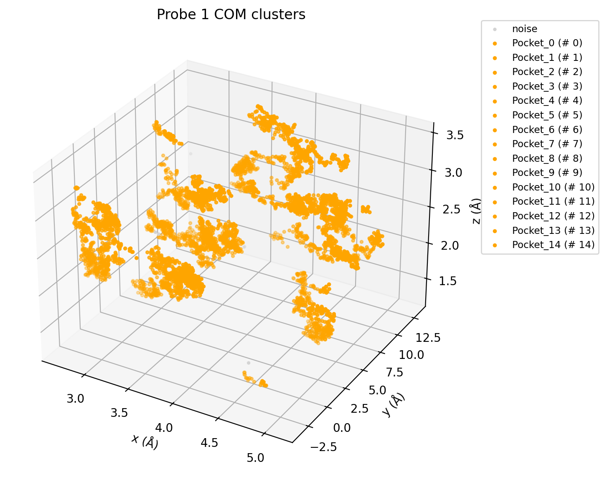
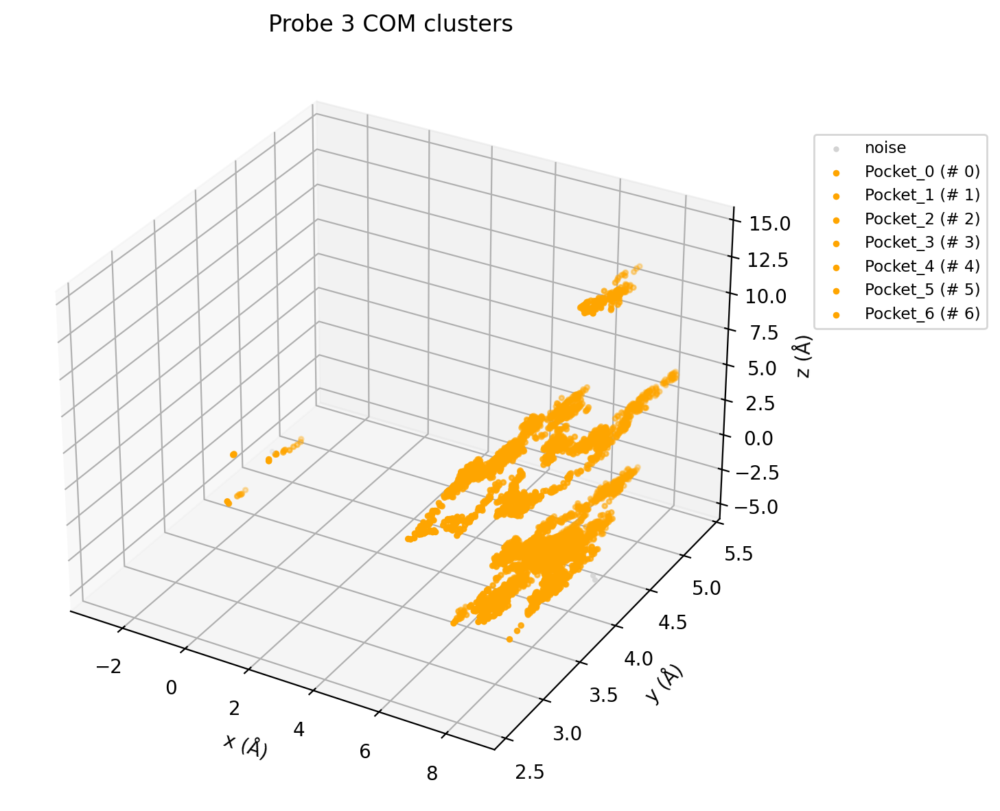

<!-- REPO_TOC -->
# FBDD Repository Structure
- [FBDD](../../../../)
  - [Frag_to_lead](../../../)
    - [9N39](../../../9N39/)
      - [1ns_Preliminary Results](../../../9N39/1ns_Preliminary%20Results/)
        - [1ns_test](../../../9N39/1ns_Preliminary%20Results/1ns_test/)
          - [NPT_equil](../../../9N39/1ns_Preliminary%20Results/1ns_test/NPT_equil/)
          - [NVT_equil](../../../9N39/1ns_Preliminary%20Results/1ns_test/NVT_equil/)
          - [Production](../../../9N39/1ns_Preliminary%20Results/1ns_test/Production/)
          - [em](../../../9N39/1ns_Preliminary%20Results/1ns_test/em/)
        - [binding_event_detection](../../../9N39/1ns_Preliminary%20Results/binding_event_detection/)
        - [mdpocket_figures](../../../9N39/1ns_Preliminary%20Results/mdpocket_figures/)
        - [occupancy_maps](../../../9N39/1ns_Preliminary%20Results/occupancy_maps/)
        - [plumed_metad_cvs](../../../9N39/1ns_Preliminary%20Results/plumed_metad_cvs/)
        - [representative_snapshots](../../../9N39/1ns_Preliminary%20Results/representative_snapshots/)
          - [P01A_probespecific_snapshots](../../../9N39/1ns_Preliminary%20Results/representative_snapshots/P01A_probespecific_snapshots/)
          - [P02A_probespecific_snapshots](../../../9N39/1ns_Preliminary%20Results/representative_snapshots/P02A_probespecific_snapshots/)
          - [P03A_probespecific_snapshots](../../../9N39/1ns_Preliminary%20Results/representative_snapshots/P03A_probespecific_snapshots/)
          - [P04A_probespecific_snapshots](../../../9N39/1ns_Preliminary%20Results/representative_snapshots/P04A_probespecific_snapshots/)
          - [global_snapshots](../../../9N39/1ns_Preliminary%20Results/representative_snapshots/global_snapshots/)
    - [Frag_to_lead_4MZI](../../)
      - [100ps_Preliminary Results](../../100ps_Preliminary%20Results/)
        - [100ps_pipeline_test](../../100ps_Preliminary%20Results/100ps_pipeline_test/)
          - [NPT_equil](../../100ps_Preliminary%20Results/100ps_pipeline_test/NPT_equil/)
          - [NVT_equil](../../100ps_Preliminary%20Results/100ps_pipeline_test/NVT_equil/)
          - [Production](../../100ps_Preliminary%20Results/100ps_pipeline_test/Production/)
          - [em](../../100ps_Preliminary%20Results/100ps_pipeline_test/em/)
        - [binding_event_detection](../../100ps_Preliminary%20Results/binding_event_detection/)
        - [mdpocket_figures](../../100ps_Preliminary%20Results/mdpocket_figures/)
        - [plumed_metad_cvs](../../100ps_Preliminary%20Results/plumed_metad_cvs/)
        - [representative_snapshots](../../100ps_Preliminary%20Results/representative_snapshots/)
      - [100ps_run_for_checkpoint_testing](../../100ps_run_for_checkpoint_testing/)
      - [1ns_Preliminary Results](../)
        - [1ns_pipeline_test](../1ns_pipeline_test/)
          - [NPT_equil](../1ns_pipeline_test/NPT_equil/)
          - [NVT_equil](../1ns_pipeline_test/NVT_equil/)
          - [Production](../1ns_pipeline_test/Production/)
          - [em](../1ns_pipeline_test/em/)
        - [binding_event_detection](./)
        - [mdpocket_figures](../mdpocket_figures/)
        - [occupancy_maps](../occupancy_maps/)
        - [plumed_metad_cvs](../plumed_metad_cvs/)
        - [representative_snapshots](../representative_snapshots/)
      - [1ns_withpullres_withcheckpoints_Preliminary Results](../../1ns_withpullres_withcheckpoints_Preliminary%20Results/)
        - [1ns_pipeline_test](../../1ns_withpullres_withcheckpoints_Preliminary%20Results/1ns_pipeline_test/)
          - [NPT_equil](../../1ns_withpullres_withcheckpoints_Preliminary%20Results/1ns_pipeline_test/NPT_equil/)
          - [NVT_equil](../../1ns_withpullres_withcheckpoints_Preliminary%20Results/1ns_pipeline_test/NVT_equil/)
          - [Production](../../1ns_withpullres_withcheckpoints_Preliminary%20Results/1ns_pipeline_test/Production/)
          - [em](../../1ns_withpullres_withcheckpoints_Preliminary%20Results/1ns_pipeline_test/em/)
        - [binding_event_detection](../../1ns_withpullres_withcheckpoints_Preliminary%20Results/binding_event_detection/)
        - [mdpocket_figures](../../1ns_withpullres_withcheckpoints_Preliminary%20Results/mdpocket_figures/)
        - [occupancy_maps](../../1ns_withpullres_withcheckpoints_Preliminary%20Results/occupancy_maps/)
        - [plumed_metad_cvs](../../1ns_withpullres_withcheckpoints_Preliminary%20Results/plumed_metad_cvs/)
        - [representative_snapshots](../../1ns_withpullres_withcheckpoints_Preliminary%20Results/representative_snapshots/)
  - [docking_4MZI_roscovitine](../../../../docking_4MZI_roscovitine/)
  - [images](../../../../images/)
<!-- /REPO_TOC -->

-----------------

# Binding Event Detection and Pocket Mapping

This module performs integrated COM clustering of probe fragments along MD trajectories and maps clusters to MDpocket-derived density peaks to identify potential binding pockets and transient binding events.

Cluster → Density Peak mapping: Each cluster centroid is assigned to the nearest MDpocket density peak (DensPeak_X).

If a cluster is farther than a user-defined threshold (e.g., 3 Å) from any density peak, it is labeled Pocket_X.

**All results shown are preliminary and are used to demonstrate pipeline/workflow functionality.**

## Binding event detection: Track consecutive frames where a probe is in a cluster.

Events lasting longer than dbscan_min_samples frames are reported as binding events.

## Interpretation:

DensPeak_X clusters are likely near real pockets detected by MDpocket.

Pocket_X clusters may represent transient, low-occupancy, or previously unidentified pockets.

Binding events summarize when and for how long a probe occupies a particular cluster/pocket. Once clusters are labeled, users can track how long a probe resides in a cluster → gives residence times, which are biologically relevant.

## Outputs:

JSON file: enhanced_clustering_results_TIMESTAMP.json with cluster centroids, names, distances to peaks, and binding events.

3D COM plots: probe trajectories color-coded by cluster labels.

3D COM plots from a 1ns production test run. **The results shown are preliminary and are used to demonstrate pipeline/workflow functionality.**

The plots do not show any binding events or meaningful clusters as expected due to the short production run of 1ns.

### 3D COM plots
(1,5) Probe : benzene
<table style="border-collapse: collapse; border: none;">
  <tr>
    <td style="border: none; text-align: center;">
      <h3>1</h3>
      
    </td>
    <td style="border: none; text-align: center;">
      <h3>5</h3>
      
    </td>
   </tr>
</table>

(2,6) Probe : methanol
<table style="border-collapse: collapse; border: none;">
  <tr>
    <td style="border: none; text-align: center;">
      <h3>2</h3>
      
    </td>
    <td style="border: none; text-align: center;">
      <h3>6</h3>
      
    </td>
  </tr>
</table>

(3,7) Probe : acetonitrile
<table style="border-collapse: collapse; border: none;">
  <tr>
    <td style="border: none; text-align: center;">
      <h3>3</h3>
      
    </td>
    <td style="border: none; text-align: center;">
      <h3>7</h3>
      
    </td>
  </tr>
</table>

(4,8) Probe : toluene
<table style="border-collapse: collapse; border: none;">
  <tr>
    <td style="border: none; text-align: center;">
      <h3>4</h3>
      
    </td>
    <td style="border: none; text-align: center;">
      <h3>8</h3>
      
    </td>
  </tr>
</table>

## Usage of JSON file for numerical cluster detection → structural snapshot → physical interpretation:

### Open JSON → see which clusters survived as “binding events”

Compare cluster names to plots to confirm physical location

DensPeak → matches an MDpocket peak

Pocket_X → a cluster far from any peak, might be minor or transient

### Once you identify a cluster / binding event of interest:

Use the rep_frame_pdb listed in the JSON (and saved in the cv_plots_dir) or extract frames manually from the full trajectory

Open in PyMOL/Chimera

Overlay protein + probe COMs to see how the probe binds in that cluster
