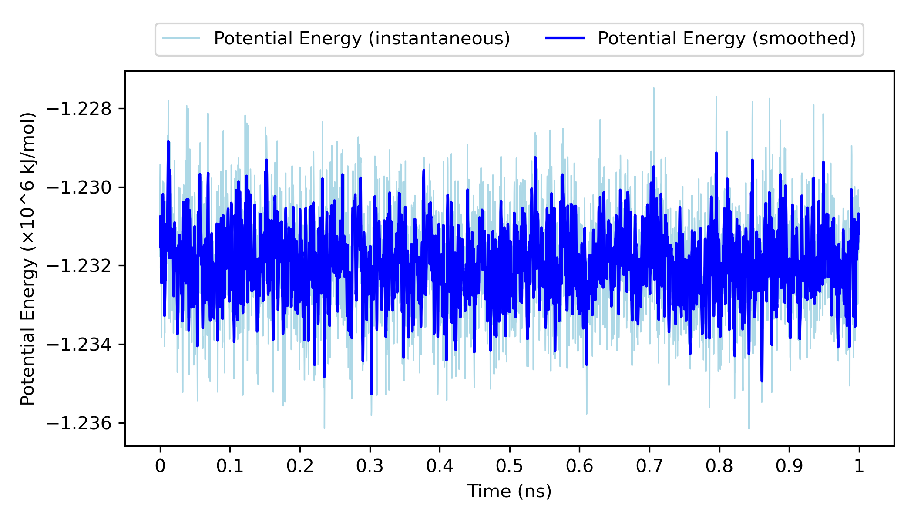
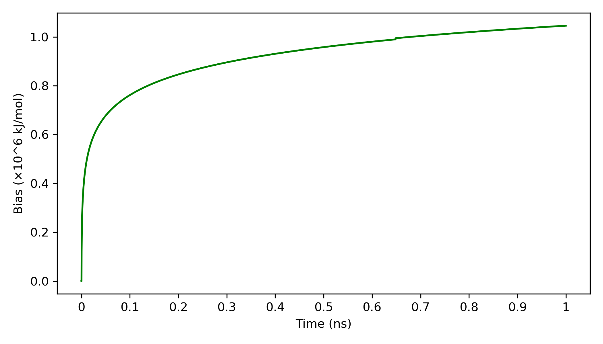
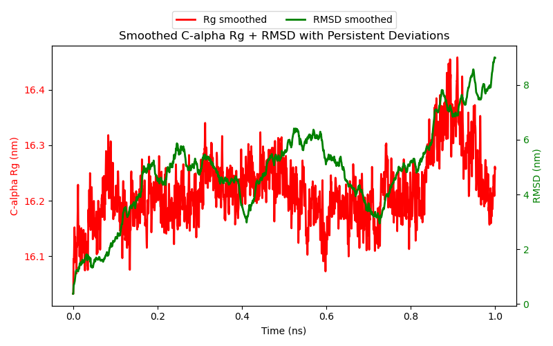

<!-- REPO_TOC -->
# FBDD Repository Structure
- [FBDD](../../../)
  - [Frag_to_lead](../../)
    - [Frag_to_lead_4MZI](../)
      - [100ps_Preliminary Results](../100ps_Preliminary%20Results/)
        - [100ps_pipeline_test](../100ps_Preliminary%20Results/100ps_pipeline_test/)
          - [NPT_equil](../100ps_Preliminary%20Results/100ps_pipeline_test/NPT_equil/)
          - [NVT_equil](../100ps_Preliminary%20Results/100ps_pipeline_test/NVT_equil/)
          - [Production](../100ps_Preliminary%20Results/100ps_pipeline_test/Production/)
          - [em](../100ps_Preliminary%20Results/100ps_pipeline_test/em/)
        - [binding_event_detection](../100ps_Preliminary%20Results/binding_event_detection/)
        - [mdpocket_figures](../100ps_Preliminary%20Results/mdpocket_figures/)
        - [plumed_metad_cvs](../100ps_Preliminary%20Results/plumed_metad_cvs/)
        - [representative_snapshots](../100ps_Preliminary%20Results/representative_snapshots/)
      - [100ps_run_for_checkpoint_testing](../100ps_run_for_checkpoint_testing/)
      - [1ns_Preliminary Results](../1ns_Preliminary%20Results/)
        - [1ns_pipeline_test](../1ns_Preliminary%20Results/1ns_pipeline_test/)
          - [NPT_equil](../1ns_Preliminary%20Results/1ns_pipeline_test/NPT_equil/)
          - [NVT_equil](../1ns_Preliminary%20Results/1ns_pipeline_test/NVT_equil/)
          - [Production](../1ns_Preliminary%20Results/1ns_pipeline_test/Production/)
          - [em](../1ns_Preliminary%20Results/1ns_pipeline_test/em/)
        - [binding_event_detection](../1ns_Preliminary%20Results/binding_event_detection/)
        - [mdpocket_figures](../1ns_Preliminary%20Results/mdpocket_figures/)
        - [occupancy_maps](../1ns_Preliminary%20Results/occupancy_maps/)
        - [plumed_metad_cvs](../1ns_Preliminary%20Results/plumed_metad_cvs/)
        - [representative_snapshots](../1ns_Preliminary%20Results/representative_snapshots/)
      - [1ns_withpullres_withcheckpoints_Preliminary Results](./)
        - [1ns_pipeline_test](1ns_pipeline_test/)
          - [NPT_equil](1ns_pipeline_test/NPT_equil/)
          - [NVT_equil](1ns_pipeline_test/NVT_equil/)
          - [Production](1ns_pipeline_test/Production/)
          - [em](1ns_pipeline_test/em/)
        - [binding_event_detection](binding_event_detection/)
        - [mdpocket_figures](mdpocket_figures/)
        - [occupancy_maps](occupancy_maps/)
        - [plumed_metad_cvs](plumed_metad_cvs/)
        - [representative_snapshots](representative_snapshots/)
  - [docking_4MZI_roscovitine](../../../docking_4MZI_roscovitine/)
  - [images](../../../images/)
<!-- /REPO_TOC -->

-----------------

# 1ns_withpullres_withcheckpoints_Preliminary Results
[⬆️ Back to top](#fbdd-repository-structure)

**NOTE THAT MOST OF THE README IN THE SUBDIRECTORIES ARE PLACEHOLDERS FOR THE UPCOMING RESULTS**

This folder **is going to** contain the preliminary/test results from the **accelerated Ligand-Mapping Molecular Dynamics (aLMMD)** pipeline such as energy, temperature and bias plots, as well as post-processing plots (eg. occupancy maps) for a 1ns production run with pull restraints on the metal as well as multiple restarts from checkpoint/backup files to demonstrate functionality.

The preliminary outputs from Gromacs for energy minimization, NVT equilibration, NPT equilibration and the 1ns production run to show pipeline/workflow functionality can be found in ([1ns_pipeline_test](1ns_pipeline_test/)).

Occupancy maps for the individual probes per-window and for the full trajectory can be found in ([occupancy_maps](occupancy_maps/))

Representative snapshots and MDpocket analysis can be found in ([representative_snapshots](representative_snapshots/)) and ([mdpocket_figures](mdpocket_figures/)) respectively within this directory.

Plots for the PLUMED metadynamics CVs can be found in ([plumed_metad_cvs](plumed_metad_cvs/)) within this directory. 

Details and preliminary results for Binding Event Detection and Pocket Mapping can be found in the binding_event_detection folder ([binding_event_detection](binding_event_detection/)) within this directory.

**All these preliminary results are merely to show pipeline/workflow functionality.**

---

## energy.png
[⬆️ Back to top](#fbdd-repository-structure)

This plot shows the changes in the (instantaneous and smoothed) potential energy (kJ/mol) of the system as the MD simulation progresses ie. time increases.

## temperature.png
[⬆️ Back to top](#fbdd-repository-structure)

This plot shows the changes in the (instantaneous and smoothed) temperature (K) of the system as the MD simulation progresses ie. time increases.

## energy_temperature_dual.png
[⬆️ Back to top](#fbdd-repository-structure)

This plot shows both of the changes in the (instantaneous and smoothed) temperature (K) of the system, as well as the changes in the (instantaneous and smoothed) potential energy (kJ/mol) of the system as the MD simulation progresses ie. time increases. 

## plumed_bias.png
[⬆️ Back to top](#fbdd-repository-structure)

This plot shows the changes in the bias (kJ/mol) of the system as the MD simulation progresses ie. time increases.

## Calpha_Rg.png
[⬆️ Back to top](#fbdd-repository-structure)

This plot shows the changes in C-alpha Rg (nm) of the protein backbone as the MD simulation progresses ie. time increases.

## Calpha_Rg_RMSD_combined.png
[⬆️ Back to top](#fbdd-repository-structure)

This plot shows the changes in C-alpha Rg (nm) of the protein backbone as the MD simulation progresses ie. time increases. 

