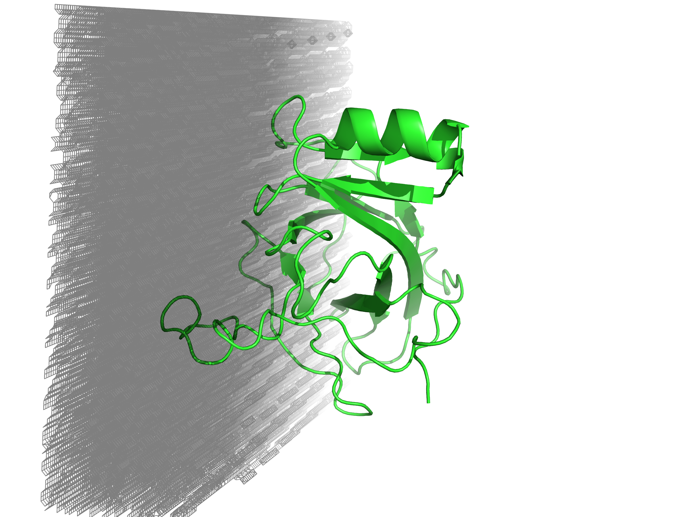
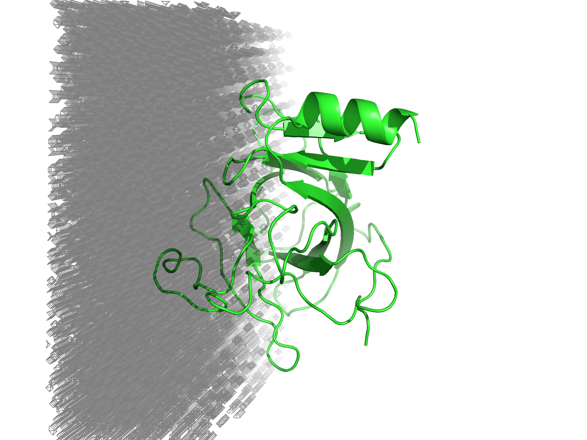
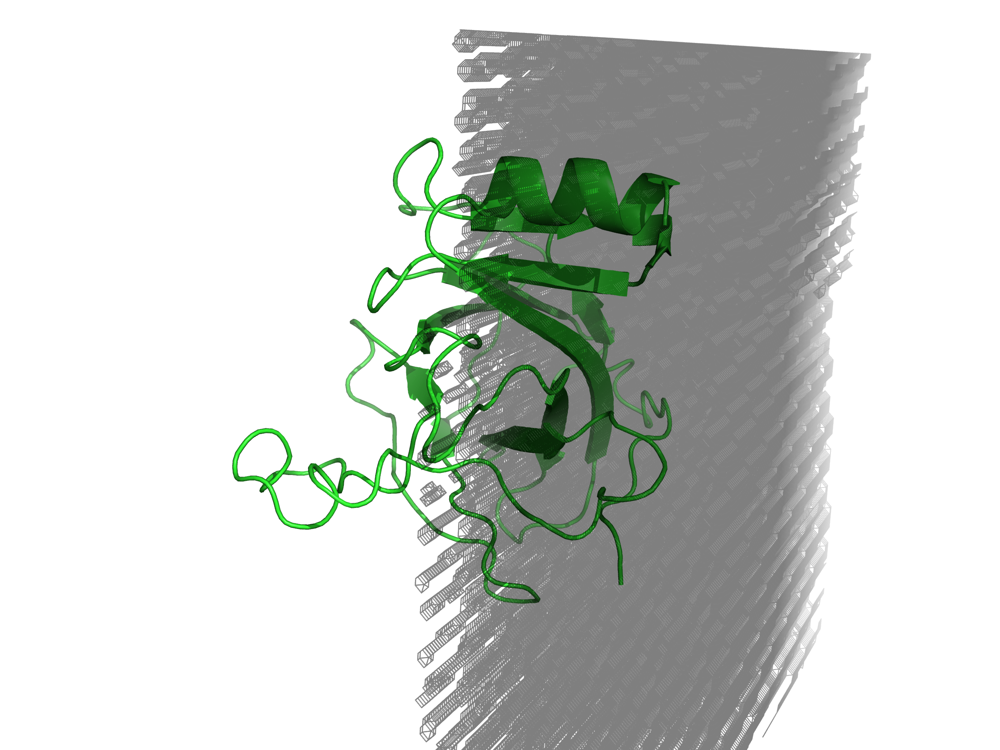
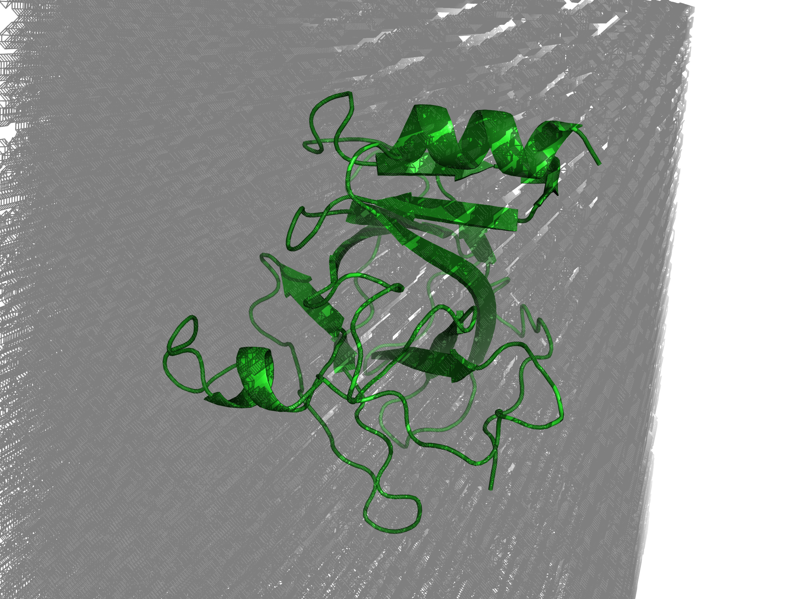
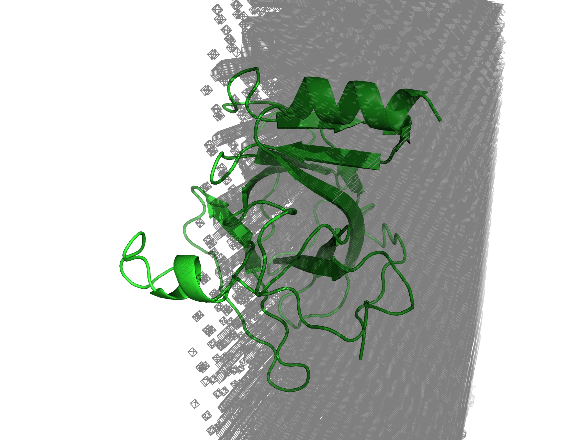
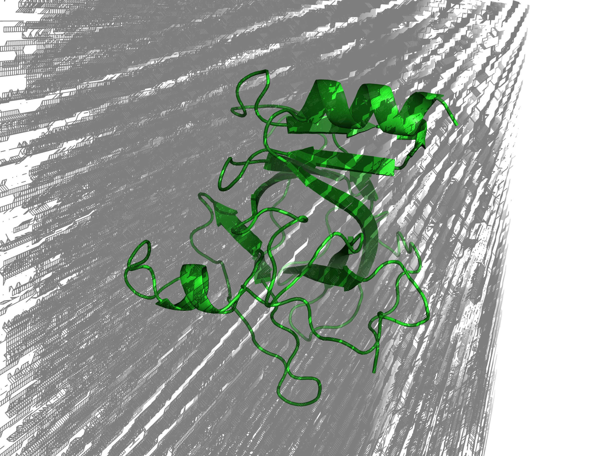

<!-- REPO_TOC -->
# FBDD Repository Structure
- [FBDD](../../../../)
  - [Frag_to_lead](../../../)
    - [9N39](../../../9N39/)
      - [1ns_Preliminary Results](../../../9N39/1ns_Preliminary%20Results/)
        - [1ns_test](../../../9N39/1ns_Preliminary%20Results/1ns_test/)
          - [NPT_equil](../../../9N39/1ns_Preliminary%20Results/1ns_test/NPT_equil/)
          - [NVT_equil](../../../9N39/1ns_Preliminary%20Results/1ns_test/NVT_equil/)
          - [Production](../../../9N39/1ns_Preliminary%20Results/1ns_test/Production/)
          - [em](../../../9N39/1ns_Preliminary%20Results/1ns_test/em/)
        - [binding_event_detection](../../../9N39/1ns_Preliminary%20Results/binding_event_detection/)
        - [mdpocket_figures](../../../9N39/1ns_Preliminary%20Results/mdpocket_figures/)
        - [occupancy_maps](../../../9N39/1ns_Preliminary%20Results/occupancy_maps/)
        - [plumed_metad_cvs](../../../9N39/1ns_Preliminary%20Results/plumed_metad_cvs/)
        - [representative_snapshots](../../../9N39/1ns_Preliminary%20Results/representative_snapshots/)
          - [P01A_probespecific_snapshots](../../../9N39/1ns_Preliminary%20Results/representative_snapshots/P01A_probespecific_snapshots/)
          - [P02A_probespecific_snapshots](../../../9N39/1ns_Preliminary%20Results/representative_snapshots/P02A_probespecific_snapshots/)
          - [P03A_probespecific_snapshots](../../../9N39/1ns_Preliminary%20Results/representative_snapshots/P03A_probespecific_snapshots/)
          - [P04A_probespecific_snapshots](../../../9N39/1ns_Preliminary%20Results/representative_snapshots/P04A_probespecific_snapshots/)
          - [global_snapshots](../../../9N39/1ns_Preliminary%20Results/representative_snapshots/global_snapshots/)
    - [Frag_to_lead_4MZI](../../)
      - [100ps_Preliminary Results](../../100ps_Preliminary%20Results/)
        - [100ps_pipeline_test](../../100ps_Preliminary%20Results/100ps_pipeline_test/)
          - [NPT_equil](../../100ps_Preliminary%20Results/100ps_pipeline_test/NPT_equil/)
          - [NVT_equil](../../100ps_Preliminary%20Results/100ps_pipeline_test/NVT_equil/)
          - [Production](../../100ps_Preliminary%20Results/100ps_pipeline_test/Production/)
          - [em](../../100ps_Preliminary%20Results/100ps_pipeline_test/em/)
        - [binding_event_detection](../../100ps_Preliminary%20Results/binding_event_detection/)
        - [mdpocket_figures](../../100ps_Preliminary%20Results/mdpocket_figures/)
        - [plumed_metad_cvs](../../100ps_Preliminary%20Results/plumed_metad_cvs/)
        - [representative_snapshots](../../100ps_Preliminary%20Results/representative_snapshots/)
      - [100ps_run_for_checkpoint_testing](../../100ps_run_for_checkpoint_testing/)
      - [1ns_Preliminary Results](../../1ns_Preliminary%20Results/)
        - [1ns_pipeline_test](../../1ns_Preliminary%20Results/1ns_pipeline_test/)
          - [NPT_equil](../../1ns_Preliminary%20Results/1ns_pipeline_test/NPT_equil/)
          - [NVT_equil](../../1ns_Preliminary%20Results/1ns_pipeline_test/NVT_equil/)
          - [Production](../../1ns_Preliminary%20Results/1ns_pipeline_test/Production/)
          - [em](../../1ns_Preliminary%20Results/1ns_pipeline_test/em/)
        - [binding_event_detection](../../1ns_Preliminary%20Results/binding_event_detection/)
        - [mdpocket_figures](../../1ns_Preliminary%20Results/mdpocket_figures/)
        - [occupancy_maps](../../1ns_Preliminary%20Results/occupancy_maps/)
        - [plumed_metad_cvs](../../1ns_Preliminary%20Results/plumed_metad_cvs/)
        - [representative_snapshots](../../1ns_Preliminary%20Results/representative_snapshots/)
      - [1ns_withpullres_withcheckpoints_Preliminary Results](../)
        - [1ns_pipeline_test](../1ns_pipeline_test/)
          - [NPT_equil](../1ns_pipeline_test/NPT_equil/)
          - [NVT_equil](../1ns_pipeline_test/NVT_equil/)
          - [Production](../1ns_pipeline_test/Production/)
          - [em](../1ns_pipeline_test/em/)
        - [binding_event_detection](../binding_event_detection/)
        - [mdpocket_figures](../mdpocket_figures/)
        - [occupancy_maps](./)
        - [plumed_metad_cvs](../plumed_metad_cvs/)
        - [representative_snapshots](../representative_snapshots/)
  - [docking_4MZI_roscovitine](../../../../docking_4MZI_roscovitine/)
  - [images](../../../../images/)
<!-- /REPO_TOC -->

# Benzene occupancy maps per window (only 2 windows shown)
[⬆️ Back to top](#fbdd-repository-structure)

<table style="border-collapse: collapse; border: none;">
  <tr>
    <td style="border: none; text-align: center;">
      <h3>A</h3>
      
    </td>
    <td style="border: none; text-align: center;">
      <h3>B</h3>
      
    </td>
  </tr>
</table>

Benzene occupancy maps were generated from (A) 0-0.2 ns and (B) 0.2-0.4 ns analysis windows of the pipeline MD simulation (total 1 ns), superimposed on the representative protein structure (PDB 4MZI – human mutant p53) for each window. The representative protein structure per window was obtained from the central frame of the window. Benzene occupancy maps are shown as black meshes. 

# Methanol occupancy maps per window (only 2 windows shown)
[⬆️ Back to top](#fbdd-repository-structure)

<table style="border-collapse: collapse; border: none;">
  <tr>
    <td style="border: none; text-align: center;">
      <h3>A</h3>
      
    </td>
    <td style="border: none; text-align: center;">
      <h3>B</h3>
      
    </td>
  </tr>
</table>

Methanol occupancy maps were generated from (A) 0-0.2 ns and (B) 0.2-0.4 ns analysis windows of the pipeline MD simulation (total 1 ns), superimposed on the representative protein structure (PDB 4MZI – human mutant p53) for each window. The representative protein structure per window was obtained from the central frame of the window. Methanol occupancy maps are shown as black meshes. 

# Acetonitrile occupancy maps per window (only 2 windows shown)
[⬆️ Back to top](#fbdd-repository-structure)

<table style="border-collapse: collapse; border: none;">
  <tr>
    <td style="border: none; text-align: center;">
      <h3>A</h3>
      
    </td>
    <td style="border: none; text-align: center;">
      <h3>B</h3>
      
    </td>
  </tr>
</table>

Acetonitrile occupancy maps were generated from (A) 0-0.2 ns and (B) 0.2-0.4 ns analysis windows of the pipeline MD simulation (total 1 ns), superimposed on the representative protein structure (PDB 4MZI – human mutant p53) for each window. The representative protein structure per window was obtained from the central frame of the window. Acetonitrile occupancy maps are shown as black meshes. 

# Toluene occupancy maps per window (only 2 windows shown)
[⬆️ Back to top](#fbdd-repository-structure)

<table style="border-collapse: collapse; border: none;">
  <tr>
    <td style="border: none; text-align: center;">
      <h3>A</h3>
      
    </td>
    <td style="border: none; text-align: center;">
      <h3>B</h3>
      
    </td>
  </tr>
</table>

Toluene occupancy maps were generated from (A) 0-0.2 ns and (B) 0.2-0.4 ns analysis windows of the pipeline MD simulation (total 1 ns), superimposed on the representative protein structure (PDB 4MZI – human mutant p53) for each window. The representative protein structure per window was obtained from the central frame of the window. Toluene occupancy maps are shown as black meshes. 

# Full trajectory occupancy maps per probe
[⬆️ Back to top](#fbdd-repository-structure)

<table style="border-collapse: collapse; border: none;">
  <tr>
    <td style="border: none; text-align: center;">
      <h3>A</h3>
      
    </td>
    <td style="border: none; text-align: center;">
      <h3>B</h3>
      
    </td>
    <td style="border: none; text-align: center;">
      <h3>C</h3>
      
    </td>
    <td style="border: none; text-align: center;">
      <h3>D</h3>
      
    </td>
  </tr>
</table>

Occupancy maps for each probe (A) benzene (B) methanol (C) acetonitrile (D) toluene were generated for the full trajectory of the pipeline MD simulation (total 1 ns), superimposed on the representative protein structure (PDB 4MZI – human mutant p53) for the whole trajectory. The representative protein structure per window was obtained from the best frame of the window (minimumRMSD to mean structure). Probe occupancy maps are shown as black meshes. 

# Full trajectory occupancy maps for all probes combined
[⬆️ Back to top](#fbdd-repository-structure)

<table style="border-collapse: collapse; border: none;">
  <tr>
    <td style="border: none; text-align: center;">
      
    </td>
  </tr>
</table>

Occupancy maps for each probe (benzene, methanol, acetonitrile, toluene) were generated for the full trajectory of the pipeline MD simulation (total 1 ns), with all of them superimposed at the same time on the representative protein structure (PDB 4MZI – human mutant p53) for the whole trajectory. The representative protein structure per window was obtained from the best frame of the window (minimumRMSD to mean structure). Probe occupancy maps are shown as black meshes. 
