<!-- REPO_TOC -->
# FBDD Repository Structure
- [FBDD](../)
  - [Frag_to_lead](./)
    - [9N39](9N39/)
      - [1ns_Preliminary Results](9N39/1ns_Preliminary%20Results/)
    - [Frag_to_lead_4MZI](Frag_to_lead_4MZI/)
      - [100ps_Preliminary Results](Frag_to_lead_4MZI/100ps_Preliminary%20Results/)
        - [100ps_pipeline_test](Frag_to_lead_4MZI/100ps_Preliminary%20Results/100ps_pipeline_test/)
          - [NPT_equil](Frag_to_lead_4MZI/100ps_Preliminary%20Results/100ps_pipeline_test/NPT_equil/)
          - [NVT_equil](Frag_to_lead_4MZI/100ps_Preliminary%20Results/100ps_pipeline_test/NVT_equil/)
          - [Production](Frag_to_lead_4MZI/100ps_Preliminary%20Results/100ps_pipeline_test/Production/)
          - [em](Frag_to_lead_4MZI/100ps_Preliminary%20Results/100ps_pipeline_test/em/)
        - [binding_event_detection](Frag_to_lead_4MZI/100ps_Preliminary%20Results/binding_event_detection/)
        - [mdpocket_figures](Frag_to_lead_4MZI/100ps_Preliminary%20Results/mdpocket_figures/)
        - [plumed_metad_cvs](Frag_to_lead_4MZI/100ps_Preliminary%20Results/plumed_metad_cvs/)
        - [representative_snapshots](Frag_to_lead_4MZI/100ps_Preliminary%20Results/representative_snapshots/)
      - [100ps_run_for_checkpoint_testing](Frag_to_lead_4MZI/100ps_run_for_checkpoint_testing/)
      - [1ns_Preliminary Results](Frag_to_lead_4MZI/1ns_Preliminary%20Results/)
        - [1ns_pipeline_test](Frag_to_lead_4MZI/1ns_Preliminary%20Results/1ns_pipeline_test/)
          - [NPT_equil](Frag_to_lead_4MZI/1ns_Preliminary%20Results/1ns_pipeline_test/NPT_equil/)
          - [NVT_equil](Frag_to_lead_4MZI/1ns_Preliminary%20Results/1ns_pipeline_test/NVT_equil/)
          - [Production](Frag_to_lead_4MZI/1ns_Preliminary%20Results/1ns_pipeline_test/Production/)
          - [em](Frag_to_lead_4MZI/1ns_Preliminary%20Results/1ns_pipeline_test/em/)
        - [binding_event_detection](Frag_to_lead_4MZI/1ns_Preliminary%20Results/binding_event_detection/)
        - [mdpocket_figures](Frag_to_lead_4MZI/1ns_Preliminary%20Results/mdpocket_figures/)
        - [occupancy_maps](Frag_to_lead_4MZI/1ns_Preliminary%20Results/occupancy_maps/)
        - [plumed_metad_cvs](Frag_to_lead_4MZI/1ns_Preliminary%20Results/plumed_metad_cvs/)
        - [representative_snapshots](Frag_to_lead_4MZI/1ns_Preliminary%20Results/representative_snapshots/)
      - [1ns_withpullres_withcheckpoints_Preliminary Results](Frag_to_lead_4MZI/1ns_withpullres_withcheckpoints_Preliminary%20Results/)
        - [1ns_pipeline_test](Frag_to_lead_4MZI/1ns_withpullres_withcheckpoints_Preliminary%20Results/1ns_pipeline_test/)
          - [NPT_equil](Frag_to_lead_4MZI/1ns_withpullres_withcheckpoints_Preliminary%20Results/1ns_pipeline_test/NPT_equil/)
          - [NVT_equil](Frag_to_lead_4MZI/1ns_withpullres_withcheckpoints_Preliminary%20Results/1ns_pipeline_test/NVT_equil/)
          - [Production](Frag_to_lead_4MZI/1ns_withpullres_withcheckpoints_Preliminary%20Results/1ns_pipeline_test/Production/)
          - [em](Frag_to_lead_4MZI/1ns_withpullres_withcheckpoints_Preliminary%20Results/1ns_pipeline_test/em/)
        - [binding_event_detection](Frag_to_lead_4MZI/1ns_withpullres_withcheckpoints_Preliminary%20Results/binding_event_detection/)
        - [mdpocket_figures](Frag_to_lead_4MZI/1ns_withpullres_withcheckpoints_Preliminary%20Results/mdpocket_figures/)
        - [occupancy_maps](Frag_to_lead_4MZI/1ns_withpullres_withcheckpoints_Preliminary%20Results/occupancy_maps/)
        - [plumed_metad_cvs](Frag_to_lead_4MZI/1ns_withpullres_withcheckpoints_Preliminary%20Results/plumed_metad_cvs/)
        - [representative_snapshots](Frag_to_lead_4MZI/1ns_withpullres_withcheckpoints_Preliminary%20Results/representative_snapshots/)
  - [docking_4MZI_roscovitine](../docking_4MZI_roscovitine/)
  - [images](../images/)
<!-- /REPO_TOC -->


--------------------------------------------------------
## Readme Table of Contents
- [FBDD Repository Structure](#fbdd-repository-structure)
  - [Readme Table of Contents](#readme-table-of-contents)
- [Frag\_to\_lead\_4MZI](#frag_to_lead_4mzi)
  - [🧬 Workflow Overview](#-workflow-overview)
  - [aLMMD Sampling / aLMMD Analysis](#almmd-sampling--almmd-analysis)
- [aLMMD Pipeline](#almmd-pipeline)
  - [Pipeline Overview](#pipeline-overview)
  - [Force Fields](#force-fields)
  - [Pipeline Workflow](#pipeline-workflow)
  - [Section 1: Preparation](#section-1-preparation)
  - [Section 2: System Setup](#section-2-system-setup)
  - [Section 3: Boosting](#section-3-boosting)
  - [Section 4: Post-processing \& Snapshot Analysis](#section-4-post-processing--snapshot-analysis)
- [Requirements](#requirements)
  - [HPC \& Backward Compatibility](#hpc--backward-compatibility)
    - [1. Tested Software Environment](#1-tested-software-environment)
      - [GROMACS](#gromacs)
      - [PLUMED](#plumed)
      - [Python](#python)
      - [Python Packages](#python-packages)
      - [Other Notes](#other-notes)
    - [2. HPC Execution Considerations](#2-hpc-execution-considerations)
    - [3. Multi-Dihedral Accelerated MD \& PLUMED](#3-multi-dihedral-accelerated-md--plumed)
  - [AMBER Compatibility and Pipeline Integration](#amber-compatibility-and-pipeline-integration)
    - [Background](#background)
    - [Conclusion](#conclusion)
- [Notes](#notes)
- [Usage](#usage)
- [HPC Production Run Script](#hpc-production-run-script)
- [HPC Resume from Backup Production Run Script](#hpc-resume-from-backup-production-run-script)
- [Fragment Library (.sdf)](#fragment-library-sdf)

--------------------------------------------------------
📌 See [CHANGELOG.md](./CHANGELOG.md) for version updates.

# Frag_to_lead_4MZI
[⬆️ Back to top](#readme-table-of-contents)

This folder contains the data and preliminary results for a fragment to lead workflow with 4MZI using aLMMD (accelerated Ligand-Mapping Molecular Dynamics).

The entire workflow can be shown as:
## 🧬 Workflow Overview
[⬆️ Back to top](#readme-table-of-contents)


This is ongoing work and i am currently working on the aLMMD sampling and analysis.

---

## aLMMD Sampling / aLMMD Analysis
[⬆️ Back to top](#readme-table-of-contents)

This aLMMD (accelerated Ligand-Mapping Molecular Dynamics) pipeline is inspired by the workflow described in the abstracts and supporting information of **Tan et al.** (2020, 2022).  

References:

- Tze-Yang Ng, J. and Tan, Y.S., 2022. Accelerated ligand-mapping molecular dynamics simulations for the detection of recalcitrant cryptic pockets and occluded binding sites. Journal of Chemical Theory and Computation, 18(3), pp.1969-1981. [Abstract & SI only — full text/code not accessed](https://pubs.acs.org/doi/10.1021/acs.jctc.1c01177) — referenced for dihedral boost, aMD, and general workflow concepts.
- Tan, Y.S. and Verma, C.S., 2020. Straightforward incorporation of multiple ligand types into molecular dynamics simulations for efficient binding site detection and characterization. Journal of Chemical Theory and Computation, 16(10), pp.6633-6644. [Abstract & SI only — full text/code not accessed](https://pubs.acs.org/doi/abs/10.1021/acs.jctc.0c00405) — referenced for general workflow concepts.

# aLMMD Pipeline

This pipeline implements an **accelerated Ligand-Mapping Molecular Dynamics (aLMMD)** workflow with automated setup, simulation, and post‑processing.  
It produces **5 (can be set) representative snapshots** for subsequent MDpocket analysis and docking tasks.
All simulation and analysis parameters were conservatively selected to ensure system stability and reproducibility across all stages, including minimization, equilibration (NVT/NPT), and production runs.

## Pipeline Overview
[⬆️ Back to top](#readme-table-of-contents)

1. **Fragment/Probe Preparation**
    - Protonate probes with RDKit and generate single 3D conformer.
    - Automatic SDF → MOL2 conversion via Antechamber + GAFF.
    - AM1‑BCC charge assignment (AmberTools, WSL2).
    - Load GAFF-protonated probes into ParmEd as full residues with explicit bonds for integration into system.

2. **Probe Placement**  
    - Multiple copies (N) of each probe placed around the protein centroid while avoiding collisions with protein and previously placed probes.
    - Unique residue naming for each copy (e.g., P01A, P01B) and sequential residue numbering.
    - Automatically removes overlapping waters within `min_dist`.
    - Collision coordinates updated after each placement to prevent overlap.
    - Final PDB saved for manual inspection.

3. **System Solvation & Neutralization**  
    - Solvate the system with TIP4P-Ew (default), with option for TIP3P or OPC (Amber ff14SB-compatible).
    - Crystallographic waters excluded prior to solvation to prevent clashes
    - Metals reintroduced as part of tleap merge.
    - Add counterions to neutralize total charge, then additional salt ions to achieve user-specified ionic strength.
    - Solvation box size automatically adjusted according to system dimensions + padding buffer.

4. **Energy Minimization(EM) & Equilibration**  
   - Energy minimization → NVT → NPT equilibration to reduce likelihood of bad contacts and large forces that might crash the system during MD runs.  
   - Automatic estimation of aMD boost parameters from equilibration (E₀, α).
   - Strong positional restraints automatically added to metal during EM to prevent drift during EM.
   - Standard positional restraints automatically added to protein and probes during EM to prevent drift during EM.
   - Pull restraints automatically added to metal to prevent drift during equilibration.
   - Standard positional restraints automatically added to protein during equilibration to prevent drift during equilibration.

5. **Multi‑Dihedral + Total‑Potential aMD with METAD CVs (Distances + COMs)**  
   - Automatic selection of torsions (protein backbone) for multi-dihedral boost.  
   - Total potential boost applied to system.
   - Accelerates exploration of backbone torsions while maintaining realistic dynamics.
   - Use of metadynamics encourages exploration of new conformational space. 
   - PLUMED METAD CVs: distances and center-of-mass (COM) coordinates of probes are automatically monitored during production.  
   - `plumed.dat` is auto-generated for U‑boost style aMD integration.

6. **GPU Acceleration**  
   - Detects GPU (CUDA/OpenCL) automatically and uses it when available.  
   - CPU fallback is supported with minor adaptations.

7. **Production Run**  
   - Full accelerated MD simulation using GROMACS 2025.03 + PLUMED 2.10.0.  
   - Plotting of PLUMED bias, total energy, and temperature after run to check stability of the MD simulation.
   - Pull restraints automatically added to metal to prevent drift in production runs.
   - Resume from checkpoint/backup files implemented to handle HPC walltime limits or crashes during ns-scale runs.
   - Five most recent checkpoint/backup folders containing all required files saved for the production run at pre-set intervals.
   - For each backup, energy/temperature/bias vs. time plots and last-frame PDBs can be generated on demand for manual inspection.
   - Before each restart, these plots and PDBs are inspected to ensure system stability (e.g., no metal drift, sharp spikes, or runaway values).

8. **Post‑processing**  
   - **Protein analysis**: C‑alpha radius of gyration (Rg) across trajectory.  
   - **Probe occupancy mapping**: Per-probe and combined density (voxel) maps.  
   - **Representative snapshot selection**: RMSD clustering, KDE peak mapping, and DBSCAN probe clustering to select representative snapshots automatically.
   - **PLUMED METAD CVs**: Probe distances and torsions are extracted, smoothed, saved as CSV, and plotted for analysis.
       - **COM Analysis**: Generate single COM overview plot for all probes.
       - Additional visualizations:
         - Per-probe x/y/z COM plots.
         - Combined per-axis plots (x-only, y-only, z-only).
         - 2D projections (x-y, x-z, y-z) for probe COMs.
         - 3D scatter plot of COMs.
         - Pairwise COM distance time series.
         - 3D scatter plots of probe COM clusters.
             - Clusters colored based on assignment (e.g., density peak vs pocket).
             - Noise points plotted in grey.
             - Legend placed outside axes for clarity.
          - **Enhanced JSON**: JSON summary of clusters and top MDpocket peaks. Includes cluster info, binding events, top MDpocket peaks per cluster.
          - **Binding events CSV/JSON**: flattened per-probe events for inspection. Includes representative frame PDBs.
   - **MDpocket analysis** is run on representative snapshots to check for cryptic and occluded sites.

9. **Output Organization**  
   - Each run output is saved under a `run_id` directory.
   - `run_id` directory contains the directories (`backup`, `gmx_run`, `gmx_temp`, `off_mols`, `plumed`).
   - Simulation outputs (`.gro`, `.trr`, `.edr`, `.tpr`, `.log`) are stored in `gmx_run`.  
   - Subdirectories in gmx_run/ for:  
     - `bias_and_energy_and_temp_plots/` → energy, temperature, bias plots.
   - Subdirectories in gmx_run/post_processing/ for:  
     - `rg/` → plots of C‑alpha radius of gyration (Rg) across trajectory.
     - `windows/` → .dx and .pdb files per window with each window having their own subdirectory.
     - `full_trajectory/` → .dx and .pdb files for the full trajectory.
     - `full_trajectory/representative_snapshots` → .pdb files for the representative snapshots.
     - `full_trajectory/representative_snapshots/cleaned_protein_pdbs` →  cleaned protein only .pdb files for the representative snapshots for downstream MDpocket analysis and docking tasks.
     - `mdpocket_analysis` → to store the MDpocket analysis results from the manual run of mdpocket outside the notebook.
     - `cv_plots/` → plots for PLUMED METAD CVs and COM Analysis, and binding events CSV/JSON.  

 ## Force Fields
    - **Protein**: AMBER ff14SB (parameters loaded from Amber prmtop files generated by tleap).
    - **DNA**: OL15 or bsc1 depending on user choice (tleap).
    - **Water**: TIP4P-Ew by default, optionally TIP3P or OPC, assigned via tleap during solvation.
    - **Small molecules / Probes (GAFF)**: GAFF v2.11 parameterized via Antechamber + tleap; included in the system prmtop/inpcrd for downstream simulation. ParmEd used to assemble probes into full system PDB/topology.
    - **Metals**: included in tleap merge

---

> **Note:** This pipeline has **potential for publication** similar to the **2020** and **2022** papers by **Tan et al.**.  
> The full code is **not publicly released on GitHub**, but is **available upon request** to technical interviewers or collaborators for evaluation purposes.
> If you **require access to the private repo containing the code**, please **contact me via the email** provided in my application/CV.

---

## Pipeline Workflow
[⬆️ Back to top](#readme-table-of-contents)

The aLMMD pipeline is divided into four main sections, each corresponding to a distinct phase of the workflow:
> **Note:** This workflow diagram is a high-level overview. Steps are grouped by functional purpose, not strict chronological order in the code.


## Section 1: Preparation

```mermaid
flowchart TD
    A["Protein & Probe Files (PDB, SDF)"] --> B["Protonate probes with RDKit & generate 3D conformers"]
    B --> C["Automatic SDF → MOL2 via Antechamber + GAFF"]
    C --> D["Load GAFF-protonated probes into ParmEd as full residues for system assembly"]
```


## Section 2: System Setup


## Section 3: Boosting


## Section 4: Post-processing & Snapshot Analysis


---

# Requirements
[⬆️ Back to top](#readme-table-of-contents)

> See [HPC & Backward Compatibility](#hpc--backward-compatibility) for supported GROMACS/PLUMED versions.
> ## Linux OS Compatibility

> The pipeline is fully compatible with native Linux systems. Only minor adjustments are needed:

> - **Paths:** Convert all Windows-style paths to Linux paths (e.g., `/home/user/...`).
> - **Executables:** Ensure `antechamber_exe` and `PLUMED_KERNEL` point to Linux locations.
> - **Shell commands:** Adjust any `find "C:/Users/..."` or backslash-escaped paths to Linux equivalents.
> - WSL dependencies are **optional**; the code is OS-agnostic.

- AmberTools 24: Ensure antechamber is available on PATH or set `antechamber_exe` to the full path
- GROMACS 2025.03 (External installation with CUDA and plumed support recommended for faster runs. Alternaltively can just use conda-forge installation but this only has plumed support and no CUDA support)
- External installation of Plumed 2.10.0
- External installation of fpocket (MDpocket) 4.0
- OpenMM 8.2
> **Note:** If running on a HPC cluster with older versions or no external build support you will have to use
> Gromacs 23/24 and plumed 2.9.2 installed via conda forge instead.
> 
> AmberTools 24 is backward compatible.
> 
> In the notebook just remember to set the paths to gromacs and the plumed kernel properly and
> you will also need to set the path variable in the python environment

- GPU with CUDA support (optional but recommended for accelerated MD)
- Python dependencies (Windows/WSL2): 
  `rdkit, openmm, openmmforcefields, mdtraj, numpy, openbabel, pdbfixer, fpocket, mdanalysis, parmed, pymol-open-source
- Pipeline was run in WSL2
- WSL2 setup: Ubuntu 22.04.5, Miniforge3, Conda environment `almmd`
- PLUMED kernel environment variable set via: 
  ```bash
  export PLUMED_KERNEL="$CONDA_PREFIX/lib/libplumedKernel.so"

- Verify installations: gmx --version, and gmx mdrun -h | grep -i plumed
- WSL2 was installed using wsl --install in PowerShell, with Ubuntu 22.04.5 installed separately as per the instructions at: https://www.windowscentral.com/how-install-wsl2-windows-10 

---
The following commands were executed after the initial setup inside WSL.

```bash
# Download installer for Miniforge (Conda) inside Ubuntu
wget https://github.com/conda-forge/miniforge/releases/latest/download/Miniforge3-Linux-x86_64.sh

# Run installer
bash Miniforge3-Linux-x86_64.sh
    
# Create environment named 'almmd'
conda create -n almmd python=3.11 -y

# activate environment
conda activate almmd

# Add dacase channel for AmberTools
conda config --add channels conda-forge
conda config --set channel_priority strict

# Conda installations
# Note if using previous version of gromacs and plumed (eg. for HPC cluster) install via: conda install -c conda-forge gromacs=2024 plumed=2.9.2
conda install -c conda-forge openmm=8.2 openmmforcefields cudatoolkit=11.8 ambertools=24 openbabel rdkit mdtraj -y
conda install -c conda-forge pdbfixer
conda install -c conda-forge parmed -y
conda install -c conda-forge mdanalysis


# RUN THE EXTERNAL INSTALLATIONS IN A NEW TERMINAL WINDOW IE. NO ENVIRONMENT
#===========================================================================
# EXTERNAL INSTALLATION OF CUDA 12.6
#===========================================================================
# Exit conda
conda deactivate

# You’ll see no (base) or (almmd) prefix now
# Download NVIDIA repo pin
wget https://developer.download.nvidia.com/compute/cuda/repos/ubuntu2204/x86_64/cuda-ubuntu2204.pin
sudo mv cuda-ubuntu2204.pin /etc/apt/preferences.d/cuda-repository-pin-600

# Add CUDA repo
sudo apt-key adv --fetch-keys https://developer.download.nvidia.com/compute/cuda/repos/ubuntu2204/x86_64/3bf863cc.pub
sudo add-apt-repository "deb https://developer.download.nvidia.com/compute/cuda/repos/ubuntu2204/x86_64/ /"

# Install CUDA 12.6
sudo apt update
sudo apt install cuda-toolkit-12-6

# now install nvidia-cuda-toolkit
cd ~
sudo apt install nvidia-cuda-toolkit
echo 'export PATH=/usr/local/cuda/bin:$PATH' >> ~/.bashrc
echo 'export LD_LIBRARY_PATH=/usr/local/cuda/lib64:$LD_LIBRARY_PATH' >> ~/.bashrc
source ~/.bashrc

# verify
nvcc --version
#===========================================================================
# EXTERNAL INSTALLATION OF PLUMED 2.10.0
#===========================================================================

***IMPORTANT***
'''
RUN THE FOLLOWING COMMANDS IN A NEW TERMINAL OR REMEMBER TO DO conda activate first after the CUDA installation
'''

# External installation of plumed 2.10.0
cd ~
wget https://www.plumed.org/downloads/plumed-2.10.0.tgz
tar -xvf plumed-2.10.0.tgz
cd plumed-2.10.0

./configure --prefix=$HOME/opt/plumed-2.10
make -j 4
make install

# verify plumed version
plumed info --version  
  
# Ensure Plumed compatibility
# (you might have to export a different path depending on where your plumed is installed depending on your system)
cd ~  
nano ~/.bashrc

# add these lines at the end of ~/.bashrc  
export PLUMED_KERNEL=$HOME/opt/plumed-2.10/lib/libplumedKernel.so
export PATH=$HOME/opt/plumed-2.10/bin:$PATH
export LD_LIBRARY_PATH=$HOME/opt/plumed-2.10/lib:$LD_LIBRARY_PATH  
    
# Reload .bashrc:
source ~/.bashrc

# Go back to almmd environment
conda activate almmd

# verify environment variable
echo $PLUMED_KERNEL

# get location of plumed kernel to place in jupyter notebook or for gromacs installation 
find $CONDA_PREFIX -name "libplumedKernel.so"
   
#===========================================================================
# EXTERNAL INSTALLATION OF GROMACS WITH CUDA SUPPORT AND PLUMED SUPPORT
#===========================================================================
# conda-forge gromacs 2025.3 has plumed support but not CUDA support

***IMPORTANT***
'''
RUN THE FOLLOWING COMMANDS IN A NEW TERMINAL OR REMEMBER TO go back to base environment after the plumed installation
'''

#------------------------------------------------------------------------------------
# cmake installation
cd $HOME
wget https://github.com/Kitware/CMake/releases/download/v3.30.5/cmake-3.30.5-linux-x86_64.tar.gz
tar -xzf cmake-3.30.5-linux-x86_64.tar.gz

# Add this to end of ~/.bashrc
cd ~  
nano ~/.bashrc
export PATH=$HOME/cmake-3.30.5-linux-x86_64/bin:$PATH
source ~/.bashrc

# verify
cmake --version

#------------------------------------------------------------------------------------
# Gromacs installation
export GMX_VERSION=2025.03
export GMX_PREFIX=$HOME/opt/gromacs-$GMX_VERSION
export BUILD_DIR=$HOME/build/gromacs-$GMX_VERSION
mkdir -p $BUILD_DIR
cd $BUILD_DIR

cd ~/build
wget https://ftp.gromacs.org/pub/gromacs/gromacs-2025.3.tar.gz
tar -xzf gromacs-2025.3.tar.gz
cd gromacs-2025.3

mkdir build
cd build

export CUDA_HOME=/usr/local/cuda
export PATH=$CUDA_HOME/bin:$PATH
export LD_LIBRARY_PATH=$CUDA_HOME/lib64:$LD_LIBRARY_PATH

export PATH=$HOME/opt/plumed-2.10/bin:$PATH 
export LD_LIBRARY_PATH=$HOME/opt/plumed-2.10/lib:$LD_LIBRARY_PATH
export PLUMED_KERNEL=$HOME/opt/plumed-2.10/lib/libplumedKernel.so

# Run cmake
cmake .. \
  -DCMAKE_INSTALL_PREFIX=$HOME/opt/gromacs-2025.3 \
  -DGMX_BUILD_OWN_FFTW=ON \
  -DGMX_GPU=CUDA \
  -DGMX_USE_PLUMED=ON \
  -DGMX_CUDA_TARGET_SM=89

# build and install
make -j$(nproc)
make install
source $HOME/opt/gromacs-2025.3/bin/GMXRC

verification:
gmx mdrun -version
gmx mdrun -h | grep -i plumed

#===========================================================================
# EXTERNAL INSTALLATION OF fpocket 4.0
#===========================================================================
# In a new terminal window
cd ~ 
conda activate almmd
sudo apt update
sudo apt install -y git cmake build-essential
cd ~
git clone https://github.com/Discngine/fpocket.git
cd fpocket
make

# add fpocket to your PATH
nano ~/.bashrc

# add this to the end of the .bashrc
export PATH=$HOME/fpocket/bin:$PATH

# **Double check that the end of the ~/.bashrc contains all the lines below**
export PATH=/usr/local/cuda/bin:$PATH
export LD_LIBRARY_PATH=/usr/local/cuda/lib64:$LD_LIBRARY_PATH
export PATH=$HOME/cmake-3.30.5-linux-x86_64/bin:$PATH
export PLUMED_KERNEL=$HOME/opt/plumed-2.10/lib/libplumedKernel.so
export PATH=$HOME/opt/plumed-2.10/bin:$PATH
export LD_LIBRARY_PATH=$HOME/opt/plumed-2.10/lib:$LD_LIBRARY_PATH
export PATH=$HOME/fpocket/bin:$PATH

# reload
source ~/.bashrc

# verify installation
which mdpocket

# output
/home/marcuswangweihow/fpocket/bin/mdpocket
  
```

---

## HPC & Backward Compatibility
[⬆️ Back to top](#readme-table-of-contents)

This workflow has been designed with HPC execution and reproducibility in mind, reflecting careful consideration of GROMACS + PLUMED setup, file handling, and automated PLUMED generation. The HPC cluster at A*Star ([https://www.a-star.edu.sg/acrc/service/hpc-software/hpc-software-listing](https://www.a-star.edu.sg/acrc/service/hpc-software/hpc-software-listing)) seems to support support user‑compiled or “external builds”.

### 1. Tested Software Environment
#### GROMACS
- Tested on **2025.03** (installed via conda-forge).  
- **Note:** GROMACS 2024 binary (installed via conda-forge) **does not** include runtime PLUMED support. This will trigger a "cannot recognise -plumed option" when running the pipeline.  
- Options for running with PLUMED:
  1. Build **GROMACS 2025 + PLUMED 2.10.0** from source as per the installation instructions under the requirements section.
  2. Use **GROMACS 2025 conda-forge**, which already supports runtime PLUMED, and point to the desired PLUMED kernel (as currently implemented in this pipeline with an external build of PLUMED 2.10.0). Testing was not done with plumed 2.92 from conda-forge. Note that conda-forge Gromacs does not have CUDA support.


#### PLUMED
- Input files auto-generated via `generate_plumed_v2_10`.
- Compatible with **PLUMED 2.10** (supports multi-dihedral accelerated MD).  
- **Testing was not done** with PLUMED 2.9.2 from conda-forge or an external build of PLUMED 2.9.2. However, documentation suggests that the pipeline is compatible with **PLUMED 2.9.2**.
- Older PLUMED versions (<2.9) are **not supported**.

#### Python
- Tested on **Python 3.11**.

#### Python Packages
- Required: `ParmEd`, `MDAnalysis`, `numpy`, `matplotlib`.

#### Other Notes
- Downgrading to OpenMM 8.0 and AmberTools 23 does **not** affect the pipeline.

### 2. HPC Execution Considerations
- **Parallelization & MPI:** Production runs support MPI/OpenMP; workflow respects checkpointing with `-cpi prod.cpt`.  
- **Temporary directories:** Intermediate files stored in `gmx_temp_dir`; final outputs in `gmx_run_dir` to reduce I/O overhead.  
- **Checkpointing:** Automatic handling of `.cpt` files ensures long simulations can resume seamlessly.  
- **POSRES & Topology Handling:** Positional restraints use local indices; `top_clean.top` is preserved to allow safe regeneration of `.tpr` files.  

### 3. Multi-Dihedral Accelerated MD & PLUMED
- Automatically selects slowest-moving torsions from NPT equilibration for multi-dihedral aMD.  
- Total-potential aMD applied via PLUMED.  
- Probe atom indices adjusted automatically for PLUMED compatibility.  
- PLUMED input copied to `gmx_temp_dir` and reusable across HPC nodes, ensuring reproducible simulations.

## AMBER Compatibility and Pipeline Integration
[⬆️ Back to top](#readme-table-of-contents)

### Background
Some users may have existing AMBER workflows with `.prmtop` and `.inpcrd` files. These could be:

1. **Complete AMBER system files**  
   - Already include probes, forcefields, ions, and other modifications.
   - Complete, high-res AMBER prmtop/inpcrd -> Load in ParmEd, convert to GROMACS (Step 6c)
   - The pipeline can take these files for downstream steps: minimization, equilibration, PLUMED generation, production runs, and post-processing. (Step 7EXT-External complete AMBER file)  
   - Useful if users already have a fully set-up system but needs automated aLMMD or need restraints or advanced post-processing.

2. **Solvated protein/DNA/RNA-only AMBER files**  
   - Contain only the solvated protein structure with optional DNA/RNA structures.
   - The pipeline can take these files for downstream steps: probe-placement, minimization, equilibration, PLUMED generation, production runs, and post-processing. (Step 6c)   
   - Runs in the same fashion as having complete AMBER system files, just starting at an earlier step in the pipeline.

3. **Low-res / missing backbone / disordered PDB containing AMBER files**  
   - Rebuild from scratch using the pipeline since the pipeline (PDBFixer/tleap) handles this issue; do not rely on incomplete AMBER files
   - Parmed might load the structure (Step 7EXT-External complete AMBER file) but cannot fix the residues. MD simulations might not be accurate.


### Conclusion
- **Complete AMBER system files:** Use pipeline for downstream aLMMD, generating restraints, and post-processing.  
- **Solvated protein/DNA/RNA-only AMBER files:** Use pipeline for probe-placement, downstream aLMMD, generating restraints, and post-processing.
- **Low-res / missing backbone / disordered PDB containing AMBER files:** Rebuild from scratch using the pipeline.    


# Notes
[⬆️ Back to top](#readme-table-of-contents)

Multi dihedral boost applied to protein backbone inspired by Tan et al. (2020, 2022)

Total-potential aMD performed via PLUMED

Metadynamics CVs automatically extracted from probe positions (distances and COMs)

Probe occupancy maps generated to select snapshots with highest density

5 representative snapshots automatically selected for downstream docking analysis

Trajectories and snapshots saved in PDB format

GPU auto-detection with CUDA available; CPU fallback supported

---

# Usage
[⬆️ Back to top](#readme-table-of-contents)

1. **Set up inputs**  
   - Input structures can be obtained via download from the Protein Data Bank as Legacy PDB Format (.pdb) or PDBx/mmCIF format (.cif). Load the input structure in PyMOL.
   - Preprocess the input structures in PyMOL -> remove waters, remove bound ligands if present -> save as _clean.pdb (eg. "/mnt/c/Users/Admin/Documents/Documents/Misc/FBDD_project/9N39/9N39_clean.pdb")
   - Specify the **input PDB** file (`input_pdb`) and **probe SDF/MOL2 files** (`probe_files`) in your Jupyter notebook.  

2. **Antechamber executable**  
   - Ensure `antechamber_exe` points to the correct Antechamber executable (either via **WSL2** or native installation).

3. **PLUMED kernel (if using accelerated MD / Metadynamics CVs)**  
   - Set the PLUMED kernel environment variable before running the notebook:

     ```bash
     export PLUMED_KERNEL="$CONDA_PREFIX/lib/libplumedKernel.so"
     ```
  - Ensure that the os.environ["PLUMED_KERNEL"] points to the correct path for "/lib/libplumedKernel.so"

4. **Run the pipeline notebook**  
   - Performs **probe placement** around protein centroid.  
   - **Solvates and neutralizes** the system.  
   - Applies **multi-dihedral accelerated MD** to protein (backbone + side chains) and ligand torsions.  
   - Executes **total-potential aMD** via PLUMED, including **Metadynamics CVs**.  
   - Produces **probe occupancy maps** and automatically selects **5 representative snapshots**.  
   - Saves **trajectories, processed snapshots, and energy/temperature plots** for downstream analysis.

5. **Access outputs**  
   - Each run output is saved under a `run_id` directory.
   - `run_id` directory contains the directories (`backup`, `gmx_run`, `gmx_temp`, `off_mols`, `plumed`).
   - Simulation outputs (`.gro`, `.trr`, `.edr`, `.tpr`, `.log`) are stored in `gmx_run`.  
   - Subdirectories in gmx_run/ for:  
     - `bias_and_energy_and_temp_plots/` → energy, temperature, bias plots.
   - Subdirectories in gmx_run/post_processing/ for:  
     - `rg/` → plots of C‑alpha radius of gyration (Rg) across trajectory.
     - `windows/` → .dx and .pdb files per window with each window having their own subdirectory.
     - `full_trajectory/` → .dx and .pdb files for the full trajectory.
     - `full_trajectory/representative_snapshots` → .pdb files for the representative snapshots.
     - `full_trajectory/representative_snapshots/cleaned_protein_pdbs` →  cleaned protein only .pdb files for the representative snapshots for downstream MDpocket analysis and docking tasks.
     - `mdpocket_analysis` → to store the MDpocket analysis results from the manual run of mdpocket outside the notebook.
     - `cv_plots/` → plots for PLUMED METAD CVs and COM Analysis, and binding events CSV/JSON.  

---

# HPC Production Run Script
[⬆️ Back to top](#readme-table-of-contents)

This script ([production_run.py](production_run.py)) automates the production molecular dynamics stage of the FBDD + aLMMD + multi-dihedral boosting workflow on HPC systems. It is designed to:

Launch GROMACS + PLUMED simulations using the pre-prepared input files from steps 1–11.

Handle periodic backups and output organization.

Generate plots for energy, temperature, and bias potentials.

> Note: This script is provided as a functional example for HPC submission. It **does not contain the novel methodological steps** (probe placement, aLMMD boosting, torsion selection, occupancy mapping) described in steps 1–11, which constitute the core scientific contributions of the workflow.

Users must manually set key parameters before launching a job such as:

- run_id
- protein_pdb path
- Probe parameters (probe_names, num_copies_per_probe)
- Simulation length / checkpoint interval

# HPC Resume from Backup Production Run Script
[⬆️ Back to top](#readme-table-of-contents)

This script ([resume_from_backup.py](resume_from_backup.py)) is designed to:

Restart the production run from a backup if the run crashed or was interrupted eg. by HPC walltime limit.

> Note: This script is provided as a functional example for HPC submission. It **does not contain the novel methodological steps** (probe placement, aLMMD boosting, torsion selection, occupancy mapping) described in steps 1–11, which constitute the core scientific contributions of the workflow.

Users must manually set key parameters before launching a job such as:

- run_id
- protein_pdb path
- Probe parameters (probe_names, num_copies_per_probe)
- Simulation length / checkpoint interval


---

# Fragment Library (.sdf)
[⬆️ Back to top](#readme-table-of-contents)

The data for the fragment library was downloaded from ZINC-22 at https://cartblanche.docking.org/tranches/3d

- Fragments subset was selected.
- H08 to H11 columns were selected with all layers (top-left option).
- Charge was set to 0
- M000 to P030 were selected corresponding to roughly 0–3 logP

In total, 20 cells were selected with the interface.

All files were set to be downloaded in sdf format via CURL method. 

The curl file returned was ZINC22-downloader-3D-sdf.tgz.curl. This file is available in this directory. The individual files will not be uploaded here as they will exceed the size limit of GitHub.

Git bash 2.51.2-64-bit was used to download the files. The bash commands used were:

```bash
# Go to the directory with the curl file
cd "/c/Users/Admin/Documents/Documents/Misc/FBDD project/ZINC22 data"

# Create a directory for saving
mkdir -p "ZINC22_all"

# This step ensures every line in the curl file saves to a unique filename instead of overwriting.
awk '{
  match($0, /https:\/\/files\.docking\.org\/zinc22\/([A-Za-z0-9\/._-]+)\.sdf\.tgz/, arr);
  if (arr[1] != "") {
    safe_name = arr[1];
    gsub("/", "_", safe_name);
    sub("-o [^ ]+", "-o \"ZINC22_all/" safe_name ".sdf.tgz\"");
  }
  print $0;
}' "ZINC22-downloader-3D-sdf.tgz.curl" > "fixed_downloads.curl"

# Run all the download commands
while read cmd; do eval "$cmd"; done < "fixed_downloads.curl"

# Check number of .tgz files
find "ZINC22_all" -name "*.sdf.tgz" | wc -l

# Extract all .tgz archives
find "ZINC22_all" -name "*.sdf.tgz" -exec tar -xvzf {} -C "ZINC22_all" \;

# Gather all .sdf into one folder
mkdir -p "combined_sdf"
find "ZINC22_all" -name "*.sdf" -exec cp {} "combined_sdf/" \;

# If necessary count how many sdf files there are
ls "combined_sdf" | wc -l

```
A total of 137 curl requests was executed succesfully, returning 137 .tgz files.

This returned a total of 30765 .sdf files ie. 30765 molecules which is sufficient for further analysis.

---
