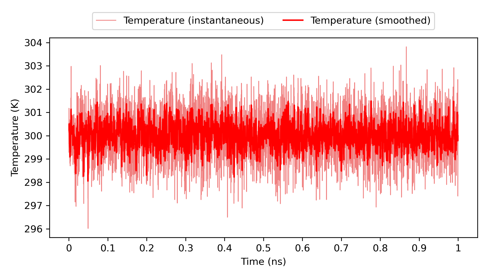

<!-- REPO_TOC -->
# FBDD Repository Structure
- [FBDD](../../)
  - [Frag_to_lead_4MZI](../)
    - [100ps_Preliminary Results](../100ps_Preliminary%20Results/)
      - [100ps_pipeline_test](../100ps_Preliminary%20Results/100ps_pipeline_test/)
        - [NPT_equil](../100ps_Preliminary%20Results/100ps_pipeline_test/NPT_equil/)
        - [NVT_equil](../100ps_Preliminary%20Results/100ps_pipeline_test/NVT_equil/)
        - [Production](../100ps_Preliminary%20Results/100ps_pipeline_test/Production/)
        - [em](../100ps_Preliminary%20Results/100ps_pipeline_test/em/)
      - [binding_event_detection](../100ps_Preliminary%20Results/binding_event_detection/)
      - [mdpocket_figures](../100ps_Preliminary%20Results/mdpocket_figures/)
      - [plumed_metad_cvs](../100ps_Preliminary%20Results/plumed_metad_cvs/)
      - [representative_snapshots](../100ps_Preliminary%20Results/representative_snapshots/)
    - [1ns_Preliminary Results](./)
      - [1ns_pipeline_test](1ns_pipeline_test/)
        - [NPT_equil](1ns_pipeline_test/NPT_equil/)
        - [NVT_equil](1ns_pipeline_test/NVT_equil/)
        - [Production](1ns_pipeline_test/Production/)
        - [em](1ns_pipeline_test/em/)
      - [binding_event_detection](binding_event_detection/)
      - [mdpocket_figures](mdpocket_figures/)
      - [occupancy_maps](occupancy_maps/)
      - [plumed_metad_cvs](plumed_metad_cvs/)
      - [representative_snapshots](representative_snapshots/)
  - [docking_4MZI_roscovitine](../../docking_4MZI_roscovitine/)
  - [images](../../images/)
<!-- /REPO_TOC -->

-----------------

# 1ns_Preliminary Results
[⬆️ Back to top](#fbdd-repository-structure)

**NOTE THAT MOST OF THE README IN THIS DIRECTORY AND SUBDIRECTORIES ARE PLACEHOLDERS FOR THE UPCOMING RESULTS**

This folder contains the preliminary/test results from the pipeline such as energy, temperature and bias plots, as well as post-processing plots (eg. occupancy maps) for a 1ns production run. The preliminary outputs from Gromacs for energy minimization, NVT equilibration, NPT equilibration and the short 100ps production run to show pipeline/workflow functionality can be found in ([1ns_pipeline_test](1ns_pipeline_test/)).

Representative snapshots and MDpocket analysis can be found in ([representative_snapshots](representative_snapshots/)) and ([mdpocket_figures](mdpocket_figures/)) respectively within this directory.

Plots for the PLUMED metadynamics CVs can be found in ([plumed_metad_cvs](plumed_metad_cvs/)) within this directory. 

Details and preliminary results for Binding Event Detection and Pocket Mapping can be found in the binding_event_detection folder ([binding_event_detection](binding_event_detection/)) within this directory.

**All these preliminary results are merely to show pipeline/workflow functionality.**

---

# Benzene occupancy maps per window (only 2 windows shown)
[⬆️ Back to top](#fbdd-repository-structure)

<table style="border-collapse: collapse; border: none;">
  <tr>
    <td style="border: none; text-align: center;">
      <h3>A</h3>
      
    </td>
    <td style="border: none; text-align: center;">
      <h3>B</h3>
      
    </td>
  </tr>
</table>

Benzene occupancy maps were generated from (A) 0 ps and (B)  ps analysis windows of the pipeline MD simulation (total 1 ns), superimposed on the representative protein structure (PDB 4MZI – human mutant p53) for each window. The representative protein structure per window was obtained from the central frame of the window. Benzene occupancy maps are shown as black meshes. 

# Methanol occupancy maps per window (only 2 windows shown)
[⬆️ Back to top](#fbdd-repository-structure)

<table style="border-collapse: collapse; border: none;">
  <tr>
    <td style="border: none; text-align: center;">
      <h3>A</h3>
      
    </td>
    <td style="border: none; text-align: center;">
      <h3>B</h3>
      
    </td>
  </tr>
</table>

Methanol occupancy maps were generated from (A) 0 ps and (B)  ps analysis windows of the pipeline MD simulation (total 1 ns), superimposed on the representative protein structure (PDB 4MZI – human mutant p53) for each window. The representative protein structure per window was obtained from the central frame of the window. Methanol occupancy maps are shown as black meshes. 

# Acetonitrile occupancy maps per window (only 2 windows shown)
[⬆️ Back to top](#fbdd-repository-structure)

<table style="border-collapse: collapse; border: none;">
  <tr>
    <td style="border: none; text-align: center;">
      <h3>A</h3>
      
    </td>
    <td style="border: none; text-align: center;">
      <h3>B</h3>
      
    </td>
  </tr>
</table>

Acetonitrile occupancy maps were generated from (A) 0 ps and (B)  ps analysis windows of the pipeline MD simulation (total 1 ns), superimposed on the representative protein structure (PDB 4MZI – human mutant p53) for each window. The representative protein structure per window was obtained from the central frame of the window. Acetonitrile occupancy maps are shown as black meshes. 

# Toluene occupancy maps per window (only 2 windows shown)
[⬆️ Back to top](#fbdd-repository-structure)

<table style="border-collapse: collapse; border: none;">
  <tr>
    <td style="border: none; text-align: center;">
      <h3>A</h3>
      
    </td>
    <td style="border: none; text-align: center;">
      <h3>B</h3>
      
    </td>
  </tr>
</table>

Toluene occupancy maps were generated from (A) 0– ps and (B)  ps analysis windows of the pipeline MD simulation (total 1 ns), superimposed on the representative protein structure (PDB 4MZI – human mutant p53) for each window. The representative protein structure per window was obtained from the central frame of the window. Toluene occupancy maps are shown as black meshes. 

# Full trajectory occupancy maps per probe
[⬆️ Back to top](#fbdd-repository-structure)

<table style="border-collapse: collapse; border: none;">
  <tr>
    <td style="border: none; text-align: center;">
      <h3>A</h3>
      
    </td>
    <td style="border: none; text-align: center;">
      <h3>B</h3>
      
    </td>
    <td style="border: none; text-align: center;">
      <h3>C</h3>
      
    </td>
    <td style="border: none; text-align: center;">
      <h3>D</h3>
      
    </td>
  </tr>
</table>

Occupancy maps for each probe (A) benzene (B) methanol (C) acetonitrile (D) toluene were generated for the full trajectory of the pipeline MD simulation (total 1 ns), superimposed on the representative protein structure (PDB 4MZI – human mutant p53) for the whole trajectory. The representative protein structure per window was obtained from the best frame of the window (minimumRMSD to mean structure). Probe occupancy maps are shown as black meshes. 

# Full trajectory occupancy maps for all probes combined
[⬆️ Back to top](#fbdd-repository-structure)

<table style="border-collapse: collapse; border: none;">
  <tr>
    <td style="border: none; text-align: center;">
      
    </td>
  </tr>
</table>

Occupancy maps for each probe (benzene, methanol, acetonitrile, toluene) were generated for the full trajectory of the pipeline MD simulation (total 1 ns), with all of them superimposed at the same time on the representative protein structure (PDB 4MZI – human mutant p53) for the whole trajectory. The representative protein structure per window was obtained from the best frame of the window (minimumRMSD to mean structure). Occupancy maps for each probe (benzene, methanol, acetonitrile, toluene) are shown as (black, blue, orange, brown) meshes respectively. 

## energy.png
[⬆️ Back to top](#fbdd-repository-structure)

This plot shows the changes in the (instantaneous and smoothed) potential energy (kJ/mol) of the system as the MD simulation progresses ie. MD step increases.

## temperature.png
[⬆️ Back to top](#fbdd-repository-structure)

This plot shows the changes in the (instantaneous and smoothed) temperature (K) of the system as the MD simulation progresses ie. MD step increases.

## energy_temperature_dual.png
[⬆️ Back to top](#fbdd-repository-structure)

This plot shows both of the changes in the (instantaneous and smoothed) temperature (K) of the system, as well as the changes in the (instantaneous and smoothed) potential energy (kJ/mol) of the system as the MD simulation progresses ie. MD step increases. 

## plumed_bias.png
[⬆️ Back to top](#fbdd-repository-structure)

This plot shows the changes in the bias (kJ/mol) of the system as the MD simulation progresses ie. MD step increases.

## Calpha_Rg.png
[⬆️ Back to top](#fbdd-repository-structure)

This plot shows the changes in C-alpha Rg (nm) of the protein backbone as the MD simulation progresses ie. time increases.

## Calpha_Rg_RMSD_combined.png
[⬆️ Back to top](#fbdd-repository-structure)

This plot shows the changes in C-alpha Rg (nm) of the protein backbone as the MD simulation progresses ie. time increases. 

