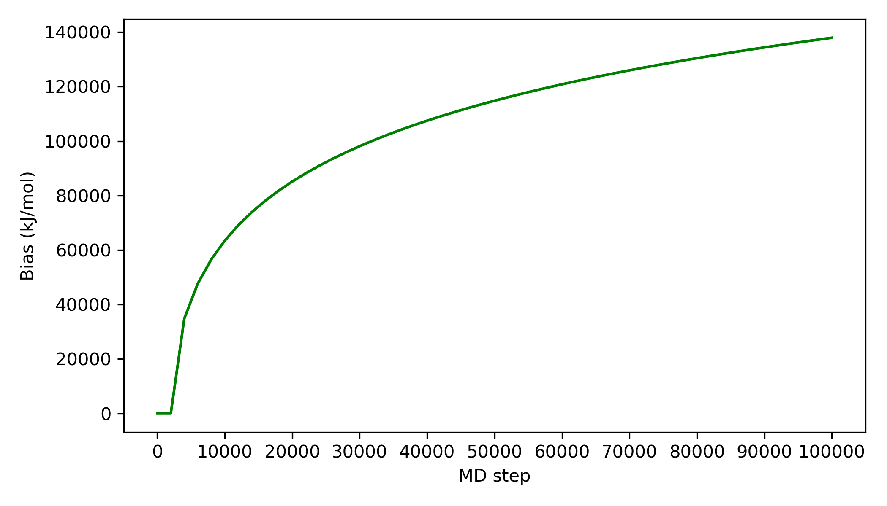
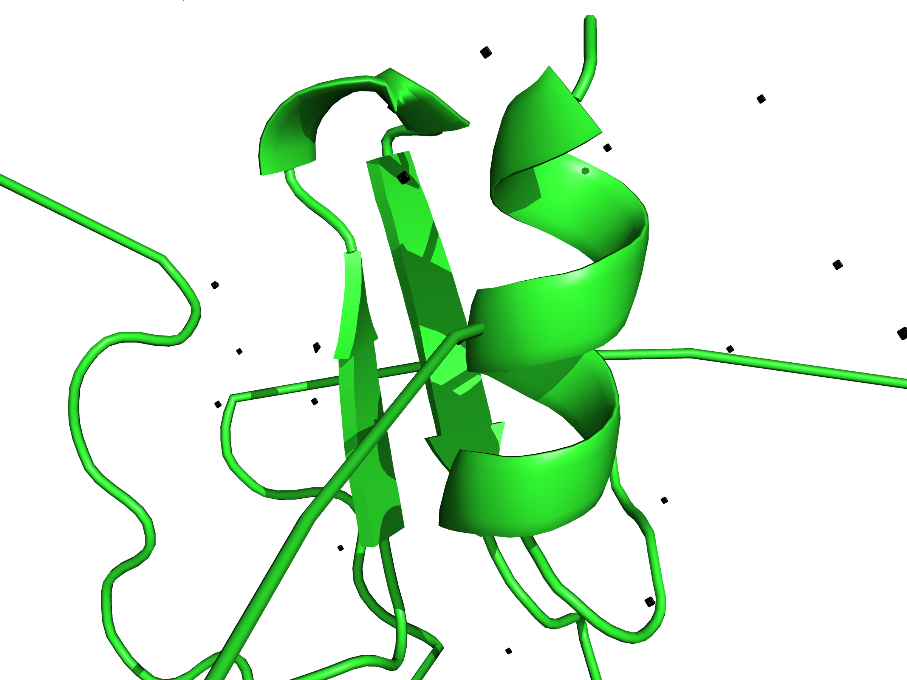
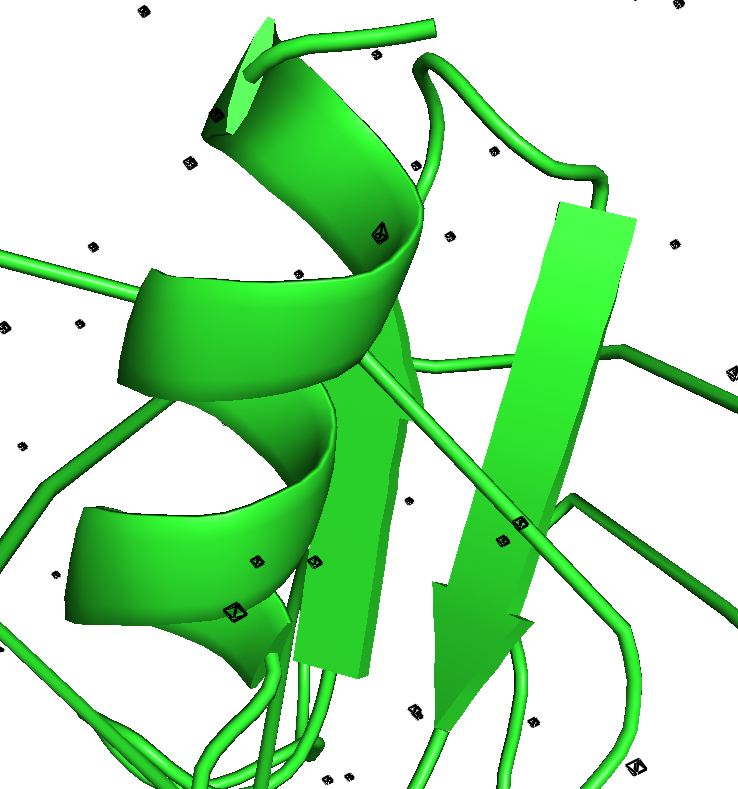

# Preliminary Results
This folder contains the preliminary/test results from the pipeline such as energy, temperature and bias plots, as well as post-processing plots for a 100ps production run.

---

## energy.png
This plot shows the changes in the (instantaneous and smoothed) potential energy (kJ/mol) of the system as the MD simulation progresses ie. MD step increases. The plot shows that the system is stable ie. no large fluctuations in potential energy.

## temperature.png
This plot shows the changes in the (instantaneous and smoothed) temperature (K) of the system as the MD simulation progresses ie. MD step increases. The plot shows that the system is stable ie. no large fluctuations in temperature.

## energy_temperature_dual.png
This plot shows both of the changes in the (instantaneous and smoothed) temperature (K) of the system, as well as the changes in the (instantaneous and smoothed) potential energy (kJ/mol) of the system as the MD simulation progresses ie. MD step increases. The plot shows that the system is stable ie. no large fluctuations in temperature or potential energy.

## plumed_bias.png
This plot shows the changes in the bias (kJ/mol) of the system as the MD simulation progresses ie. MD step increases. The plot shows that most of the relevant collective variable (CV) regions have been visited since the increase in bias is slowing down.

## Calpha_Rg.png
This plot shows the changes in C-alpha Rg (nm) of the protein backbone as the MD simulation progresses ie. time increases.

## Calpha_Rg_RMSD_combined.png
This plot shows the changes in C-alpha Rg (nm) of the protein backbone as the MD simulation progresses ie. time increases. The plot shows that there is likely a structural change from ca. 0.065ns to ca. 0.095ns as marked by the drop in the radius of gyration together with an increase in RMSD, where RMSD measures deviation from the reference structure (the initial conformation). The fall in the radius of gyration indicates the protein is becoming more compact in that region of the trajectory. The smaller wells with fewer black dots represents shorter-lived or smaller deviations — minor conformational shifts, local motions, or fluctuations.

# Benzene occupancy maps per window (only 2 windows shown)
<table style="border-collapse: collapse; border: none;">
  <tr>
    <td style="border: none; text-align: center;">
      <h3>A</h3>
      
    </td>
    <td style="border: none; text-align: center;">
      <h3>B</h3>
      
    </td>
  </tr>
</table>

Benzene occupancy maps were generated from (A) Cluster 2 (0–20 ps) and (B) Cluster 1 (21–40 ps) analysis windows of the pipeline MD simulation (total 100 ps), superimposed on the representative protein structure (PDB 4MZI – human mutant p53) for each window. The representative structure was chosen as the snapshot whose probe atoms best overlap with the average grid peaks. Benzene occupancy maps are shown as black meshes.

The small and scattered appearance of the meshes is due to each cluster being based on only a handful of snapshots (5 per window by default) and the relatively short production run of 100 ps. As a result, the isomesh polygons are tiny and dispersed — the “hotspot” occupancy has not fully converged. Each mesh essentially reflects a limited number of probe binding events, rather than a fully sampled occupancy. Longer production runs (ns-scale) and more snapshots per window would yield smoother, more interpretable clusters.

# Methanol occupancy maps per window (only 2 windows shown)
<table style="border-collapse: collapse; border: none;">
  <tr>
    <td style="border: none; text-align: center;">
      <h3>A</h3>
      
    </td>
    <td style="border: none; text-align: center;">
      <h3>B</h3>
      
    </td>
  </tr>
</table>

Methanol occupancy maps were generated from (A) Cluster 2 (0–20 ps) and (B) Cluster 1 (21–40 ps) analysis windows of the pipeline MD simulation (total 100 ps), superimposed on the representative protein structure (PDB 4MZI – human mutant p53) for each window. The representative structure was chosen as the snapshot whose probe atoms best overlap with the average grid peaks. Methanol occupancy maps are shown as black meshes.

The small and scattered appearance of the meshes is due to each cluster being based on only a handful of snapshots (5 per window by default) and the relatively short production run of 100 ps. As a result, the isomesh polygons are tiny and dispersed — the “hotspot” occupancy has not fully converged. Each mesh essentially reflects a limited number of probe binding events, rather than a fully sampled occupancy. Longer production runs (ns-scale) and more snapshots per window would yield smoother, more interpretable clusters.

