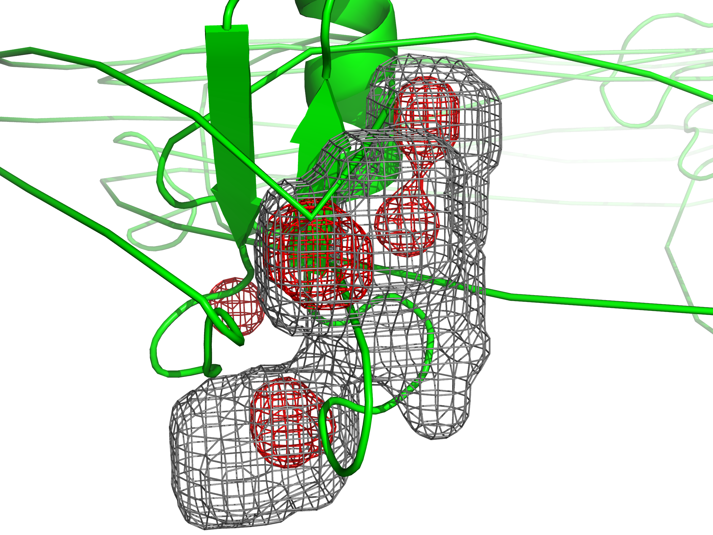
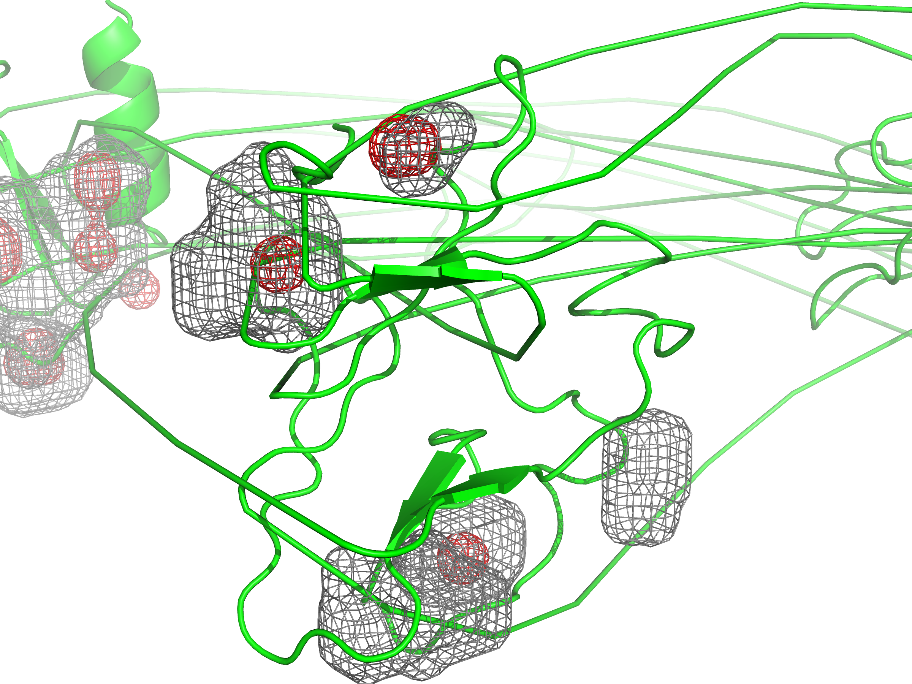

# FBDD Repository Structure

- [FBDD](../../../)
  - [Frag_to_lead_4MZI](../../)
      - [Preliminary Results](../)
        - [binding_event_detection](../binding_event_detection/)
        - [mdpocket_figures](./)
        - [plumed_metad_cvs](../plumed_metad_cvs/)
        - [representative_snapshots](../representative_snapshots/)

------------------------------------

The MDpocket figures shown here are **preliminary** results for a short 100ps production run of the pipeline for worklflow functionality illustration purposes.
 - High-density regions (dens_iso 8, red meshes) and frequent occupancy (freq_iso 0.5, gray meshes)

Each representative snapshot was analyzed using MDpocket to generate:

 - Occupancy grids (freq_iso), highlighting frequently sampled pockets.

 - Density grids (dens_iso), highlighting highly populated regions.

Potential cryptic or occluded sites are identified outside frequent-density regions.

Figures illustrate pocket locations, occupancy density, and potential druggable regions.

All figures show the MDpocket density maps generated from a short 100ps test simulation of 4MZI.

# overview.png
Overall pocket occupancy map from representative snapshots.

# region1.png & region2.png
Localized views highlighting high-density regions (dens_iso 8, red meshes) and frequent occupancy (freq_iso 0.5, gray meshes).
<table style="border-collapse: collapse; border: none;">
  <tr>
    <td style="border: none; text-align: center;">
      <h3>A</h3>
      
    </td>
    <td style="border: none; text-align: center;">
      <h3>B</h3>
      
    </td>
  </tr>
</table>

# cryptic_site.png 
Example of a potential cryptic or occluded pocket identified outside high-frequency regions.

