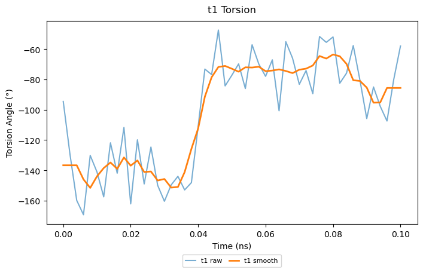
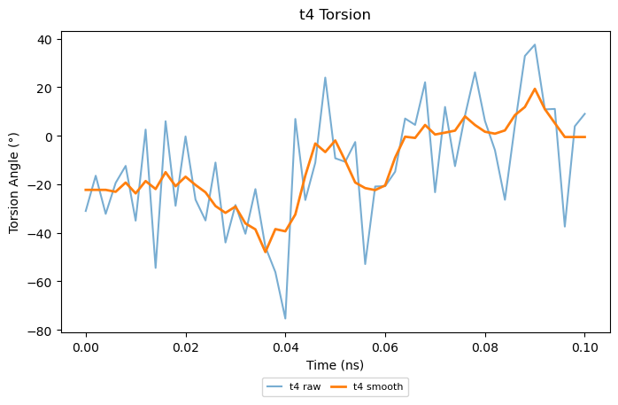

# Distance and torsion plots

The distance vs time plots as well as the torsions vs time plots obatined by plotting the data from plumed_bias_scalar.dat are just for sanity checks.

The plots show that the dihedrals change with time and the probes are moving, which shows the system is working.

# Distance vs time plots
<table style="border-collapse: collapse; border: none;">
  <tr>
    <td style="border: none; text-align: center;">
      <h3>A</h3>
      
    </td>
    <td style="border: none; text-align: center;">
      <h3>B</h3>
      
    </td>
    <td style="border: none; text-align: center;">
      <h3>C</h3>
      
    </td>
  </tr>
</table>

# Torsions vs time plots
<table style="border-collapse: collapse; border: none;">
  <tr>
    <td style="border: none; text-align: center;">
      <h3>A</h3>
      
    </td>
    <td style="border: none; text-align: center;">
      <h3>B</h3>
      
    </td>
    <td style="border: none; text-align: center;">
      <h3>C</h3>
      
    </td>
    <td style="border: none; text-align: center;">
      <h3>D</h3>
      
    </td>
  </tr>
</table>

# Combined torsions vs time plot

