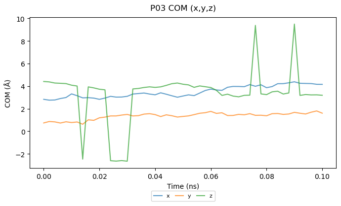
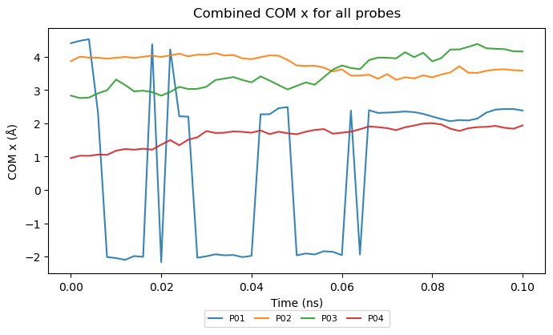
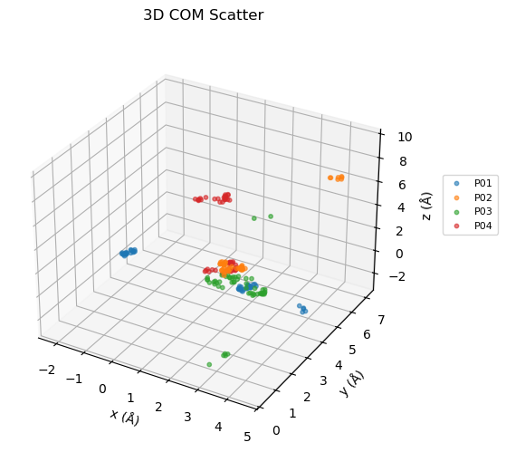

plumed_bias_scalar.dat and plumed_com_components.dat contain the raw data for the below plots. These files were generated from a short 100ps production test run. 

**All results shown here are preliminary results and only serve to show workflow/pipeline functionality.**

# From plumed_bias_scalar.dat
## Distance and torsion plots

The distance vs time plots as well as the torsions vs time plots obatined by plotting the data from plumed_bias_scalar.dat are just for sanity checks.

The plots show that the dihedrals change with time and the probes are moving, which shows the system is working.

## Distance vs time plots
<table style="border-collapse: collapse; border: none;">
  <tr>
    <td style="border: none; text-align: center;">
      <h3>A</h3>
      
    </td>
    <td style="border: none; text-align: center;">
      <h3>B</h3>
      
    </td>
    <td style="border: none; text-align: center;">
      <h3>C</h3>
      
    </td>
  </tr>
</table>

## Torsions vs time plots
<table style="border-collapse: collapse; border: none;">
  <tr>
    <td style="border: none; text-align: center;">
      <h3>A</h3>
      
    </td>
    <td style="border: none; text-align: center;">
      <h3>B</h3>
      
    </td>
    <td style="border: none; text-align: center;">
      <h3>C</h3>
      
    </td>
    <td style="border: none; text-align: center;">
      <h3>D</h3>
      
    </td>
  </tr>
</table>

## Combined torsions vs time plot

---
# From plumed_com_components.dat

With more probes and longer simulations, the 2D/3D COM density plots could become informative about preferred probe regions, which might correspond to cryptic or binding sites.

Otherwise with just 4 probes and short 100ps runs, mostly a sanity check.

## Per-probe (x,y,z) plots
See if any probe is behaving weirdly.
<table style="border-collapse: collapse; border: none;">
  <tr>
    <td style="border: none; text-align: center;">
      <h3>A</h3>
      
    </td>
    <td style="border: none; text-align: center;">
      <h3>B</h3>
      
    </td>
    <td style="border: none; text-align: center;">
      <h3>C</h3>
      
    </td>
    <td style="border: none; text-align: center;">
      <h3>D</h3>
      
    </td>
  </tr>
</table>

## Combined per-axis plots (x-only, y-only, z-only)
Detects if probes drift together or if one is outlier.
<table style="border-collapse: collapse; border: none;">
  <tr>
    <td style="border: none; text-align: center;">
      <h3>A</h3>
      
    </td>
    <td style="border: none; text-align: center;">
      <h3>B</h3>
      
    </td>
    <td style="border: none; text-align: center;">
      <h3>C</h3>
      
    </td>
  </tr>
</table>

## 2D projections (x-y, x-z, y-z)
See if probes overlap unphysically or leave the expected region.
<table style="border-collapse: collapse; border: none;">
  <tr>
    <td style="border: none; text-align: center;">
      <h3>A</h3>
      
    </td>
    <td style="border: none; text-align: center;">
      <h3>B</h3>
      
    </td>
    <td style="border: none; text-align: center;">
      <h3>C</h3>
      
    </td>
  </tr>
</table>

## 3D COM scatter
Good for spotting impossible geometries, clustering, or probes stuck together.

For multiple copies or long simulations, dense clusters may indicate potential hotspots or binding regions. 

## Pairwise COM distances
To confirm probes don’t collide or drift apart unexpectedly.

