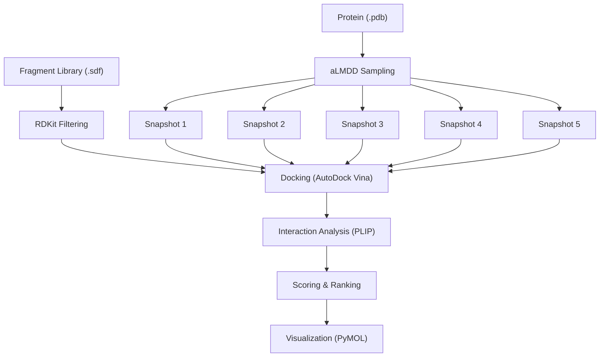
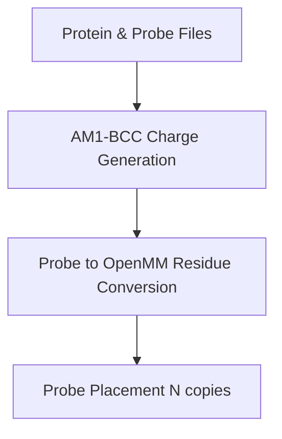
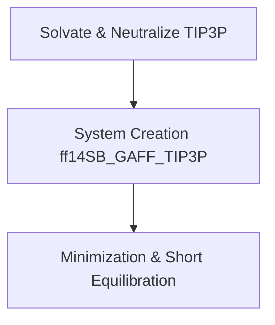
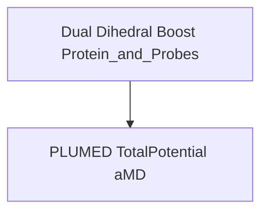
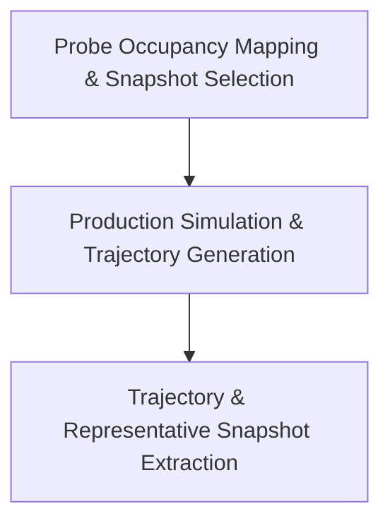

# Frag_to_lead_4MZI
This folder contains the data and results for a fragment to lead workflow with 4MZI.

The entire fragment to lead workflow can be shown as:
## 🧬 Fragment to Lead Workflow Overview



This is ongoing work and i am currently working on the aLMDD sampling as of 7 Nov 2025.

Completed parts of workflow:
- Fragment Library (.sdf)
- Protein (.pdb)

# Fragment Library (.sdf)
The data for the fragment library was downloaded from ZINC-22 at https://cartblanche.docking.org/tranches/3d

- Fragments subset was selected.
- H08 to H11 columns were selected with all layers (top-left option).
- Charge was set to 0
- M000 to P030 were selected corresponding to roughly 0–3 logP

In total, 20 cells were selected with the interface.

All files were set to be downloaded in sdf format via CURL method. 

The curl file returned was ZINC22-downloader-3D-sdf.tgz.curl. This file is available in this directory. The individual files will not be uploaded here as they will exceed the size limit of GitHub.

Git bash 2.51.2-64-bit was used to download the files. The bash commands used were:

```bash
# Go to the directory with the curl file
cd "/c/Users/Admin/Documents/Documents/Misc/FBDD project/ZINC22 data"

# Create a directory for saving
mkdir -p "ZINC22_all"

# This step ensures every line in the curl file saves to a unique filename instead of overwriting.
awk '{
  match($0, /https:\/\/files\.docking\.org\/zinc22\/([A-Za-z0-9\/._-]+)\.sdf\.tgz/, arr);
  if (arr[1] != "") {
    safe_name = arr[1];
    gsub("/", "_", safe_name);
    sub("-o [^ ]+", "-o \"ZINC22_all/" safe_name ".sdf.tgz\"");
  }
  print $0;
}' "ZINC22-downloader-3D-sdf.tgz.curl" > "fixed_downloads.curl"

# Run all the download commands
while read cmd; do eval "$cmd"; done < "fixed_downloads.curl"

# Check number of .tgz files
find "ZINC22_all" -name "*.sdf.tgz" | wc -l

# Extract all .tgz archives
find "ZINC22_all" -name "*.sdf.tgz" -exec tar -xvzf {} -C "ZINC22_all" \;

# Gather all .sdf into one folder
mkdir -p "combined_sdf"
find "ZINC22_all" -name "*.sdf" -exec cp {} "combined_sdf/" \;

# If necessary count how many sdf files there are
ls "combined_sdf" | wc -l

```
A total of 137 curl requests was executed succesfully, returning 137 .tgz files.

This returned a total of 30765 .sdf files ie. 30765 molecules which is sufficient for further analysis.

---

# aLMDD Sampling

This is the aLMDD (accelerated Ligand Mobility in Molecular Dynamics) pipeline, fully aligned with **Tan et al.**.  

## Features

- Windows-native Antechamber AM1-BCC automation  
- Probe → OpenMM residue conversion (real residues, bonds)  
- Probe placement (N copies)  
- Solvate & neutralize (TIP3P)  
- Minimization → equilibration → automated boost parameter estimation  
- **Dual dihedral boost** (protein + probes, non-optional)  
- AM1‑BCC charges for probes  
- **PLUMED-based total-potential aMD integration**  
- GPU (CUDA) auto-detection and usage  
- Force fields: **ff14SB + GAFF + TIP3P**  
- Probe occupancy density map & automatic snapshot selection  
- Trajectory + representative snapshot extraction  

## Pipeline Workflow
The aLMDD pipeline is divided into four main sections, each corresponding to a distinct phase of the workflow. Follow them sequentially from Section 1 → Section 4:

## Section 1: Preparation


## Section 2: System Setup


## Section 3: Boosting

## Section 4: Analysis



# Requirements

AmberTools: Ensure antechamber is available on PATH or set antechamber_exe to the full path

OpenMM ForceField XML files: ff14SB.xml, gaff.xml, tip3p.xml (installed with OpenMM)

GPU (CUDA) drivers if using GPU acceleration

Python dependencies: rdkit, openmm, openmmforcefields, mdtraj, numpy, plumed

# Notes

All probes are automatically converted to OpenMM residues with proper bond connectivity

Dual dihedral boost is applied to both protein and probes according to Tan et al.

Total-potential aMD is performed via PLUMED to reproduce the exact accelerated MD

Probe occupancy maps are automatically generated to select snapshots with highest density

Trajectories and snapshots are saved in PDB format for further analysis

# Usage

Set protein_pdb and probe_files in your notebook

Ensure antechamber_exe points to the correct Antechamber executable (WSL2 or native)

Run the pipeline notebook to generate charges, build the system, apply dual dihedral boost, run aMD, and extract snapshots

Access trajectory and snapshot outputs for downstream analysis

# References

Tan et al., J Chem Theory Comput. 2022 Mar 8;18(3):1969-1981. doi: 10.1021/acs.jctc.1c01177. Epub 2022 Feb 17 — for dual dihedral boost, aMD settings, and probe placement protocols.
Available from (https://pubs.acs.org/doi/10.1021/acs.jctc.1c01177)

---

