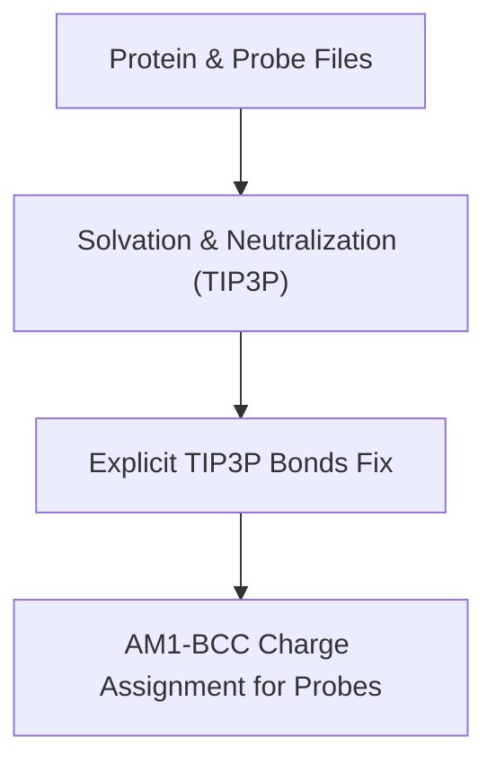
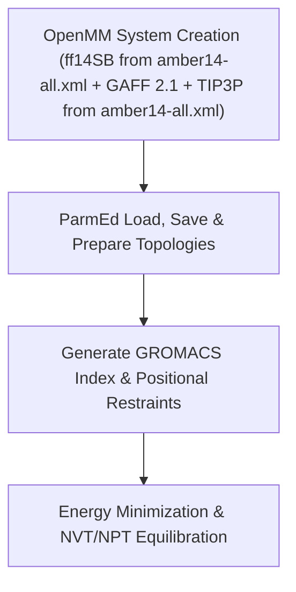
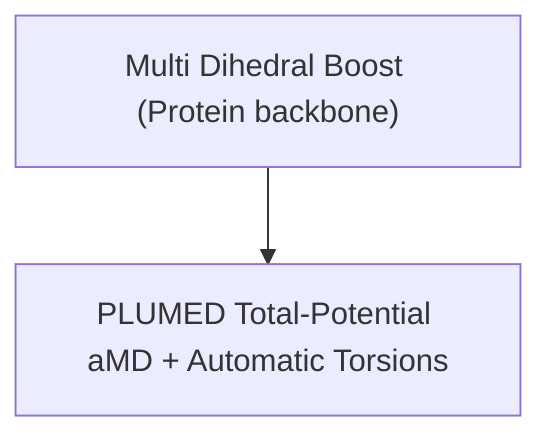
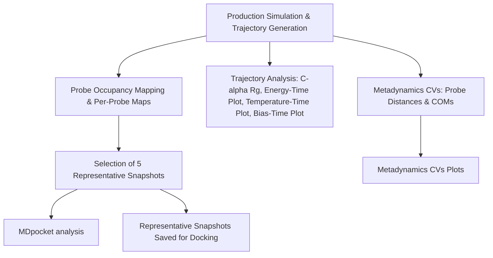

# FBDD Repository Structure

- [FBDD](../)
    - [Frag_to_lead_4MZI](./)
        - [Preliminary Results](Preliminary%20Results/)
          - [100ps_pipeline_test](Preliminary%20Results/100ps_pipeline_test/)
          - [binding_event_detection](Preliminary%20Results/binding_event_detection/)
          - [mdpocket_figures](Preliminary%20Results/mdpocket_figures/)
          - [plumed_metad_cvs](Preliminary%20Results/plumed_metad_cvs/)
          - [representative_snapshots](Preliminary%20Results/representative_snapshots/)

--------------------------------------------------------
## Table of Contents
- [Frag_to_lead_4MZI](#frag_to_lead_4mzi)
- [🧬 Workflow Overview](#-workflow-overview)
- [Preliminary Results](#preliminary-results)
- [Fragment Library (.sdf)](#fragment-library-sdf)
- [aLMMD Sampling / aLMMD Analysis](#almmd-sampling--almmd-analysis)
    - [aLMMD Pipeline](#almmd-pipeline)
        - [Pipeline Overview](#pipeline-overview)
        - [Pipeline Workflow](#pipeline-workflow)
- [Requirements](#requirements)
- [HPC & Backward Compatibility](#hpc--backward-compatibility)
- [AMBER Compatibility and Pipeline Integration](#amber-compatibility-and-pipeline-integration)
- [Notes](#notes)
- [Usage](#usage)

--------------------------------------------------------
# Frag_to_lead_4MZI
This folder contains the data and results for a fragment to lead workflow with 4MZI using aLMMD (accelerated Ligand-Mapping Molecular Dynamics).

The entire workflow can be shown as:
## 🧬 Workflow Overview


This is ongoing work and i am currently working on the aLMMD sampling and analysis.

---

# Preliminary Results
This folder contains the preliminary/test results from the pipeline such as energy, temperature and bias plots, as well as post-processing plots (eg. occupancy maps) for a 100ps production run. The preliminary outputs from Gromacs for energy minimization, NVT equilibration, NPT equilibration and the short 100ps production run to show pipeline/workflow functionality can be found in ([100ps_pipeline_test](Preliminary%20Results/100ps_pipeline_test/)).

Representative snapshots and MDpocket analysis can be found in ([representative_snapshots](Preliminary%20Results/representative_snapshots/)) and ([mdpocket_figures](Preliminary%20Results/mdpocket_figures/)) respectively.

Plots for the PLUMED metadynamics CVs can be found in ([plumed_metad_cvs](Preliminary%20Results/plumed_metad_cvs/)). 

Details and preliminary results for Binding Event Detection and Pocket Mapping can be found in the binding_event_detection folder ([binding_event_detection](Preliminary%20Results/binding_event_detection/)).

**All these preliminary results are merely to show pipeline/workflow functionality.**

# Fragment Library (.sdf)
[⬆️ Back to top](#table-of-contents)

The data for the fragment library was downloaded from ZINC-22 at https://cartblanche.docking.org/tranches/3d

- Fragments subset was selected.
- H08 to H11 columns were selected with all layers (top-left option).
- Charge was set to 0
- M000 to P030 were selected corresponding to roughly 0–3 logP

In total, 20 cells were selected with the interface.

All files were set to be downloaded in sdf format via CURL method. 

The curl file returned was ZINC22-downloader-3D-sdf.tgz.curl. This file is available in this directory. The individual files will not be uploaded here as they will exceed the size limit of GitHub.

Git bash 2.51.2-64-bit was used to download the files. The bash commands used were:

```bash
# Go to the directory with the curl file
cd "/c/Users/Admin/Documents/Documents/Misc/FBDD project/ZINC22 data"

# Create a directory for saving
mkdir -p "ZINC22_all"

# This step ensures every line in the curl file saves to a unique filename instead of overwriting.
awk '{
  match($0, /https:\/\/files\.docking\.org\/zinc22\/([A-Za-z0-9\/._-]+)\.sdf\.tgz/, arr);
  if (arr[1] != "") {
    safe_name = arr[1];
    gsub("/", "_", safe_name);
    sub("-o [^ ]+", "-o \"ZINC22_all/" safe_name ".sdf.tgz\"");
  }
  print $0;
}' "ZINC22-downloader-3D-sdf.tgz.curl" > "fixed_downloads.curl"

# Run all the download commands
while read cmd; do eval "$cmd"; done < "fixed_downloads.curl"

# Check number of .tgz files
find "ZINC22_all" -name "*.sdf.tgz" | wc -l

# Extract all .tgz archives
find "ZINC22_all" -name "*.sdf.tgz" -exec tar -xvzf {} -C "ZINC22_all" \;

# Gather all .sdf into one folder
mkdir -p "combined_sdf"
find "ZINC22_all" -name "*.sdf" -exec cp {} "combined_sdf/" \;

# If necessary count how many sdf files there are
ls "combined_sdf" | wc -l

```
A total of 137 curl requests was executed succesfully, returning 137 .tgz files.

This returned a total of 30765 .sdf files ie. 30765 molecules which is sufficient for further analysis.

---

## aLMMD Sampling / aLMMD Analysis
[⬆️ Back to top](#table-of-contents)

This aLMMD (accelerated Ligand-Mapping Molecular Dynamics) pipeline is inspired by the workflow described in the abstracts and supporting information of **Tan et al.** (2020, 2022).  

References:

- Tze-Yang Ng, J. and Tan, Y.S., 2022. Accelerated ligand-mapping molecular dynamics simulations for the detection of recalcitrant cryptic pockets and occluded binding sites. Journal of Chemical Theory and Computation, 18(3), pp.1969-1981. [Abstract & SI only — full text/code not accessed](https://pubs.acs.org/doi/10.1021/acs.jctc.1c01177) — referenced for dihedral boost, aMD, and general workflow concepts.
- Tan, Y.S. and Verma, C.S., 2020. Straightforward incorporation of multiple ligand types into molecular dynamics simulations for efficient binding site detection and characterization. Journal of Chemical Theory and Computation, 16(10), pp.6633-6644. [Abstract & SI only — full text/code not accessed](https://pubs.acs.org/doi/abs/10.1021/acs.jctc.0c00405) — referenced for general workflow concepts.

# aLMMD Pipeline

This pipeline implements an **accelerated Ligand-Mapping Molecular Dynamics (aLMMD)** workflow with automated setup, simulation, and post‑processing.  
It produces **5 (can be set) representative snapshots** for subsequent MDpocket analysis and docking tasks.

## Pipeline Overview
[⬆️ Back to top](#table-of-contents)

1. **Fragment/Probe Preparation**  
    - Automatic SDF → MOL2 conversion with 3D coordinates.
    - AM1‑BCC charge assignment via Antechamber (AmberTools, WSL2).
    - Conversion of probes into OpenMM residues (full residues, explicit bonds).
    - Supports multiple probes (P01, P02, …) with per-probe residue templates. 

2. **Probe Placement**  
    - N copies of each probe placed around the protein centroid while avoiding collisions 

3. **System Solvation & Neutralization**  
   - TIP3P water model.  
   - Ionic strength / counterion neutralization as needed.

4. **Energy Minimization & Equilibration**  
   - Energy minimization → NVT → NPT equilibration.  
   - Automatic estimation of aMD boost parameters from equilibration (E₀, α).

5. **Multi‑Dihedral + Total‑Potential aMD with METAD CVs (Distances + COMs)**  
   - Automatic selection of torsions (protein backbone) for multi-dihedral boost.  
   - Total potential boost applied to system.  
   - PLUMED METAD CVs: distances and center-of-mass (COM) coordinates of probes are automatically monitored during production.  
   - `plumed.dat` is auto-generated for U‑boost style aMD integration.

6. **GPU Acceleration**  
   - Detects GPU (CUDA/OpenCL) automatically and uses it when available.  
   - CPU fallback is supported with minor adaptations.

7. **Production Run**  
   - Full accelerated MD simulation using PLUMED.  
   - Plotting of PLUMED bias, total energy, and temperature after run.

8. **Post‑processing**  
   - **Protein analysis**: C‑alpha radius of gyration (Rg) across trajectory.  
   - **Probe occupancy mapping**: Per-probe and combined density (voxel) maps.  
   - **Representative snapshot selection**: RMSD clustering, KDE peak mapping, and DBSCAN probe clustering to select representative snapshots.
   - **PLUMED METAD CVs**: Probe distances and torsions are extracted, smoothed, saved as CSV, and plotted for analysis.
       - **COM Analysis**: Generate single COM overview plot for all probes.
       - Additional visualizations:
         - Per-probe x/y/z COM plots.
         - Combined per-axis plots (x-only, y-only, z-only).
         - 2D projections (x-y, x-z, y-z) for probe COMs.
         - 3D scatter plot of COMs.
         - Pairwise COM distance time series.
         - 3D scatter plots of probe COM clusters.
             - Clusters colored based on assignment (e.g., density peak vs pocket).
             - Noise points plotted in grey.
             - Legend placed outside axes for clarity.
          - **Enhanced JSON**: JSON summary of clusters and top MDpocket peaks. Includes cluster info, binding events, top MDpocket peaks per cluster.
          - **Binding events CSV/JSON**: flattened per-probe events for inspection. Includes representative frame PDBs.
   - **MDpocket analysis** is run on representative snapshots.

9. **Output Organization**  
   - Simulation outputs (`.gro`, `.trr`, `.edr`, `.tpr`, `.log`) are stored in `gmx_run_dir`.  
   - Subdirectories in gmx_run_dir/ for:  
     - `bias_and_energy_and_temp_plots/` → energy, temperature, bias plots
   - Subdirectories in gmx_run_dir/post_processing/ for:  
     - `rg/` → plots of C‑alpha radius of gyration (Rg) across trajectory 
     - `windows/` → .dx and .pdb files per window
     - `full_trajectory/` → .dx and .pdb files for the full trajectory
     - `full_trajectory/representative_snapshots` → .pdb files for the representative snapshots
     - `full_trajectory/representative_snapshots/cleaned_protein_pdbs` →  cleaned protein only .pdb files for the representative snapshots for downstream MDpocket analysis and docking tasks
     - `mdpocket_analysis` → to store the MDpocket analysis results from the manual run of mdpocket outside the notebook
     - `cv_plots/` → plots for PLUMED METAD CVs and COM Analysis, and binding events CSV/JSON  

 ## Force Fields

    - **Protein**: AMBER ff14SB, via `amber14-all.xml` (includes ff14SB).  
    - **Water**: TIP3P, standard model from Amber `amber14` force field.  
    - **Small molecules / Probes (GAFF)**:  
      - GAFF version 2.11, via `GAFFTemplateGenerator` (OpenMM-compatible).  

---

> **Note:** This pipeline has potential for publication similar to the 2020 and 2022 papers by Tan et al.  
> The full code is **not publicly released on GitHub**, but is **available upon request** to technical interviewers or collaborators for evaluation purposes.
> If you require access, please contact me via the email provided in my application/CV.

---

## Pipeline Workflow
[⬆️ Back to top](#table-of-contents)

The aLMMD pipeline is divided into four main sections, each corresponding to a distinct phase of the workflow:
> **Note:** This workflow diagram is a high-level overview. Steps are grouped by functional purpose, not strict chronological order in the code.


## Section 1: Preparation


## Section 2: System Setup


## Section 3: Boosting


## Section 4: Post-processing & Snapshot Analysis


---

# Requirements
[⬆️ Back to top](#table-of-contents)

> See [HPC & Backward Compatibility](#hpc--backward-compatibility) for supported GROMACS/PLUMED versions.
> ## Linux OS Compatibility

> The pipeline is fully compatible with native Linux systems. Only minor adjustments are needed:

> - **Paths:** Convert all Windows-style paths to Linux paths (e.g., `/home/user/...`).
> - **Executables:** Ensure `antechamber_exe` and `PLUMED_KERNEL` point to Linux locations.
> - **Shell commands:** Adjust any `find "C:/Users/..."` or backslash-escaped paths to Linux equivalents.
> - WSL dependencies are **optional**; the code is OS-agnostic.

- AmberTools 24: Ensure antechamber is available on PATH or set `antechamber_exe` to the full path
- GROMACS 2025.03
- External installation of Plumed 2.10.0
- External installation of fpocket (MDpocket) 4.0
- OpenMM 8.2
> **Note:** If running on a HPC cluster with older versions or no external build support you will have to use
> Gromacs 23/24 and plumed 2.9.2 installed via conda forge instead.
> 
> AmberTools 24 is backward compatible.
> 
> In the notebook just remember to set the paths to gromacs and the plumed kernel properly and
> you will also need to set the path variable in the python environment


- Force fields:
  - ff14SB from amber14-all.xml
  - TIP3P from amber14-all.xml
  - GAFF 2.1 for probes
- GPU with CUDA support (optional but recommended for accelerated MD)
- Python dependencies (Windows/WSL2): 
  `rdkit, openmm, openmmforcefields, mdtraj, numpy, openbabel, pdbfixer, fpocket, mdanalysis, parmed, pymol-open-source
- Pipeline was run in WSL2
- WSL2 setup: Ubuntu 22.04.5, Miniforge3, Conda environment `almmd`
- PLUMED kernel environment variable set via: 
  ```bash
  export PLUMED_KERNEL="$CONDA_PREFIX/lib/libplumedKernel.so"

- Verify installations: gmx --version, python -m openmm.testInstallation, and gmx mdrun -h | grep -i plumed
- WSL2 was installed using wsl --install in PowerShell, with Ubuntu 22.04.5 installed separately as per the instructions at: https://www.windowscentral.com/how-install-wsl2-windows-10 

---
The following commands were executed after the initial setup inside WSL.

<pre>
# Download installer for Miniforge (Conda) inside Ubuntu
wget https://github.com/conda-forge/miniforge/releases/latest/download/Miniforge3-Linux-x86_64.sh

# Run installer
bash Miniforge3-Linux-x86_64.sh
    
# Create environment named 'almmd'
conda create -n almmd python=3.11 -y

# activate environment
conda activate almmd

# Add dacase channel for AmberTools
conda config --add channels conda-forge
conda config --set channel_priority strict

# Installations
# Note if using previous version of gromacs and plumed (eg. for HPC cluster) install via: conda install -c conda-forge gromacs=2024 plumed=2.9.2
conda install -c conda-forge openmm=8.2 openmmforcefields cudatoolkit=11.8 ambertools=24 openbabel rdkit mdtraj -y
conda install -c conda-forge pdbfixer
conda install -c conda-forge fpocket -y
conda install mdanalysis    

# install gromacs and parmed (if not already)
conda install -c conda-forge gromacs parmed -y

# Install pymol  
pip install pymol-open-source  

# Check pymol version if necessary  
pip show pymol-open-source
  
# verify gmx is available and GPU status
gmx --version
    
# check available platforms (GPU)
gmx mdrun -h | head -n 20

# Verify installation
python -m openmm.testInstallation

# Output
# OpenMM Version: 8.2
# Git Revision: 53770948682c40bd460b39830d4e0f0fd3a4b868
#
# There are 3 Platforms available:
#
# 1 Reference - Successfully computed forces
# 2 CPU - Successfully computed forces
# 3 CUDA - Successfully computed forces
#
# Median difference in forces between platforms:
#
# Reference vs. CPU: 6.30392e-06
# Reference vs. CUDA: 6.75486e-06
# CPU vs. CUDA: 7.06771e-07

# External installation of plumed 2.10.0
cd ~
wget https://www.plumed.org/downloads/plumed-2.10.0.tgz
tar -xvf plumed-2.10.0.tgz
cd plumed-2.10.0

./configure --prefix=$HOME/opt/plumed-2.10
make -j 4
make install

# verify plumed version
plumed info --version  
  
# Ensure Plumed compatibility
# (you might have to export a different path depending on where your plumed is installed depending on your system)
cd ~  
nano ~/.bashrc

# add these lines at the end of .bashrc  
export PLUMED_KERNEL=$HOME/opt/plumed-2.10/lib/libplumedKernel.so
export PATH=$HOME/opt/plumed-2.10/bin:$PATH
export LD_LIBRARY_PATH=$HOME/opt/plumed-2.10/lib:$LD_LIBRARY_PATH  
    
# Reload .bashrc:
source ~/.bashrc    

# Go back to almmd environment
conda activate almmd

# verify environment variable
echo $PLUMED_KERNEL

# get location of plumed kernel to place in jupyter notebook  
find $CONDA_PREFIX -name "libplumedKernel.so"
  
# run a quick (non-destructive) plumed load test:
gmx mdrun -h | grep -i plumed

# External installation of fpocket 4.0
cd ~ 
conda activate almmd
sudo apt update
sudo apt install -y git cmake build-essential
cd ~
git clone https://github.com/Discngine/fpocket.git
cd fpocket
make


# add fpocket to your PATH
nano ~/.bashrc

# add this to the end of the .bashrc
export PATH=$HOME/fpocket/bin:$PATH

# reload
source ~/.bashrc

# verify installation
which mdpocket

# output
/home/marcuswangweihow/fpocket/bin/mdpocket
  
</pre>

---

## HPC & Backward Compatibility
[⬆️ Back to top](#table-of-contents)

This workflow has been designed with HPC execution and reproducibility in mind, reflecting careful consideration of GROMACS + PLUMED setup, file handling, and automated PLUMED generation. The HPC cluster at A*Star ([https://www.a-star.edu.sg/acrc/service/hpc-software/hpc-software-listing](https://www.a-star.edu.sg/acrc/service/hpc-software/hpc-software-listing)) seems to support support user‑compiled or “external builds”.

### 1. Tested Software Environment
#### GROMACS
- Tested on **2025.03** (installed via conda-forge).  
- **Note:** GROMACS 2024 binary (installed via conda-forge) **does not** include runtime PLUMED support. This will trigger a "cannot recognise -plumed option" when running the pipeline.  
- Options for running with PLUMED:
  1. Build **GROMACS 2024 + PLUMED 2.9.2** from source with `-DGMX_USE_PLUMED=ON`.
  2. Use **GROMACS 2025 conda-forge**, which already supports runtime PLUMED, and point to the desired PLUMED kernel (as currently implemented in this pipeline with an external build of PLUMED 2.10.0). Testing was not done with plumed 2.92 from conda-forge.

#### PLUMED
- Input files auto-generated via `generate_plumed_v2_10`.
- Compatible with **PLUMED 2.10** (supports multi-dihedral accelerated MD).  
- **Testing was not done** with PLUMED 2.9.2 from conda-forge or an external build of PLUMED 2.9.2. However, documentation suggests that the pipeline is compatible with **PLUMED 2.9.2**.
- Older PLUMED versions (<2.9) are **not supported**.

#### Python
- Tested on **Python 3.11**.

#### Python Packages
- Required: `ParmEd`, `MDAnalysis`, `numpy`, `matplotlib`.

#### Other Notes
- Downgrading to OpenMM 8.0 and AmberTools 23 does **not** affect the pipeline.

### 2. HPC Execution Considerations
- **Parallelization & MPI:** Production runs support MPI/OpenMP; workflow respects checkpointing with `-cpi prod.cpt`.  
- **Temporary directories:** Intermediate files stored in `gmx_temp_dir`; final outputs in `gmx_run_dir` to reduce I/O overhead.  
- **Checkpointing:** Automatic handling of `.cpt` files ensures long simulations can resume seamlessly.  
- **POSRES & Topology Handling:** Positional restraints use local indices; `top_clean.top` is preserved to allow safe regeneration of `.tpr` files.  

### 3. Multi-Dihedral Accelerated MD & PLUMED
- Automatically selects slowest-moving torsions from NPT equilibration for multi-dihedral aMD.  
- Total-potential aMD applied via PLUMED.  
- Probe atom indices adjusted automatically for PLUMED compatibility.  
- PLUMED input copied to `gmx_temp_dir` and reusable across HPC nodes, ensuring reproducible simulations.

## AMBER Compatibility and Pipeline Integration
[⬆️ Back to top](#table-of-contents)

### Background
Some users may have existing AMBER workflows with `.prmtop` and `.inpcrd` files. These could be:

1. **Complete AMBER system files**  
   - Already include probes, custom forcefields, ions, and other modifications.
   - Complete, high-res AMBER prmtop/inpcrd -> Load in ParmEd, convert to GROMACS (Step 8a-AMBER)
   - The pipeline can take these files for downstream steps: minimization, equilibration, PLUMED generation, production runs, and post-processing.  
   - Useful if users already have a fully set-up system but needs automated aLMMD or advanced post-processing.

2. **Protein-only AMBER files**  
   - Contain only the protein structure and standard forcefields.  
   - **Cannot be directly used to add multi-probe setups, custom GAFF parameters, or PLUMED CVs.**  
   - In this case, starting from scratch using the pipeline is recommended, as it automates probe placement, multi-dihedral boost and aMD setup, PLUMED integration, and downstream post-processing.  
   - Protein-only AMBER files provide **no usable shortcut** for building a complete aLMMD system.

3. **Low-res / missing backbone / disordered PDB containing AMBER files**  
   - Rebuild from scratch using your pipeline since OpenMM + PDBFixer handles this issue; do not rely on incomplete AMBER files
   - Parmed will happily load the structure (Step 8a-AMBER) but cannot fix the residues. MD simulations might not be accurate.


### Conclusion
- **Complete AMBER files:** Use pipeline for downstream aLMMD and post-processing.  
- **Protein-only AMBER files:** Start fresh using the pipeline which generates the full system required for multi-probe aLMMD + PLUMED analysis.  


# Notes
[⬆️ Back to top](#table-of-contents)

All probes automatically converted to OpenMM residues with correct bond connectivity

Multi dihedral boost applied to protein backbone inspired by Tan et al. (2020, 2022)

Total-potential aMD performed via PLUMED

Metadynamics CVs automatically extracted from probe positions (distances and COMs)

Probe occupancy maps generated to select snapshots with highest density

5 representative snapshots automatically selected for downstream docking analysis

Trajectories and snapshots saved in PDB format

GPU auto-detection with CUDA available; CPU fallback supported

---

# Usage
[⬆️ Back to top](#table-of-contents)

1. **Set up inputs**  
   - Specify the **protein PDB** file (`protein_pdb`) and **probe SDF/MOL2 files** (`probe_files`) in your Jupyter notebook.  

2. **Antechamber executable**  
   - Ensure `antechamber_exe` points to the correct Antechamber executable (either via **WSL2** or native installation).

3. **PLUMED kernel (if using accelerated MD / Metadynamics CVs)**  
   - Set the PLUMED kernel environment variable before running the notebook:

     ```bash
     export PLUMED_KERNEL="$CONDA_PREFIX/lib/libplumedKernel.so"
     ```
  - Ensure that the os.environ["PLUMED_KERNEL"] points to the correct path for "/lib/libplumedKernel.so"

4. **Run the pipeline notebook**  
   - Generates **AM1-BCC charges** for probes.  
   - Converts probes into **OpenMM residues**.  
   - Performs **probe placement** around protein centroid.  
   - Solvates and neutralizes the system with **TIP3P water**.  
   - Applies **multi-dihedral accelerated MD** to protein (backbone + side chains) and ligand torsions.  
   - Executes **total-potential aMD** via PLUMED, including **Metadynamics CVs**.  
   - Produces **probe occupancy maps** and automatically selects **5 representative snapshots**.  
   - Saves **trajectories, processed snapshots, and energy/temperature plots** for downstream analysis.

5. **Access outputs**  
   - Trajectories (`.trr`/`.gro`) and snapshots (`.pdb`) are saved in the designated output directories.  
   - Occupancy maps and post-processing results are stored in `probe_density_map_dir`.  
   - Representative snapshots are ready for **docking analysis**.  

---

# HPC Production Run Script (production_run.py)
[⬆️ Back to top](#table-of-contents)

This script automates the production molecular dynamics stage of the FBDD + aLMMD + multi-dihedral boosting workflow on HPC systems. It is designed to:

Launch GROMACS + PLUMED simulations using the pre-prepared input files from steps 1–11.

Handle periodic backups and output organization.

Generate plots for energy, temperature, and bias potentials.

> Note: This script is provided as a functional example for HPC submission. It **does not contain the novel methodological steps** (probe placement, aLMMD boosting, torsion selection, occupancy mapping) described in steps 1–11, which constitute the core scientific contributions of the workflow.

Users must manually set key parameters before launching a job such as:

- run_id
- protein_pdb path
- Probe parameters (probe_names, num_copies_per_probe)
- Simulation length / checkpoint interval

# HPC Resume from Backup Production Run Script (resume_from_backup.py)
[⬆️ Back to top](#table-of-contents)

This script is designed to:

Restart the production run from a backup if the run crashed or was interrupted eg. by HPC walltime limit.

> Note: This script is provided as a functional example for HPC submission. It **does not contain the novel methodological steps** (probe placement, aLMMD boosting, torsion selection, occupancy mapping) described in steps 1–11, which constitute the core scientific contributions of the workflow.

Users must manually set key parameters before launching a job such as:

- run_id
- protein_pdb path
- Probe parameters (probe_names, num_copies_per_probe)
- Simulation length / checkpoint interval


