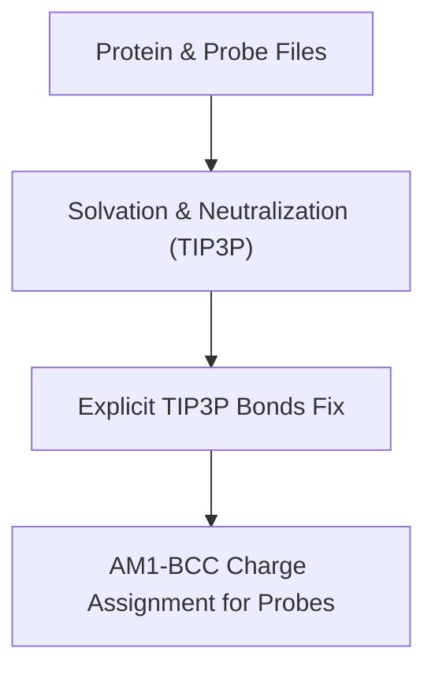
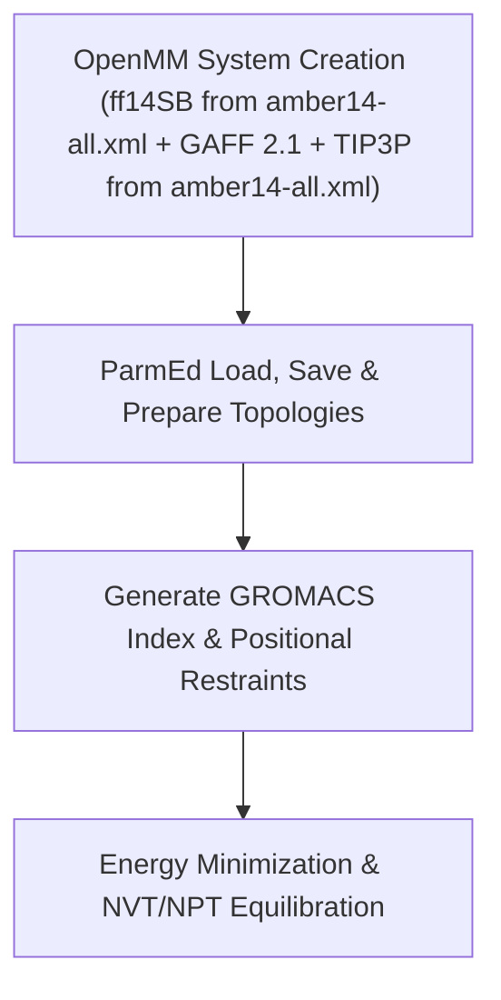
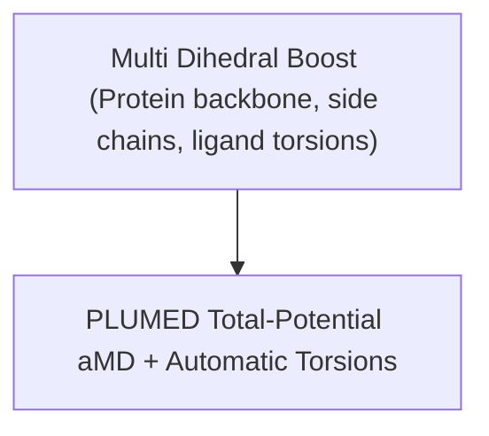
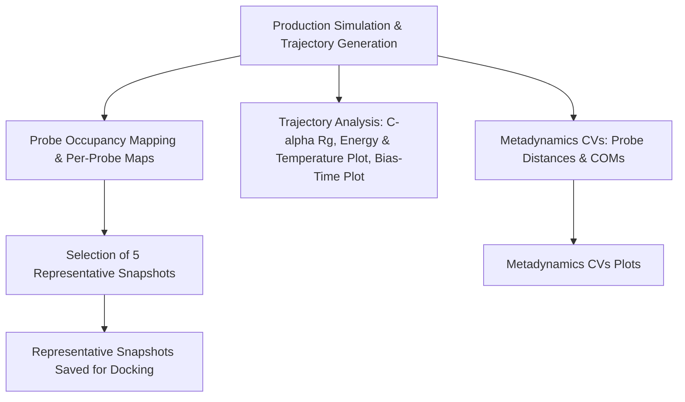

# Frag_to_lead_4MZI
This folder contains the data and results for a fragment to lead workflow with 4MZI using aLMMD (accelerated Ligand-Mapping Molecular Dynamics).

The entire workflow can be shown as:
## 🧬 Workflow Overview


This is ongoing work and i am currently working on the aLMMD sampling and analysis.

---

# Preliminary Results
This folder contains the preliminary/test results from the pipeline such as energy, temperature and bias plots, as well as post-processing plots (eg. occupancy maps) for a 100ps production run.

# Fragment Library (.sdf)
The data for the fragment library was downloaded from ZINC-22 at https://cartblanche.docking.org/tranches/3d

- Fragments subset was selected.
- H08 to H11 columns were selected with all layers (top-left option).
- Charge was set to 0
- M000 to P030 were selected corresponding to roughly 0–3 logP

In total, 20 cells were selected with the interface.

All files were set to be downloaded in sdf format via CURL method. 

The curl file returned was ZINC22-downloader-3D-sdf.tgz.curl. This file is available in this directory. The individual files will not be uploaded here as they will exceed the size limit of GitHub.

Git bash 2.51.2-64-bit was used to download the files. The bash commands used were:

```bash
# Go to the directory with the curl file
cd "/c/Users/Admin/Documents/Documents/Misc/FBDD project/ZINC22 data"

# Create a directory for saving
mkdir -p "ZINC22_all"

# This step ensures every line in the curl file saves to a unique filename instead of overwriting.
awk '{
  match($0, /https:\/\/files\.docking\.org\/zinc22\/([A-Za-z0-9\/._-]+)\.sdf\.tgz/, arr);
  if (arr[1] != "") {
    safe_name = arr[1];
    gsub("/", "_", safe_name);
    sub("-o [^ ]+", "-o \"ZINC22_all/" safe_name ".sdf.tgz\"");
  }
  print $0;
}' "ZINC22-downloader-3D-sdf.tgz.curl" > "fixed_downloads.curl"

# Run all the download commands
while read cmd; do eval "$cmd"; done < "fixed_downloads.curl"

# Check number of .tgz files
find "ZINC22_all" -name "*.sdf.tgz" | wc -l

# Extract all .tgz archives
find "ZINC22_all" -name "*.sdf.tgz" -exec tar -xvzf {} -C "ZINC22_all" \;

# Gather all .sdf into one folder
mkdir -p "combined_sdf"
find "ZINC22_all" -name "*.sdf" -exec cp {} "combined_sdf/" \;

# If necessary count how many sdf files there are
ls "combined_sdf" | wc -l

```
A total of 137 curl requests was executed succesfully, returning 137 .tgz files.

This returned a total of 30765 .sdf files ie. 30765 molecules which is sufficient for further analysis.

---

## aLMMD Sampling / aLMMD Analysis

This aLMMD (accelerated Ligand-Mapping Molecular Dynamics) pipeline is inspired by the workflow described in the abstracts and supporting information of **Tan et al.** (2020, 2022).  

References:

- Tze-Yang Ng, J. and Tan, Y.S., 2022. Accelerated ligand-mapping molecular dynamics simulations for the detection of recalcitrant cryptic pockets and occluded binding sites. Journal of Chemical Theory and Computation, 18(3), pp.1969-1981. [Abstract & SI only — full text/code not accessed](https://pubs.acs.org/doi/10.1021/acs.jctc.1c01177) — referenced for dihedral boost, aMD, and general workflow concepts.
- Tan, Y.S. and Verma, C.S., 2020. Straightforward incorporation of multiple ligand types into molecular dynamics simulations for efficient binding site detection and characterization. Journal of Chemical Theory and Computation, 16(10), pp.6633-6644. [Abstract & SI only — full text/code not accessed](https://pubs.acs.org/doi/abs/10.1021/acs.jctc.0c00405) — referenced for general workflow concepts.

# aLMMD Pipeline

This pipeline implements an **accelerated Ligand-Mapping Molecular Dynamics (aLMMD)** workflow with automated setup, simulation, and post‑processing.  
It produces **5 representative snapshots** for subsequent docking analysis.

## Pipeline Overview

1. **Fragment/Probe Preparation**  
   - Automatic SDF → MOL2 conversion with 3D coordinates.  
   - AM1‑BCC charge assignment via Antechamber (AmberTools, WSL2).  
   - Conversion of probes into OpenMM residues (full residues, explicit bonds).  

2. **Probe Placement**  
   - N copies of each probe placed around the protein centroid.  
   - Random translations to diversify initial positions.

3. **System Solvation & Neutralization**  
   - TIP3P water model.  
   - Ionic strength / counterion neutralization as needed.

4. **Energy Minimization & Equilibration**  
   - Energy minimization → NVT → NPT equilibration.  
   - Automatic estimation of aMD boost parameters from equilibration (E₀, α).

5. **Multi‑Dihedral (4 slowest) + Total‑Potential aMD with METAD CVs (Distances + COMs)**  
   - Automatic selection of torsions (protein backbone & side chains, ligand) for multi-dihedral boost.  
   - Total potential boost applied to system.  
   - PLUMED METAD CVs: distances and center-of-mass (COM) coordinates of probes are automatically monitored during production.  
   - `plumed.dat` is auto-generated for U‑boost style aMD integration.

6. **GPU Acceleration**  
   - Detects GPU (CUDA/OpenCL) automatically and uses it when available.  
   - CPU fallback is supported with minor adaptations.

7. **Production Run**  
   - Full accelerated MD simulation using PLUMED.  
   - Plotting of PLUMED bias, total energy, and temperature during runtime.

8. **Post‑processing**  
   - **Protein analysis**: C‑alpha radius of gyration (Rg) across trajectory.  
   - **Probe occupancy mapping**: Per-probe and combined density (voxel) maps.  
   - **Representative snapshot selection**: Highest-occupancy frames selected for MDpocket and docking.  
   - **PLUMED METAD CVs**: Probe distances and COMs are extracted, smoothed, saved as CSV, and plotted for trajectory analysis.  
   - MDpocket analysis is run on representative snapshots.

9. **Output Organization**  
   - Simulation outputs (`.gro`, `.trr`, `.edr`, `.tpr`, `.log`) are stored in `gmx_run_dir`.  
   - Subdirectories for:  
     - `plots/` → energy, temperature, CV plots  
     - `best_snapshots/` → snapshots for docking  
     - `MDpocket_results/` → binding site analysis  
     - `probe_density_maps/` → density maps  

## Force Fields

- **Protein**: AMBER ff14SB, via `amber14-all.xml` (includes ff14SB).  
- **Water**: TIP3P, standard model from Amber `amber14` force field.  
- **Small molecules / Probes (GAFF)**:  
  - GAFF version 2.11, via `GAFFTemplateGenerator` (OpenMM-compatible).  

---

> **Note:** This pipeline has potential for publication similar to the 2020 and 2022 papers by Tan et al.  
> The full code is **not publicly released on GitHub**, but is **available upon request** to technical interviewers or collaborators for evaluation purposes.
> If you require access, please contact me via the email provided in my application/CV.

---

## Pipeline Workflow
The aLMMD pipeline is divided into four main sections, each corresponding to a distinct phase of the workflow:
> **Note:** This workflow diagram is a high-level overview. Steps are grouped by functional purpose, not strict chronological order in the code.


## Section 1: Preparation


## Section 2: System Setup


## Section 3: Boosting


## Section 4: Post-processing & Snapshot Analysis


---

# Requirements

- AmberTools 24: Ensure antechamber is available on PATH or set `antechamber_exe` to the full path
- GROMACS 2025.03 (with PLUMED support)
- Force fields:
  - ff14SB from amber14-all.xml
  - TIP3P from amber14-all.xml
  - GAFF 2.1 for probes
- GPU with CUDA support (optional but recommended for accelerated MD)
- Python dependencies (Windows/WSL2): 
  `rdkit, openmm, openmmforcefields, mdtraj, numpy, openbabel, pdbfixer, fpocket, mdanalysis, parmed, openmm-plumed`, pymol-open-source
- Pipeline was run in WSL2
- WSL2 setup: Ubuntu 22.04.5, Miniforge3, Conda environment `almmd`
- PLUMED kernel environment variable set via: 
  ```bash
  export PLUMED_KERNEL="$CONDA_PREFIX/lib/libplumedKernel.so"

- Verify installations: gmx --version, python -m openmm.testInstallation, and gmx mdrun -h | grep -i plumed
- WSL2 was installed using wsl --install in PowerShell, with Ubuntu 22.04.5 installed separately as per the instructions at: https://www.windowscentral.com/how-install-wsl2-windows-10 

---
The following commands were executed after the initial setup inside WSL.

<pre>
# Download installer for Miniforge (Conda) inside Ubuntu
wget https://github.com/conda-forge/miniforge/releases/latest/download/Miniforge3-Linux-x86_64.sh

# Run installer
bash Miniforge3-Linux-x86_64.sh
    
# Create environment named 'almmd'
conda create -n almmd python=3.11 -y

# activate environment
conda activate almmd

# Add dacase channel for AmberTools
conda config --add channels conda-forge
conda config --set channel_priority strict

# Installations    
conda install -c conda-forge openmm=8.2 openmmforcefields cudatoolkit=11.8 openmm-plumed ambertools=24 openbabel rdkit mdtraj -y
conda install -c conda-forge pdbfixer
conda install -c conda-forge fpocket -y
conda install mdanalysis    

# install gromacs and parmed (if not already)
conda install -c conda-forge gromacs parmed -y

# Install pymol  
pip install pymol-open-source  

# Check pymol version if necessary  
pip show pymol-open-source
  
# verify gmx is available and GPU status
gmx --version
    
# check available platforms (GPU)
gmx mdrun -h | head -n 20

# Verify installation
python -m openmm.testInstallation

# Output
# OpenMM Version: 8.2
# Git Revision: 53770948682c40bd460b39830d4e0f0fd3a4b868
#
# There are 3 Platforms available:
#
# 1 Reference - Successfully computed forces
# 2 CPU - Successfully computed forces
# 3 CUDA - Successfully computed forces
#
# Median difference in forces between platforms:
#
# Reference vs. CPU: 6.30392e-06
# Reference vs. CUDA: 6.75486e-06
# CPU vs. CUDA: 7.06771e-07

# External installation of plumed 2.10
cd ~
wget https://www.plumed.org/downloads/plumed-2.10.0.tgz
tar -xvf plumed-2.10.0.tgz
cd plumed-2.10.0

./configure --prefix=$HOME/plumed-2.10.0
make -j 4
make install

# verify plumed version
plumed info --version  
  
# Ensure Plumed compatibility
# (you might have to export a different path depending on where your plumed is installed depending on your system)
cd ~  
nano ~/.bashrc

# add these lines at the end of .bashrc  
export PLUMED_KERNEL=$HOME/opt/plumed-2.10/lib/libplumedKernel.so
export PATH=$HOME/opt/plumed-2.10/bin:$PATH
export LD_LIBRARY_PATH=$HOME/opt/plumed-2.10/lib:$LD_LIBRARY_PATH  
    
# Reload .bashrc:
source ~/.bashrc    

# Go back to almmd environment
conda activate almmd

# verify environment variable
echo $PLUMED_KERNEL

# get location of plumed kernel to place in jupyter notebook  
find $CONDA_PREFIX -name "libplumedKernel.so"
  
# run a quick (non-destructive) plumed load test:
gmx mdrun -h | grep -i plumed

    
</pre>

---

# Notes

All probes automatically converted to OpenMM residues with correct bond connectivity

Multi dihedral boost applied to protein (backbone + side chains) and probes inspired by Tan et al. (2020, 2022)

Total-potential aMD performed via PLUMED

Metadynamics CVs automatically extracted from probe positions (distances and COMs)

Probe occupancy maps generated to select snapshots with highest density

5 representative snapshots automatically selected for downstream docking analysis

Trajectories and snapshots saved in PDB format

GPU auto-detection with CUDA available; CPU fallback supported

---

# Usage

1. **Set up inputs**  
   - Specify the **protein PDB** file (`protein_pdb`) and **probe SDF/MOL2 files** (`probe_files`) in your Jupyter notebook.  

2. **Antechamber executable**  
   - Ensure `antechamber_exe` points to the correct Antechamber executable (either via **WSL2** or native installation).

3. **PLUMED kernel (if using accelerated MD / Metadynamics CVs)**  
   - Set the PLUMED kernel environment variable before running the notebook:

     ```bash
     export PLUMED_KERNEL="$CONDA_PREFIX/lib/libplumedKernel.so"
     ```
  - Ensure that the os.environ["PLUMED_KERNEL"] points to the correct path for "/lib/libplumedKernel.so"

4. **Run the pipeline notebook**  
   - Generates **AM1-BCC charges** for probes.  
   - Converts probes into **OpenMM residues**.  
   - Performs **probe placement** around protein centroid.  
   - Solvates and neutralizes the system with **TIP3P water**.  
   - Applies **multi-dihedral accelerated MD** to protein (backbone + side chains) and ligand torsions.  
   - Executes **total-potential aMD** via PLUMED, including **Metadynamics CVs**.  
   - Produces **probe occupancy maps** and automatically selects **5 representative snapshots**.  
   - Saves **trajectories, processed snapshots, and energy/temperature plots** for downstream analysis.

5. **Access outputs**  
   - Trajectories (`.trr`/`.gro`) and snapshots (`.pdb`) are saved in the designated output directories.  
   - Occupancy maps and post-processing results are stored in `probe_density_map_dir`.  
   - Representative snapshots are ready for **docking analysis**.  

---


