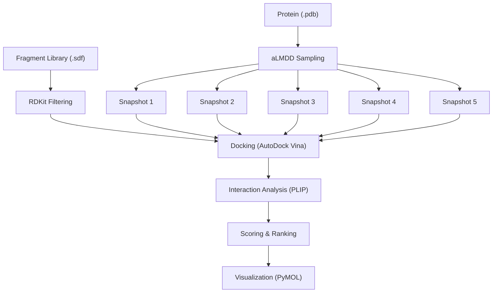

# Frag_to_lead_4MZI
This folder contains the data and results for a fragment to lead workflow with 4MZI.

The entire workflow can be shown as:
## 🧬 Workflow Overview



This is ongoing work and i am currently working on the aLMDD sampling as of 7 Nov 2025.

Completed parts of workflow:
- Fragment Library (.sdf)
- Protein (.pdb)

# Data and Methods
The data was downloaded from ZINC-22 at https://cartblanche.docking.org/tranches/3d

- Fragments subset was selected.
- H08 to H11 columns were selected with all layers (top-left option).
- Charge was set to 0
- M000 to P030 were selected corresponding to roughly 0–3 logP

In total, 20 cells were selected with the interface.

All files were set to be downloaded in sdf format via CURL method. 

The curl file returned was ZINC22-downloader-3D-sdf.tgz.curl. This file is available in this directory. The individual files will not be uploaded here as they will exceed the size limit of GitHub.

Git bash 2.51.2-64-bit was used to download the files. The bash commands used were:

```bash
# Go to the directory with the curl file
cd "/c/Users/Admin/Documents/Documents/Misc/FBDD project/ZINC22 data"

# Create a directory for saving
mkdir -p "ZINC22_all"

# This step ensures every line in the curl file saves to a unique filename instead of overwriting.
awk '{
  match($0, /https:\/\/files\.docking\.org\/zinc22\/([A-Za-z0-9\/._-]+)\.sdf\.tgz/, arr);
  if (arr[1] != "") {
    safe_name = arr[1];
    gsub("/", "_", safe_name);
    sub("-o [^ ]+", "-o \"ZINC22_all/" safe_name ".sdf.tgz\"");
  }
  print $0;
}' "ZINC22-downloader-3D-sdf.tgz.curl" > "fixed_downloads.curl"

# Run all the download commands
while read cmd; do eval "$cmd"; done < "fixed_downloads.curl"

# Check number of .tgz files
find "ZINC22_all" -name "*.sdf.tgz" | wc -l

# Extract all .tgz archives
find "ZINC22_all" -name "*.sdf.tgz" -exec tar -xvzf {} -C "ZINC22_all" \;

# Gather all .sdf into one folder
mkdir -p "combined_sdf"
find "ZINC22_all" -name "*.sdf" -exec cp {} "combined_sdf/" \;

# If necessary count how many sdf files there are
ls "combined_sdf" | wc -l

```
This returned a total of 30765 .sdf files ie. 30765 molecules which is sufficient for further analysis.

