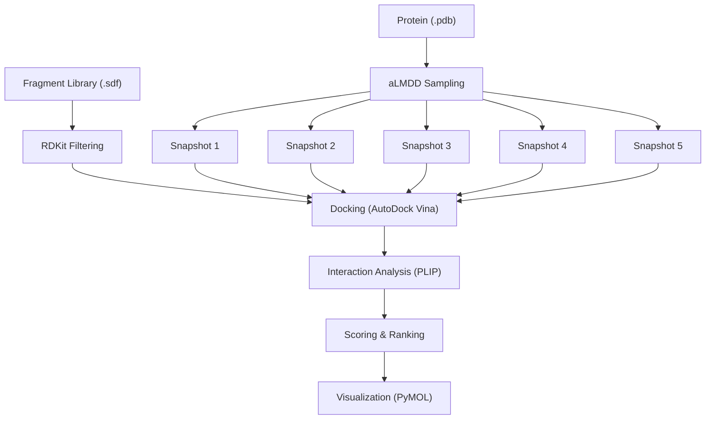

# FBDD

A repository containing code and testing during my self-training of FBDD skills.

# Frag_to_lead_4MZI
This folder contains the data and results for a fragment to lead workflow with 4MZI.

The entire workflow can be shown as:
## 🧬 Workflow Overview

This is ongoing work and i am currently working on the aLMDD sampling as of 7 Nov 2025.

Completed parts of workflow:
- Fragment Library (.sdf)
- Protein (.pdb)

More details can be found in the folder's README.

# prepare_ligands.ipynb
This notebook contains a script to prepare ligands automatically for docking in AutoDock Vina.

Main software and dependencies used:
- Windows 11
- MGLTools-1.5.7 (AutoDock Tools)
- Autodock Vina v1.2.7 (from https://github.com/ccsb-scripps/AutoDock-Vina/releases)
- OpenBabel 3.1.1

The script requires a folder containing all ligand files in .sdf format and outputs all ligands in .pdbqt format in a separate folder with numbering.

During the ligand preparation, the following operations are performed.
 - Add all hydrogens
 - Assign Gasteiger charges
 - non-polar hydrogens are merged
 - Count rotatable bonds

Note that for receptors, an automated script is not provided because of the need to assign Kollman charges.

During receptor preparation, the following operations are performed within AutoDock Tools before saving the receptor as a .pdbqt file.
 - Delete water 
 - Add polar hydrogens
 - Add Kollman charges

# docking.py
By default, the parameters for:
- num_modes = 9
- exhaustiveness = 8
- energy_range = 4

are set in the config.txt file.

The script takes each ligand prepared using prepare_ligands.ipynb and docks it with the specified receptor using AutoDock Vina.

Each docked ligand is saved as a .pdbqt file and the log file for the entire process is saved as docking_log.txt

# FBDD.ipyb
This notebook contains three functions

 - get_descriptors
   
   This function takes a list of molecules as input and calculates the molecular descriptors for each molecule in the list.
   
   The resulting list can be easily saved to a dataframe for input into the model function
   
 - train_fragment_nn_model
   
   This function takes a dataframe and trains it using a neural network model.
   The output is a model and the test data as tensors

 - train_fragment_rf_model
   
   This function takes a dataframe and trains it using a random forest model.
   The output is a model and the test data as tensors
   
 - evaluate_model
   
   This function takes a model and test tensor data as input.
   The output is a dictionary of metrics.

# def mol_to_frags(mol_list)
This function takes in a list of molecules as input and decomposes them into fragments using BRICS.

The resulting list of fragments can be converted into a dataframe and fed into the function for calculating molecular descriptors.

# Docking_4MZI_roscovitine
This folder contains the .pdbqt files for 4MZI - Crystal structure of a human mutant p53 and Roscovitine as the ligand.

The .pdbqt file containing the 9 poses of the docked ligand is also included. 

The log.txt file and the config.txt file for this docking project is included in this folder.

