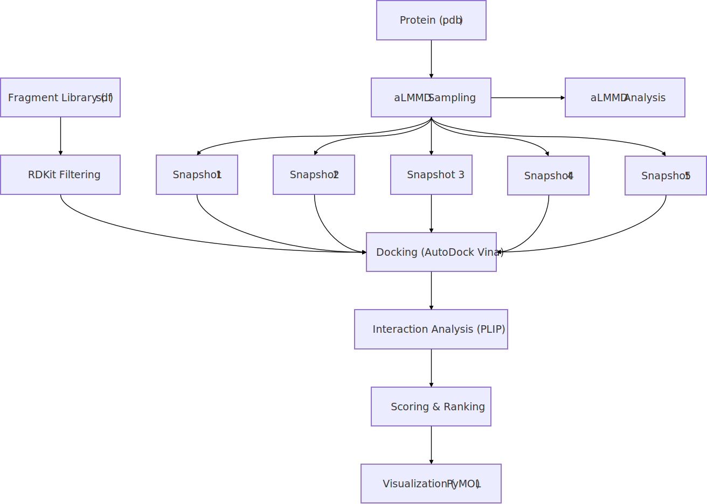
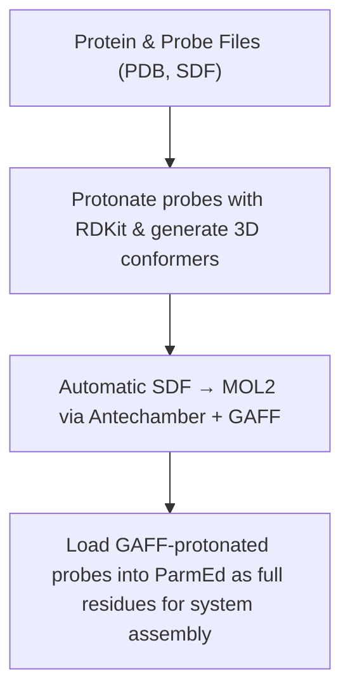
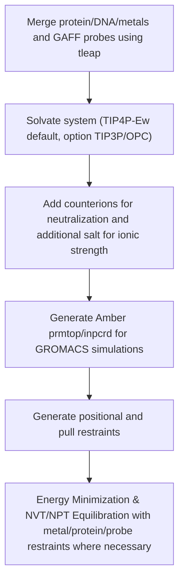
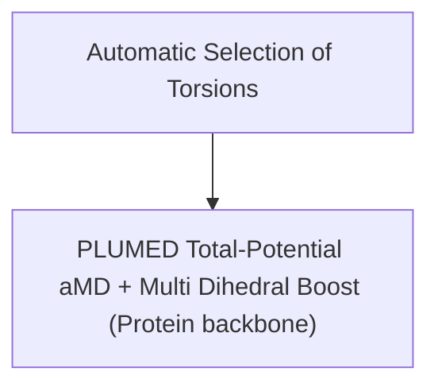
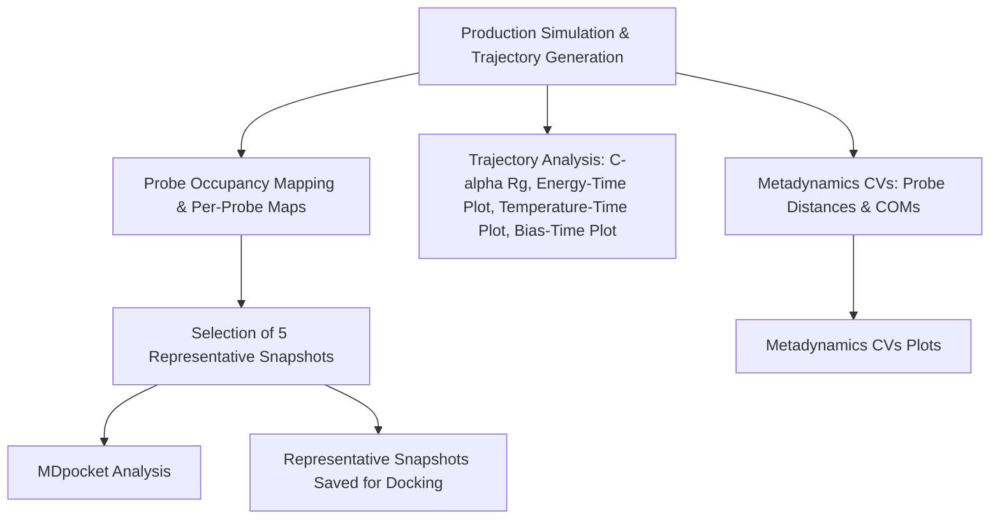

<!-- REPO_TOC -->
# FBDD Repository Structure
- [FBDD](./)
  - [Frag_to_lead](Frag_to_lead/)
    - [9N39](Frag_to_lead/9N39/)
      - [1ns_Preliminary Results](Frag_to_lead/9N39/1ns_Preliminary%20Results/)
        - [1ns_test](Frag_to_lead/9N39/1ns_Preliminary%20Results/1ns_test/)
          - [NPT_equil](Frag_to_lead/9N39/1ns_Preliminary%20Results/1ns_test/NPT_equil/)
          - [NVT_equil](Frag_to_lead/9N39/1ns_Preliminary%20Results/1ns_test/NVT_equil/)
          - [Production](Frag_to_lead/9N39/1ns_Preliminary%20Results/1ns_test/Production/)
          - [em](Frag_to_lead/9N39/1ns_Preliminary%20Results/1ns_test/em/)
        - [mdpocket_figures](Frag_to_lead/9N39/1ns_Preliminary%20Results/mdpocket_figures/)
        - [occupancy_maps](Frag_to_lead/9N39/1ns_Preliminary%20Results/occupancy_maps/)
        - [plumed_metad_cvs](Frag_to_lead/9N39/1ns_Preliminary%20Results/plumed_metad_cvs/)
        - [probe_behaviour_analysis](Frag_to_lead/9N39/1ns_Preliminary%20Results/probe_behaviour_analysis/)
        - [representative_snapshots](Frag_to_lead/9N39/1ns_Preliminary%20Results/representative_snapshots/)
          - [P01A_probespecific_snapshots](Frag_to_lead/9N39/1ns_Preliminary%20Results/representative_snapshots/P01A_probespecific_snapshots/)
          - [P02A_probespecific_snapshots](Frag_to_lead/9N39/1ns_Preliminary%20Results/representative_snapshots/P02A_probespecific_snapshots/)
          - [P03A_probespecific_snapshots](Frag_to_lead/9N39/1ns_Preliminary%20Results/representative_snapshots/P03A_probespecific_snapshots/)
          - [P04A_probespecific_snapshots](Frag_to_lead/9N39/1ns_Preliminary%20Results/representative_snapshots/P04A_probespecific_snapshots/)
          - [global_snapshots](Frag_to_lead/9N39/1ns_Preliminary%20Results/representative_snapshots/global_snapshots/)
    - [Final_validation_test_5HO4](Frag_to_lead/Final_validation_test_5HO4/)
      - [100ps_test](Frag_to_lead/Final_validation_test_5HO4/100ps_test/)
        - [NPT_equil](Frag_to_lead/Final_validation_test_5HO4/100ps_test/NPT_equil/)
        - [NVT_equil](Frag_to_lead/Final_validation_test_5HO4/100ps_test/NVT_equil/)
        - [Production](Frag_to_lead/Final_validation_test_5HO4/100ps_test/Production/)
        - [em](Frag_to_lead/Final_validation_test_5HO4/100ps_test/em/)
    - [Frag_to_lead_4MZI](Frag_to_lead/Frag_to_lead_4MZI/)
      - [100ps_Preliminary Results](Frag_to_lead/Frag_to_lead_4MZI/100ps_Preliminary%20Results/)
        - [100ps_pipeline_test](Frag_to_lead/Frag_to_lead_4MZI/100ps_Preliminary%20Results/100ps_pipeline_test/)
          - [NPT_equil](Frag_to_lead/Frag_to_lead_4MZI/100ps_Preliminary%20Results/100ps_pipeline_test/NPT_equil/)
          - [NVT_equil](Frag_to_lead/Frag_to_lead_4MZI/100ps_Preliminary%20Results/100ps_pipeline_test/NVT_equil/)
          - [Production](Frag_to_lead/Frag_to_lead_4MZI/100ps_Preliminary%20Results/100ps_pipeline_test/Production/)
          - [em](Frag_to_lead/Frag_to_lead_4MZI/100ps_Preliminary%20Results/100ps_pipeline_test/em/)
        - [binding_event_detection](Frag_to_lead/Frag_to_lead_4MZI/100ps_Preliminary%20Results/binding_event_detection/)
        - [mdpocket_figures](Frag_to_lead/Frag_to_lead_4MZI/100ps_Preliminary%20Results/mdpocket_figures/)
        - [plumed_metad_cvs](Frag_to_lead/Frag_to_lead_4MZI/100ps_Preliminary%20Results/plumed_metad_cvs/)
        - [representative_snapshots](Frag_to_lead/Frag_to_lead_4MZI/100ps_Preliminary%20Results/representative_snapshots/)
      - [100ps_run_for_checkpoint_testing](Frag_to_lead/Frag_to_lead_4MZI/100ps_run_for_checkpoint_testing/)
      - [1ns_Preliminary Results](Frag_to_lead/Frag_to_lead_4MZI/1ns_Preliminary%20Results/)
        - [1ns_pipeline_test](Frag_to_lead/Frag_to_lead_4MZI/1ns_Preliminary%20Results/1ns_pipeline_test/)
          - [NPT_equil](Frag_to_lead/Frag_to_lead_4MZI/1ns_Preliminary%20Results/1ns_pipeline_test/NPT_equil/)
          - [NVT_equil](Frag_to_lead/Frag_to_lead_4MZI/1ns_Preliminary%20Results/1ns_pipeline_test/NVT_equil/)
          - [Production](Frag_to_lead/Frag_to_lead_4MZI/1ns_Preliminary%20Results/1ns_pipeline_test/Production/)
          - [em](Frag_to_lead/Frag_to_lead_4MZI/1ns_Preliminary%20Results/1ns_pipeline_test/em/)
        - [binding_event_detection](Frag_to_lead/Frag_to_lead_4MZI/1ns_Preliminary%20Results/binding_event_detection/)
        - [mdpocket_figures](Frag_to_lead/Frag_to_lead_4MZI/1ns_Preliminary%20Results/mdpocket_figures/)
        - [occupancy_maps](Frag_to_lead/Frag_to_lead_4MZI/1ns_Preliminary%20Results/occupancy_maps/)
        - [plumed_metad_cvs](Frag_to_lead/Frag_to_lead_4MZI/1ns_Preliminary%20Results/plumed_metad_cvs/)
        - [representative_snapshots](Frag_to_lead/Frag_to_lead_4MZI/1ns_Preliminary%20Results/representative_snapshots/)
      - [1ns_withpullres_withcheckpoints_Preliminary Results](Frag_to_lead/Frag_to_lead_4MZI/1ns_withpullres_withcheckpoints_Preliminary%20Results/)
        - [1ns_pipeline_test](Frag_to_lead/Frag_to_lead_4MZI/1ns_withpullres_withcheckpoints_Preliminary%20Results/1ns_pipeline_test/)
          - [NPT_equil](Frag_to_lead/Frag_to_lead_4MZI/1ns_withpullres_withcheckpoints_Preliminary%20Results/1ns_pipeline_test/NPT_equil/)
          - [NVT_equil](Frag_to_lead/Frag_to_lead_4MZI/1ns_withpullres_withcheckpoints_Preliminary%20Results/1ns_pipeline_test/NVT_equil/)
          - [Production](Frag_to_lead/Frag_to_lead_4MZI/1ns_withpullres_withcheckpoints_Preliminary%20Results/1ns_pipeline_test/Production/)
          - [em](Frag_to_lead/Frag_to_lead_4MZI/1ns_withpullres_withcheckpoints_Preliminary%20Results/1ns_pipeline_test/em/)
        - [binding_event_detection](Frag_to_lead/Frag_to_lead_4MZI/1ns_withpullres_withcheckpoints_Preliminary%20Results/binding_event_detection/)
        - [mdpocket_figures](Frag_to_lead/Frag_to_lead_4MZI/1ns_withpullres_withcheckpoints_Preliminary%20Results/mdpocket_figures/)
        - [occupancy_maps](Frag_to_lead/Frag_to_lead_4MZI/1ns_withpullres_withcheckpoints_Preliminary%20Results/occupancy_maps/)
        - [plumed_metad_cvs](Frag_to_lead/Frag_to_lead_4MZI/1ns_withpullres_withcheckpoints_Preliminary%20Results/plumed_metad_cvs/)
        - [representative_snapshots](Frag_to_lead/Frag_to_lead_4MZI/1ns_withpullres_withcheckpoints_Preliminary%20Results/representative_snapshots/)
    - [Fragment_preprocessing](Frag_to_lead/Fragment_preprocessing/)
  - [docking_4MZI_roscovitine](docking_4MZI_roscovitine/)
  - [images](images/)
<!-- /REPO_TOC -->

-------------------------------------------------------------------------------
# Readme Table of Contents
- [FBDD Repository Structure](#fbdd-repository-structure)
- [Readme Table of Contents](#readme-table-of-contents)
- [Frag\_to\_lead](#frag_to_lead)
  - [🧬 Workflow Overview](#-workflow-overview)
- [aLMMD Pipeline - aLMMD Sampling / aLMMD Analysis](#almmd-pipeline---almmd-sampling--almmd-analysis)
  - [Pipeline Overview](#pipeline-overview)
  - [Force Fields](#force-fields)
  - [Pipeline Workflow](#pipeline-workflow)
- [Fragment Preprocessing Pipeline Overview](#fragment-preprocessing-pipeline-overview)
- [prepare\_ligands.ipynb](#prepare_ligandsipynb)
- [docking.py](#dockingpy)
- [FBDD.ipyb](#fbddipyb)
- [def mol\_to\_frags(mol\_list)](#def-mol_to_fragsmol_list)
- [Docking\_4MZI\_roscovitine](#docking_4mzi_roscovitine)

-------------------------------------------------------------------------------

# Frag_to_lead
[⬆️ Back to top](#readme-table-of-contents)

This folder contains the data and results for a fragment to lead workflow using aLMMD (accelerated Ligand-Mapping Molecular Dynamics).

The entire workflow can be shown as:
## 🧬 Workflow Overview
[⬆️ Back to top](#readme-table-of-contents)

This is ongoing work and i am currently working on:
Fragment preprocessing

Completed work on:
aLMMD sampling and analysis

---

# aLMMD Pipeline - aLMMD Sampling / aLMMD Analysis
[⬆️ Back to top](#readme-table-of-contents)

This pipeline implements an **accelerated Ligand-Mapping Molecular Dynamics (aLMMD)** workflow with automated setup, simulation, and post‑processing.  
It produces **5 (can be set) representative snapshots** for subsequent MDpocket analysis and docking tasks.

The pipeline is inspired by the workflow described in the abstracts and supporting information of **Tan et al.** (2020, 2022).  

References:

- Tze-Yang Ng, J. and Tan, Y.S., 2022. Accelerated ligand-mapping molecular dynamics simulations for the detection of recalcitrant cryptic pockets and occluded binding sites. Journal of Chemical Theory and Computation, 18(3), pp.1969-1981. [Abstract & SI only — full text/code not accessed](https://pubs.acs.org/doi/10.1021/acs.jctc.1c01177) — referenced for dihedral boost, aMD, and general workflow concepts.
- Tan, Y.S. and Verma, C.S., 2020. Straightforward incorporation of multiple ligand types into molecular dynamics simulations for efficient binding site detection and characterization. Journal of Chemical Theory and Computation, 16(10), pp.6633-6644. [Abstract & SI only — full text/code not accessed](https://pubs.acs.org/doi/abs/10.1021/acs.jctc.0c00405) — referenced for general workflow concepts.

## Pipeline Overview
[⬆️ Back to top](#readme-table-of-contents)

1. **Fragment/Probe Preparation**
    - Protonate probes with RDKit and generate single 3D conformer.
    - Automatic SDF → MOL2 conversion via Antechamber + GAFF.
    - AM1‑BCC charge assignment (AmberTools, WSL2).
    - Load GAFF-protonated probes into ParmEd as full residues with explicit bonds for integration into system.

2. **Probe Placement**  
    - Multiple copies (N) of each probe placed around the protein centroid while avoiding collisions with protein and previously placed probes.
    - Unique residue naming for each copy (e.g., P01A, P01B) and sequential residue numbering.
    - Automatically removes overlapping waters within `min_dist`.
    - Collision coordinates updated after each placement to prevent overlap.
    - Final PDB saved for manual inspection.

3. **System Solvation & Neutralization**  
    - Solvate the system with TIP4P-Ew (default), with option for TIP3P or OPC (Amber ff14SB-compatible).
    - Crystallographic waters excluded prior to solvation to prevent clashes
    - Metals reintroduced as part of tleap merge.
    - Add counterions to neutralize total charge, then additional salt ions to achieve user-specified ionic strength.
    - Solvation box size automatically adjusted according to system dimensions + padding buffer.

4. **Energy Minimization(EM) & Equilibration**  
   - Energy minimization → NVT → NPT equilibration to reduce likelihood of bad contacts and large forces that might crash the system during MD runs.  
   - Automatic estimation of aMD boost parameters from equilibration (E₀, α).
   - Strong positional restraints automatically added to metal during EM to prevent drift during EM.
   - Standard positional restraints automatically added to protein and probes during EM to prevent drift during EM.
   - Pull restraints automatically added to metal to prevent drift during equilibration.
   - Standard positional restraints automatically added to protein during equilibration to prevent drift during equilibration.

5. **Multi‑Dihedral + Total‑Potential aMD with METAD CVs (Distances + COMs)**  
   - Automatic selection of torsions (protein backbone) for multi-dihedral boost.  
   - Total potential boost applied to system.
   - Accelerates exploration of backbone torsions while maintaining realistic dynamics.
   - Use of metadynamics encourages exploration of new conformational space. 
   - PLUMED METAD CVs: distances and center-of-mass (COM) coordinates of probes are automatically monitored during production.  
   - `plumed.dat` is auto-generated for U‑boost style aMD integration.

6. **GPU Acceleration**  
   - Detects GPU (CUDA/OpenCL) automatically and uses it when available.  
   - CPU fallback is supported with minor adaptations.

7. **Production Run**  
   - Full accelerated MD simulation using GROMACS 2025.03 + PLUMED 2.10.0.  
   - Plotting of PLUMED bias, total energy, and temperature after run to check stability of the MD simulation.
   - Pull restraints automatically added to metal to prevent drift in production runs.
   - Resume from checkpoint/backup files implemented to handle HPC walltime limits or crashes during ns-scale runs.
   - Five most recent checkpoint/backup folders containing all required files saved for the production run at pre-set intervals.
   - For each backup, energy/temperature/bias vs. time plots and last-frame PDBs can be generated on demand for manual inspection.
   - Before each restart, these plots and PDBs are inspected to ensure system stability (e.g., no metal drift, sharp spikes, or runaway values).

8. **Post‑processing**
   - All post processing steps support multi-run handling.
   - **Protein analysis**: C‑alpha radius of gyration (Rg) across trajectory.  
   - **Probe occupancy mapping**: Per-probe and combined density (voxel) maps.  
   - **Representative snapshot selection**: RMSD clustering, KDE peak mapping, and DBSCAN probe clustering to select representative snapshots automatically.
   - **MDpocket analysis**: Run on representative snapshots to identify cavities, including cryptic and occluded sites; computes per-cavity metrics, maps KDE probe peaks, ranks cavities based on occupancy and geometry, and supports multi-run ensemble analyses.
   - **PLUMED METAD CVs & Probe analysis**: Probe distances and torsions are extracted, smoothed, saved as CSV, and plotted for analysis.
    - **Cavity occupancy analysis**:
      - Tracks per-probe occupancy in MDpocket cavities, including **time spent in each cavity** and **fraction of simulation occupancy**.
      - Multi-run support: aggregates occupancy across multiple simulations for ensemble-level cavity interpretation.
      - Occupancy visualizations:
        - Per-cavity probe occupancy across time (fraction of probes in each cavity).
        - Highlights frequently visited vs unexplored cavities.
      - Outputs saved in structured JSONs for reproducible analysis and downstream aggregation.

9. **Output Organization**  
   - Each run output is saved under a `run_id` directory.
   - `run_id` directory contains the directories (`backup`, `gmx_run`, `gmx_temp`, `off_mols`, `plumed`).
   - Simulation outputs (`.gro`, `.trr`, `.edr`, `.tpr`, `.log`) are stored in `gmx_run`.  
   - Subdirectories in gmx_run/ for:  
     - `bias_and_energy_and_temp_plots/` → energy, temperature, bias plots.
   - Subdirectories in gmx_run/post_processing/ for:  
     - `rg/` → plots of C‑alpha radius of gyration (Rg) across trajectory.
     - `windows/` → .dx and .pdb files per window with each window having their own subdirectory.
     - `full_trajectory/` → .dx and .pdb files for the full trajectory.
     - `full_trajectory/representative_snapshots` → .pdb files for the representative snapshots.
     - `full_trajectory/representative_snapshots/cleaned_protein_pdbs` →  cleaned protein only .pdb files for the representative snapshots for downstream MDpocket analysis and docking tasks.
     - `full_trajectory/representative_snapshots/cleaned_protein_pdbs/mdpocket_analysis` → to store the MDpocket analysis results from the manual run of mdpocket outside the notebook. Files will be automatically moved into this folder by running subsequent notebook cells
     - `torsion_plots/` → smoothed plots for individual torsions from PLUMED METAD CVs
     - `probe_analysis/` → plots for per-cavity probe occupancy (fraction of probes in each cavity) across time, highlighting frequently visited vs unexplored cavities   

 ## Force Fields
    - **Protein**: AMBER ff14SB (parameters loaded from Amber prmtop files generated by tleap).
    - **DNA**: OL15 or bsc1 depending on user choice (tleap).
    - **Water**: TIP4P-Ew by default, optionally TIP3P or OPC, assigned via tleap during solvation.
    - **Small molecules / Probes (GAFF)**: GAFF v2.11 parameterized via Antechamber + tleap; 
      included in the system prmtop/inpcrd for downstream simulation. ParmEd used to assemble probes into full system PDB/topology.
    - **Metals**: included in tleap merge   

---

> **Note:** This pipeline has **potential for publication** similar to the **2020** and **2022** papers by **Tan et al.**.  
> The full pipeline code is **not publicly released** due to publication considerations. Selected outputs and workflow details are provided for transparency.
> 
> The complete implementation is **available upon request** for technical evaluation or collaboration.
> 
> To access the private repository, please **contact me via the email** provided in my application/CV.
> 
> More details on the aLMMD pipeline can be found in the Frag_to_lead folder's README.

---
## Pipeline Workflow
[⬆️ Back to top](#readme-table-of-contents)

The aLMMD pipeline is divided into four main sections, each corresponding to a distinct phase of the workflow:
> **Note:** This workflow diagram is a high-level overview. Steps are grouped by functional purpose, not strict chronological order in the code.

## Section 1: Preparation

```mermaid
flowchart TD
    A["Protein & Probe Files (PDB, SDF)"] --> B["Protonate probes with RDKit & generate 3D conformers"]
    B --> C["Automatic SDF → MOL2 via Antechamber + GAFF"]
    C --> D["Load GAFF-protonated probes into ParmEd as full residues for system assembly"]
```

## Section 2: System Setup

```mermaid
flowchart TD
    E["Merge protein/DNA/metals and GAFF probes using tleap"] --> F["Solvate system (TIP4P-Ew default, option TIP3P/OPC)"]
    F --> G["Add counterions for neutralization and additional salt for ionic strength"]
    G --> H["Generate Amber prmtop/inpcrd for GROMACS simulations"]
    H --> I["Generate positional and pull restraints"]
    I --> J["Energy Minimization & NVT/NPT Equilibration with metal/protein/probe restraints where necessary"]
```

## Section 3: Boosting

```mermaid
flowchart TD
    J["Automatic Selection of Torsions"] --> K["PLUMED Total-Potential aMD + Multi Dihedral Boost (Protein backbone)"]
```

## Section 4: Post-processing & Snapshot Analysis

```mermaid
flowchart TD
    L["Production Simulation & Trajectory Generation"] --> M["Probe Occupancy Mapping & Per-Probe Maps"]
    M --> N["Selection of 5 Representative Snapshots"]
    N --> O["MDpocket Analysis"]
    N --> P["Representative Snapshots Saved for Docking"]

    L --> Q["Trajectory Analysis: C-alpha Rg, Energy-Time Plot, Temperature-Time Plot, Bias-Time Plot"]
    L --> R["Metadynamics CVs: Probe Distances & COMs"]
    R --> S["Metadynamics CVs Plots"]
```

---

# Fragment Preprocessing Pipeline Overview
[⬆️ Back to top](#readme-table-of-contents)

1. **Library Loading & File Handling**
    - Raw fragment library stored in `library_folder` (SDF/SMILES).  
    - Folder structure and metadata JSON prepared to track runs and parameters.  
    - Automatic checking for missing or invalid files before processing.

2. **Molecule Cleaning & Sanitization**
    - Remove unwanted metals and keep the largest fragment per molecule.  
    - Add explicit hydrogens.  
    - Sanitize molecules with RDKit; molecules failing sanitization are logged and skipped.  
    - Full logging of cleaning status into CSV for traceability.
    - Generation of `sanitization_report.json` provides a **transparent QC snapshot** of the preprocessing stage of the fragment library.

3. **Fragment Filtering (Rule-of-3 + PSA)**
    - Filter cleaned molecules to retain **fragment-friendly molecules** according to Rule-of-3 + PSA:
      - Molecular weight (MW) ≤ 300  
      - H-bond donors ≤ 3  
      - H-bond acceptors ≤ 3  
      - clogP ≤ 3  
      - Rotatable bonds ≤ 3  
      - Polar Surface Area (PSA) ≤ 60 Ų  
    - Compute all descriptors using RDKit for each molecule and log them in `filtered_log.csv`.  
    - Molecules failing one or more rules are flagged and excluded from downstream 3D conformer generation.  
    - Summary of filtering results stored in `filtered_summary.json`, including:
      - Total molecules processed  
      - Number and percentage of molecules passing or failing  
      - Failure counts per rule (MW, donors, acceptors, clogP, rotatable bonds, PSA)   
    - Provides a **quantitative snapshot of library quality** and ensures only fragment-compliant molecules proceed downstream.

4. **3D Conformer Generation (ETKDGv3)**
    - Generate initial low-energy 3D conformers for **filtered fragment molecules** using **RDKit ETKDGv3**.  
    - Number of conformers per fragment configurable (`numConfs`).  
    - Conformers stored in a single SDF file, with per-conformer properties:
      - `mol_name`  
      - `mol_index`  
      - `conf_id` for traceability  
      - **Descriptors logged per conformer** in `conformer_log.csv`:
        - Molecular weight (MW)  
        - Number of hydrogen donors  
        - Number of hydrogen acceptors  
        - cLogP  
        - Number of rotatable bonds  
        - Polar Surface Area (PSA)  
        - Status (`success` / failure message)  
    - Skipped or problematic molecules are logged in CSV with failure message for reproducibility.  
    - Provides a **traceable 3D conformer dataset** for downstream MMFF minimization, docking, and MD workflows.

5. **Force Field Minimization (MMFF)**
    - MMFF94 energy minimization planned for all generated conformers.  
    - Ready to iterate over SDF conformers, minimize energies, and store results in a new SDF.  
    - Per-conformer logging of minimization status and energy for reproducibility.
  
6. **Output Organization**  
    - Each run output is saved under a `run_id` directory.  
    - `run_id` directory contains the directory (`frag_pp_run`).
    - Metadata JSON saved in `run_dir`.
    - Pipeline outputs are stored in `frag_pp_run`:
      - `cleaned_molecules.sdf` 
      - `sanitization_report.json`  
      - `sanitization_log.csv`  
      - `filtered_log.csv`  
      - `filtered_summary.json`
      - `filtered_fragments.sdf`
      - `conformer_log.csv`
      - `etkdg_summary.json`
      - `fragments_conformers.sdf`  
      - `conformer_minimization_log.csv`  
      - `min_fragments_conformers.sdf`  

> **Note:** The full pipeline code is **not publicly released** due to ongoing development and publication considerations. Selected outputs and workflow details are provided for transparency.
> 
> The complete implementation is **available upon request** for technical evaluation or collaboration.
> 
> To access the private repository, please **contact me via the email** provided in my application/CV.

---

# prepare_ligands.ipynb
[⬆️ Back to top](#readme-table-of-contents)

This notebook contains a script to prepare ligands automatically for docking in AutoDock Vina.

Main software and dependencies used:
- Windows 11
- MGLTools-1.5.7 (AutoDock Tools)
- Autodock Vina v1.2.7 (from https://github.com/ccsb-scripps/AutoDock-Vina/releases)
- OpenBabel 3.1.1

The script requires a folder containing all ligand files in .sdf format and outputs all ligands in .pdbqt format in a separate folder with numbering.

During the ligand preparation, the following operations are performed.
 - Add all hydrogens
 - Assign Gasteiger charges
 - non-polar hydrogens are merged
 - Count rotatable bonds

Note that for receptors, an automated script is not provided because of the need to assign Kollman charges.

During receptor preparation, the following operations are performed within AutoDock Tools before saving the receptor as a .pdbqt file.
 - Delete water 
 - Add polar hydrogens
 - Add Kollman charges

# docking.py
[⬆️ Back to top](#readme-table-of-contents)

By default, the parameters for:
- num_modes = 9
- exhaustiveness = 8
- energy_range = 4

are set in the config.txt file.

The script takes each ligand prepared using prepare_ligands.ipynb and docks it with the specified receptor using AutoDock Vina.

Each docked ligand is saved as a .pdbqt file and the log file for the entire process is saved as docking_log.txt

# FBDD.ipyb
[⬆️ Back to top](#readme-table-of-contents)

This notebook contains three functions

 - get_descriptors
   
   This function takes a list of molecules as input and calculates the molecular descriptors for each molecule in the list.
   
   The resulting list can be easily saved to a dataframe for input into the model function
   
 - train_fragment_nn_model
   
   This function takes a dataframe and trains it using a neural network model.
   The output is a model and the test data as tensors

 - train_fragment_rf_model
   
   This function takes a dataframe and trains it using a random forest model.
   The output is a model and the test data as tensors
   
 - evaluate_model
   
   This function takes a model and test tensor data as input.
   The output is a dictionary of metrics.

# def mol_to_frags(mol_list)
[⬆️ Back to top](#readme-table-of-contents)

This function takes in a list of molecules as input and decomposes them into fragments using BRICS.

The resulting list of fragments can be converted into a dataframe and fed into the function for calculating molecular descriptors.

# Docking_4MZI_roscovitine
[⬆️ Back to top](#readme-table-of-contents)

This folder contains the .pdbqt files for 4MZI - Crystal structure of a human mutant p53 and Roscovitine as the ligand.

The .pdbqt file containing the 9 poses of the docked ligand is also included. 

The log.txt file and the config.txt file for this docking project is included in this folder.

