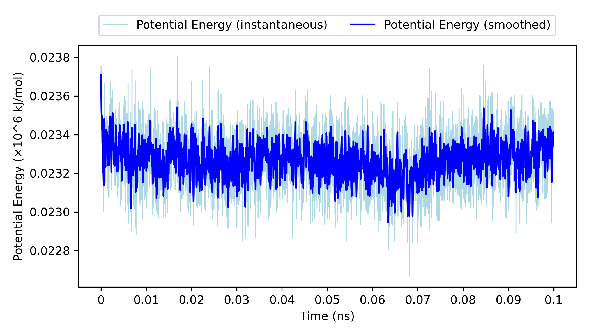
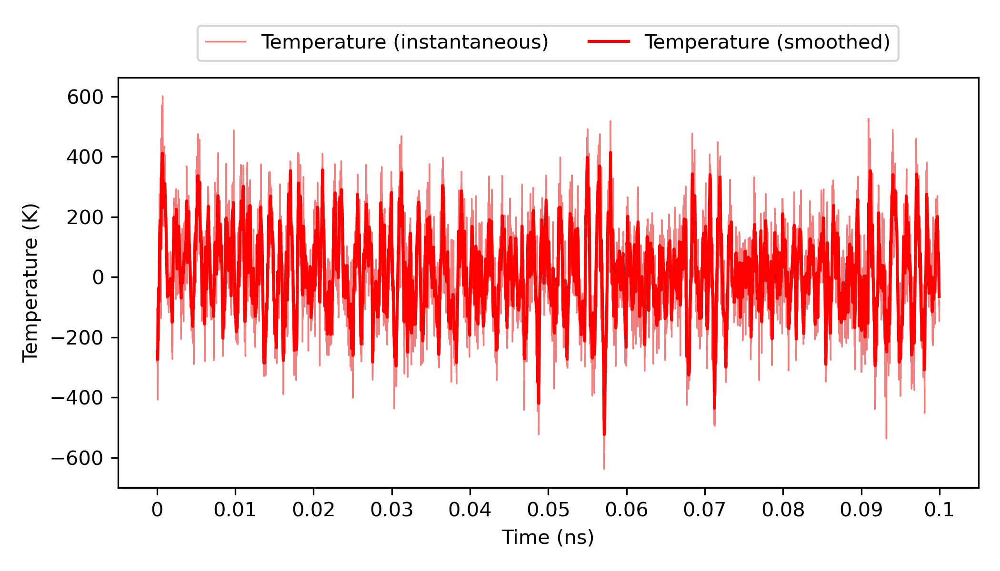
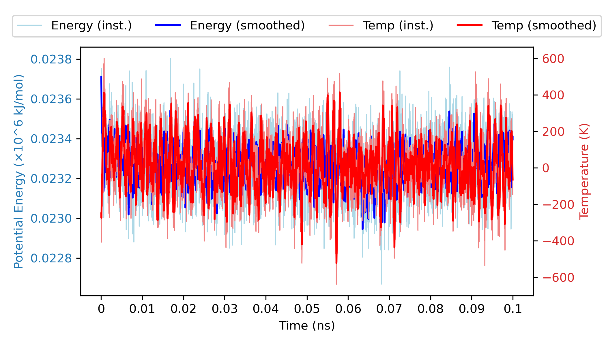
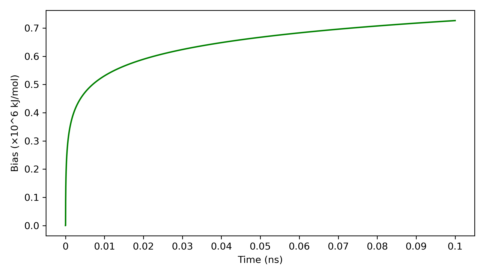
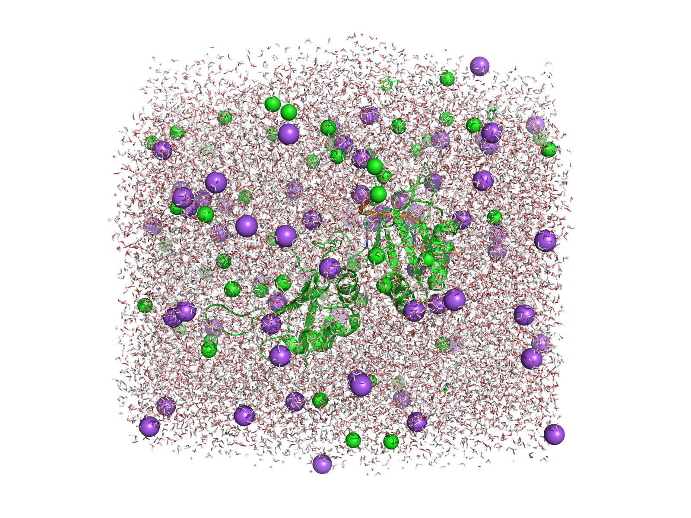
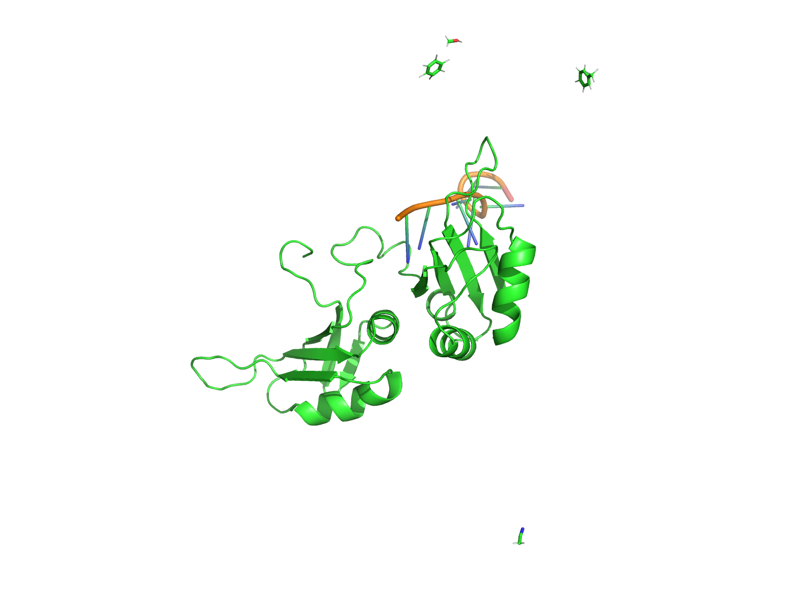

<!-- REPO_TOC -->
# FBDD Repository Structure
- [FBDD](../../)
  - [Docking](../../Docking/)
  - [Fragment_processing](../../Fragment_processing/)
  - [aLMMD](../)
    - [9N39](../9N39/)
      - [1ns_Preliminary Results](../9N39/1ns_Preliminary%20Results/)
        - [1ns_test](../9N39/1ns_Preliminary%20Results/1ns_test/)
          - [NPT_equil](../9N39/1ns_Preliminary%20Results/1ns_test/NPT_equil/)
          - [NVT_equil](../9N39/1ns_Preliminary%20Results/1ns_test/NVT_equil/)
          - [Production](../9N39/1ns_Preliminary%20Results/1ns_test/Production/)
          - [em](../9N39/1ns_Preliminary%20Results/1ns_test/em/)
        - [mdpocket_figures](../9N39/1ns_Preliminary%20Results/mdpocket_figures/)
        - [occupancy_maps](../9N39/1ns_Preliminary%20Results/occupancy_maps/)
        - [plumed_metad_cvs](../9N39/1ns_Preliminary%20Results/plumed_metad_cvs/)
        - [probe_behaviour_analysis](../9N39/1ns_Preliminary%20Results/probe_behaviour_analysis/)
        - [representative_snapshots](../9N39/1ns_Preliminary%20Results/representative_snapshots/)
          - [P01A_probespecific_snapshots](../9N39/1ns_Preliminary%20Results/representative_snapshots/P01A_probespecific_snapshots/)
          - [P02A_probespecific_snapshots](../9N39/1ns_Preliminary%20Results/representative_snapshots/P02A_probespecific_snapshots/)
          - [P03A_probespecific_snapshots](../9N39/1ns_Preliminary%20Results/representative_snapshots/P03A_probespecific_snapshots/)
          - [P04A_probespecific_snapshots](../9N39/1ns_Preliminary%20Results/representative_snapshots/P04A_probespecific_snapshots/)
          - [global_snapshots](../9N39/1ns_Preliminary%20Results/representative_snapshots/global_snapshots/)
    - [Final_validation_test_5HO4](./)
      - [100ps_test](100ps_test/)
        - [NPT_equil](100ps_test/NPT_equil/)
        - [NVT_equil](100ps_test/NVT_equil/)
        - [Production](100ps_test/Production/)
        - [em](100ps_test/em/)
    - [Frag_to_lead_4MZI](../Frag_to_lead_4MZI/)
      - [100ps_Preliminary Results](../Frag_to_lead_4MZI/100ps_Preliminary%20Results/)
        - [100ps_pipeline_test](../Frag_to_lead_4MZI/100ps_Preliminary%20Results/100ps_pipeline_test/)
          - [NPT_equil](../Frag_to_lead_4MZI/100ps_Preliminary%20Results/100ps_pipeline_test/NPT_equil/)
          - [NVT_equil](../Frag_to_lead_4MZI/100ps_Preliminary%20Results/100ps_pipeline_test/NVT_equil/)
          - [Production](../Frag_to_lead_4MZI/100ps_Preliminary%20Results/100ps_pipeline_test/Production/)
          - [em](../Frag_to_lead_4MZI/100ps_Preliminary%20Results/100ps_pipeline_test/em/)
        - [binding_event_detection](../Frag_to_lead_4MZI/100ps_Preliminary%20Results/binding_event_detection/)
        - [mdpocket_figures](../Frag_to_lead_4MZI/100ps_Preliminary%20Results/mdpocket_figures/)
        - [plumed_metad_cvs](../Frag_to_lead_4MZI/100ps_Preliminary%20Results/plumed_metad_cvs/)
        - [representative_snapshots](../Frag_to_lead_4MZI/100ps_Preliminary%20Results/representative_snapshots/)
      - [100ps_run_for_checkpoint_testing](../Frag_to_lead_4MZI/100ps_run_for_checkpoint_testing/)
      - [1ns_Preliminary Results](../Frag_to_lead_4MZI/1ns_Preliminary%20Results/)
        - [1ns_pipeline_test](../Frag_to_lead_4MZI/1ns_Preliminary%20Results/1ns_pipeline_test/)
          - [NPT_equil](../Frag_to_lead_4MZI/1ns_Preliminary%20Results/1ns_pipeline_test/NPT_equil/)
          - [NVT_equil](../Frag_to_lead_4MZI/1ns_Preliminary%20Results/1ns_pipeline_test/NVT_equil/)
          - [Production](../Frag_to_lead_4MZI/1ns_Preliminary%20Results/1ns_pipeline_test/Production/)
          - [em](../Frag_to_lead_4MZI/1ns_Preliminary%20Results/1ns_pipeline_test/em/)
        - [binding_event_detection](../Frag_to_lead_4MZI/1ns_Preliminary%20Results/binding_event_detection/)
        - [mdpocket_figures](../Frag_to_lead_4MZI/1ns_Preliminary%20Results/mdpocket_figures/)
        - [occupancy_maps](../Frag_to_lead_4MZI/1ns_Preliminary%20Results/occupancy_maps/)
        - [plumed_metad_cvs](../Frag_to_lead_4MZI/1ns_Preliminary%20Results/plumed_metad_cvs/)
        - [representative_snapshots](../Frag_to_lead_4MZI/1ns_Preliminary%20Results/representative_snapshots/)
      - [1ns_withpullres_withcheckpoints_Preliminary Results](../Frag_to_lead_4MZI/1ns_withpullres_withcheckpoints_Preliminary%20Results/)
        - [1ns_pipeline_test](../Frag_to_lead_4MZI/1ns_withpullres_withcheckpoints_Preliminary%20Results/1ns_pipeline_test/)
          - [NPT_equil](../Frag_to_lead_4MZI/1ns_withpullres_withcheckpoints_Preliminary%20Results/1ns_pipeline_test/NPT_equil/)
          - [NVT_equil](../Frag_to_lead_4MZI/1ns_withpullres_withcheckpoints_Preliminary%20Results/1ns_pipeline_test/NVT_equil/)
          - [Production](../Frag_to_lead_4MZI/1ns_withpullres_withcheckpoints_Preliminary%20Results/1ns_pipeline_test/Production/)
          - [em](../Frag_to_lead_4MZI/1ns_withpullres_withcheckpoints_Preliminary%20Results/1ns_pipeline_test/em/)
        - [binding_event_detection](../Frag_to_lead_4MZI/1ns_withpullres_withcheckpoints_Preliminary%20Results/binding_event_detection/)
        - [mdpocket_figures](../Frag_to_lead_4MZI/1ns_withpullres_withcheckpoints_Preliminary%20Results/mdpocket_figures/)
        - [occupancy_maps](../Frag_to_lead_4MZI/1ns_withpullres_withcheckpoints_Preliminary%20Results/occupancy_maps/)
        - [plumed_metad_cvs](../Frag_to_lead_4MZI/1ns_withpullres_withcheckpoints_Preliminary%20Results/plumed_metad_cvs/)
        - [representative_snapshots](../Frag_to_lead_4MZI/1ns_withpullres_withcheckpoints_Preliminary%20Results/representative_snapshots/)
  - [exploratory_examples](../../exploratory_examples/)
    - [docking_4MZI_roscovitine](../../exploratory_examples/docking_4MZI_roscovitine/)
  - [images](../../images/)
<!-- /REPO_TOC -->

---

This folder contains the preliminary results and data for the final validation test of the pipeline. This final validation test was performed with 5HO4 with a 100ps production run and is intended to only verify existing features of the pipeline not show system stability. Post processing results will not be uploaded since the pipeline/workflow functionality has already been demonstrated with the preliminary results of 9N39 and 4MZI in earlier work. Subsequently, after the completion of this validation test, the aLMMD pipeline is ready and and subsequent work will focus on other parts of the FBDD workflow eg. fragment preprocessing or docking.

# 100ps_test
[⬆️ Back to top](#fbdd-repository-structure)

This folder contains the preliminary/test results from the pipeline such as energy, temperature and bias plots, as well as post-processing plots (eg. occupancy maps) for a 100ps production run. 

The preliminary outputs from Gromacs for energy minimization, NVT equilibration, NPT equilibration and the 100ps production run to show pipeline/workflow functionality can be found in ([100ps_test](100ps_test/)).

**All these preliminary results are merely to show pipeline/workflow functionality.**

---

## energy.png
[⬆️ Back to top](#fbdd-repository-structure)

This plot shows the changes in the (instantaneous and smoothed) potential energy (kJ/mol) of the system as the MD simulation progresses ie. time increases.

## temperature.png
[⬆️ Back to top](#fbdd-repository-structure)

This plot shows the changes in the (instantaneous and smoothed) temperature (K) of the system as the MD simulation progresses ie. time increases.

## energy_temperature_dual.png
[⬆️ Back to top](#fbdd-repository-structure)

This plot shows both of the changes in the (instantaneous and smoothed) temperature (K) of the system, as well as the changes in the (instantaneous and smoothed) potential energy (kJ/mol) of the system as the MD simulation progresses ie. time increases. 

## plumed_bias.png
[⬆️ Back to top](#fbdd-repository-structure)

This plot shows the changes in the bias (kJ/mol) of the system as the MD simulation progresses ie. time increases.

## last_frame_pdb.png
[⬆️ Back to top](#fbdd-repository-structure)

The table below shows the png of the last frame of the 100ps production run for 5HO4 which is a protein/RNA complex.

<table style="border-collapse: collapse; border: none;">
  <tr>
    <td style="border: none; text-align: center;">
      <h3>A</h3>
      
    </td>
    <td style="border: none; text-align: center;">
      <h3>B</h3>
      
    </td>
  </tr>
</table>
